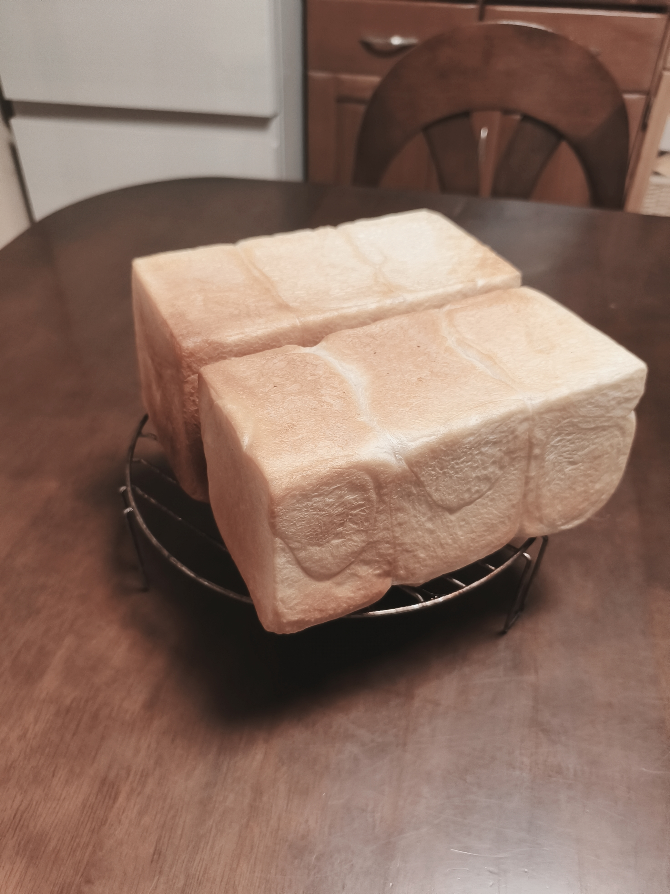

[2回目]()までで、**1斤側だけ二次発酵で上がりきらない**問題が連続して発生。型容積比（プロフーズ1斤:1.5斤 = 1650:2700cc ≒ 1:1.64）に対して、分割比率1:1.5は1斤側が相対的に多めなはずなのに伸びない、という不可解な状況だった。

今回は逆に**1斤側を厚めに**振って、生地量を増やせば上がりきるのか検証する。

## 今回の検証ポイント

**分割比率を 1:1.5 → 1:1.30 に変更**（1斤側 400g / 1.5斤側 520g）

| | 1斤側 | 1.5斤側 |
|---|---:|---:|
| 前回(2回目) | 360g | 540g |
| **今回** | **400g** | **520g** |
| 型容量 | 1650cc | 2700cc |
| 前回 型比容積 | 4.58 | 5.00 |
| 今回 型比容積 | **4.13** | **5.19** |

1斤側を生地量+40g、1.5斤側を-20g。1.5斤側はさらにスカスカになる方向だが、目的は1斤側の検証なので許容。

## 条件

| 項目 | 2回目 | 今回 |
|---|---|---|
| 開始時刻 | 昼〜午後 | 20:00 |
| 室温 | 20℃ | **22.6℃** |
| 分割比率 | 1:1.5（360g:540g） | **1:1.30（400g:520g）** |

配合・工程は2回目と同一。室温が+2.6℃高いのは差異として記録しておく。

## 配合（2回目と同一）

| 材料 | 分量 |
|---|---:|
| プロフーズ ゆめちから | 500 g |
| 砂糖 | 27 g |
| 塩 | 7 g |
| ドライイースト（とかち野 予備発酵タイプ） | 12.5 g |
| 予備発酵用 お湯 | 100 g |
| 予備発酵用 砂糖 | 10 g |
| 牛乳 | 180 g |
| 水 | 70 g |
| 無塩バター（常温戻し） | 50 g |

## 工程

1. **予備発酵**: お湯100g + 砂糖10g にドライイースト12.5gを入れて予備発酵。
2. **一次こね**: ニーダーに小麦粉・砂糖・塩を入れ、予備発酵させたイーストと牛乳・水を加えて10分こね。
3. **バター投入**: 常温に戻した無塩バターを入れ、さらに5分こね。
4. **一次発酵**: オーブンの発酵機能、35℃ で 45分。
5. **分割・ベンチタイム**: **1斤側 400g / 1.5斤側 520g** に分割、それぞれを3分割。ベンチタイム15分。
6. **成形 → 二次発酵**: 食パン型に入れ、35℃ で 60分（必要に応じて延長）。
7. **焼成**: 200℃ で 25分 → 前後を入れ替えてさらに 3分。

## 観察ポイント

- [ ] 1斤側の伸び不足が**解消するか**（今回の主目的）
- [ ] 1.5斤側が今度は上がりきらなくならないか（型比容積5.19はかなりスカスカ）
- [ ] 二次発酵60分時点での両者の伸び具合
- [ ] 二次発酵の追加時間（前回は+15分）
- [ ] 焼き上がりの色・腰折れ・側面の白さ
- [ ] 室温+2.6℃の影響

## 仕上がり

- **両方とも型から溢れんばかりに膨らみ、1斤側の伸び不足が完全に解消**。
- 角までしっかり立ち、ボリュームは過去最大。
- 一方で**焼きムラ**が目立つ。手前側が白っぽく、奥側に色が付いている。

## 振り返り

### 仮説検証の結果

| 項目 | 1〜2回目 | 3回目 |
|---|---|---|
| 1斤側の生地量 | 360g | **400g** |
| 1斤側の伸び | 7分目止まり | **型から溢れる** |

**生地量を360g→400gに増やしただけで、伸び不足は解消した**。型比容積で見ると 4.58→4.13 への変化。山型食パンの標準（3.5〜3.7）にまだ遠いが、少なくともこの型では400g前後が必要、という暫定結論。

### 残る変数

ただし今回は**室温22.6℃**（前回20℃）と発酵環境も変わっているため、生地量だけが効いたとは断定できない。次回は生地量400gのまま気温が下がった日にも再現できるか確認したい。

### 焼きムラ

手前側が白く、奥側に色が付く傾向。家庭用オーブンの庫内温度ムラはありがち。**焼成20分時点で前後を入れ替える**運用に変更すれば改善しそう（現在は25分焼いた後に入れ替えて+3分）。

## 次回に向けてのメモ

- [ ] このレシピ（粉500g・分割400g:520g）を**暫定の定番**として確定
- [ ] 焼成は **20分で前後入れ替え → さらに8分** の運用に変更してテスト
- [ ] 室温が低い日に再度同条件で焼き、生地量400gの効果を確認
- [ ] 1.5斤側の型比容積5.19はかなり余裕があるので、より生地量を増やしたらどうなるか（500g:560g など）も試したい
- [ ] こね上げ温度・発酵中の生地温度の実測は引き続き宿題
