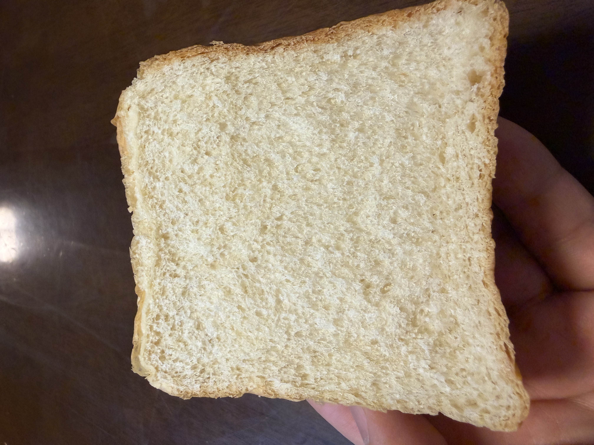

[3回目]()で1斤側の伸び不足は生地量400gで解消したが、**焼きムラ**（手前側が白く奥側に色が付く）が残った。今回は焼成の入れ替えタイミングだけを変更して、ムラが減るか検証する。

## 今回の検証ポイント

**焼成の入れ替えタイミング**: 25分後 → **20分後**に前倒し

| | 3回目 | 今回 |
|---|---|---|
| 焼成1段階目 | 200℃ 25分 | **200℃ 20分** |
| 入れ替え | あり | あり |
| 焼成2段階目 | 200℃ 3分 | **200℃ 8分** |
| 合計時間 | 28分 | **28分**（同じ）|

合計時間は変えず、入れ替えタイミングだけ早める。これで両面の焼き色が均等になるか。

## 条件

| 項目 | 3回目 | 今回 |
|---|---|---|
| 開始時刻 | 20:00 | 18:00 |
| 室温 | 22.6℃ | **19.5℃** |
| 天気 | (記録なし) | 曇り |
| 分割 | 400g:520g | (同一) |
| 配合・工程 | (前回参照) | (同一) |

**室温が-3.1℃低い**。これが副次的な検証ポイントになる:

> 3回目で生地量400gにして1斤側の伸び不足が解消したが、室温も+2.6℃高かったため「生地量が効いたのか気温が効いたのか」切り分け不能だった。今回は気温が3回目より低いので、ここでも1斤側が上がりきれば**生地量が主因**と確定できる。

## 配合（3回目と同一）

| 材料 | 分量 |
|---|---:|
| プロフーズ ゆめちから | 500 g |
| 砂糖 | 27 g |
| 塩 | 7 g |
| ドライイースト（とかち野 予備発酵タイプ） | 12.5 g |
| 予備発酵用 お湯 | 100 g |
| 予備発酵用 砂糖 | 10 g |
| 牛乳 | 180 g |
| 水 | 70 g |
| 無塩バター（常温戻し） | 50 g |

## 工程

1. **予備発酵**: お湯100g + 砂糖10g にドライイースト12.5gを入れて予備発酵。
2. **一次こね**: ニーダーに小麦粉・砂糖・塩を入れ、予備発酵させたイーストと牛乳・水を加えて10分こね。
3. **バター投入**: 常温に戻した無塩バターを入れ、さらに5分こね。
4. **一次発酵**: オーブンの発酵機能、35℃ で 45分。
5. **分割・ベンチタイム**: 1斤側 400g / 1.5斤側 520g に分割、それぞれを3分割。ベンチタイム15分。
6. **成形 → 二次発酵**: 食パン型に入れ、35℃ で 60分（必要に応じて延長）。
7. **焼成**: **200℃ で 20分 → 前後を入れ替えてさらに 8分**（変更点）。

## 観察ポイント

- [ ] 焼きムラが改善するか（今回の主目的）
- [ ] 1斤側の伸びが室温19.5℃でも維持されるか（生地量400gの効果検証）
- [ ] 二次発酵時間（室温が低めなので前回より長くなる可能性）
- [ ] 焼き色全体の濃さが28分でどうなるか（後半温度が長く効くので濃くなるかも）

## 仕上がり

- **両方の山がほぼ同じ高さに揃った**。1斤側と1.5斤側のバランスが過去最高。
- **焼き色は均一でムラがほぼない**。手前・奥の差がほとんど見えない → 入れ替えタイミング前倒しの効果が出ている。
- 山の頂点にやや色の深い部分があり、これが焦げっぽく感じた箇所。ただ写真で見る範囲では「焦げ」というより「色が深め」のレベル。
- 角がしっかり立ち、側面の白さも残っている。
- 頂点に薄いブリスター気味の焼きシワが出ているのは発酵状態が良好な証拠。
- 1斤側の伸びも維持。**室温19.5℃でも400gで上がりきった** → 3回目の結果は気温ではなく生地量が主因と確定。

### 断面

- **気泡が細かくて均一**。大きな穴やトンネルがなく、しっとり系食パンの理想形。
- クラムは美しいクリーム色。ゆめちからの色味が良く出ている。
- クラスト（耳）は薄すぎず厚すぎず適度。
- 縦長の楕円形の気泡が均等に並ぶ → 成形時のガス抜きと張りが適切だった証拠。
- 上部・下部・側面どこも密度が均一 → 火の通りが均等。

## 振り返り

### 仮説検証の結果

| 項目 | 3回目 | 今回（4回目） |
|---|---|---|
| 入れ替えタイミング | 25分後 | **20分後** |
| 焼きムラ | あり | **ほぼ解消** ✓ |
| 室温 | 22.6℃ | **19.5℃** |
| 1斤側の伸び | 良好 | **良好** ✓ |
| 焼き色 | 良好 | **若干焦げ** ✗ |

主目的の**焼きムラ解消は成功**。副次的な検証として、**室温が低くても生地量400gなら1斤側が上がりきる**ことも確認できた。日誌2回ぶんの仮説検証がきれいに回収できた回。

### 焼き色の評価（写真確認後）

事前には「若干焦げっぽい」と感じたが、撮影後に客観的に見ると**頂点にやや深めの色が出ているレベル**で、焦げと呼ぶほどではない。むしろ**仕上がりとしてはほぼ理想形**と言える。

ただし山の頂点が一番熱に晒される部分なので、そこの色が深まる傾向は構造的に避けにくい。気にする場合の選択肢:

1. **合計時間を1〜2分短縮**: 200℃ 20分 → 入れ替え → **6〜7分**（合計26〜27分）
2. **後半の温度を下げる**: 200℃ 20分 → 入れ替え → **180℃ 8分**
3. このまま定番化して許容する

選択肢2は色が浅くなりすぎるリスクがある。今回の仕上がりが許容範囲なら**そのまま定番化**が一番無難。次回は同条件でもう一度焼いて、色味の出方が安定するか確認するのが良さそう。

## 次回に向けてのメモ

- [ ] **このレシピを定番として確定**（粉500g・分割400g:520g・焼成200℃ 20分→入れ替え→8分）
- [ ] 同条件でもう一度焼いて、仕上がりが安定するか再現性確認
- [ ] 色味が気になる回があれば後半を180℃に下げて比較
- [ ] こね上げ温度・発酵中の生地温度の実測は引き続き宿題
