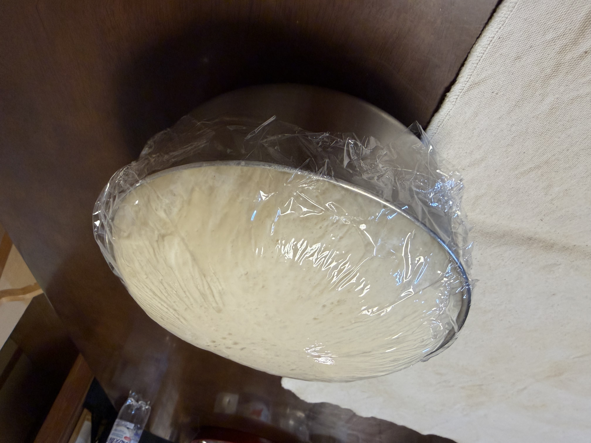
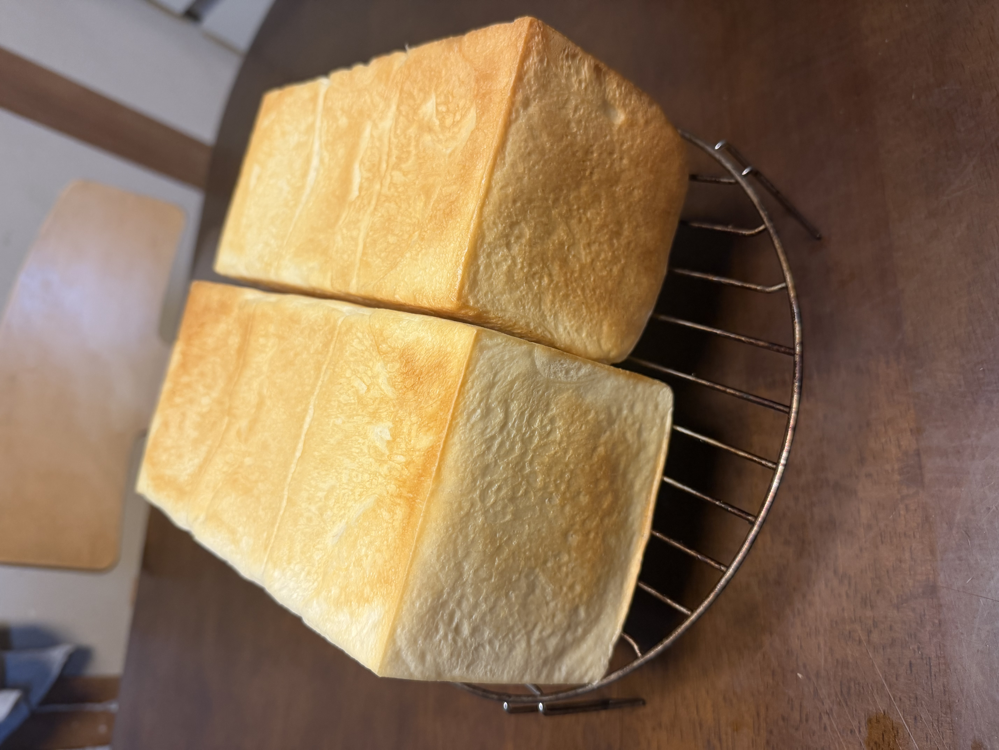

[4回目]()で外観・断面ともに理想的な仕上がりに到達。今回は**プロフーズのゆめちからが切れた**ため、新規購入したニップンのゆめちからブレンドを半量混ぜて使用する。砂糖量も微調整した。

## 今回の検証ポイント

**変更点は3つ**:

1. **粉構成**: ゆめちから（プロフーズ）100% → **ゆめちから 250g + ゆめちからブレンド（ニップン）250g**
   - 4回目までずっと使っていたプロフーズのゆめちからが切れたため、新規購入したニップンのゆめちからブレンドを半量追加した形。
2. **砂糖量**: 合計37g → **合計25g**（予備発酵 10g→5g、生地 27g→20g）
3. **焼成後半温度**: 200℃ → **180℃**（4回目で保留にしていた焦げ対策案）

| | 4回目 | 今回 |
|---|---|---|
| 粉 | ゆめちから 500g | **ゆめちから 250g + ブレンド 250g** |
| 砂糖（生地） | 27g | **20g** |
| 砂糖（予備発酵） | 10g | **5g** |
| 砂糖 合計 | 37g（粉比 7.4%） | **25g（粉比 5.0%）** |
| 焼成 前半 | 200℃ 20分 | 200℃ 20分（同じ） |
| 焼成 後半 | 200℃ 8分 | **180℃ 8分** |
| 分割 | 400g:520g | (同一) |
| 工程 | (同一) | (同一) |

ゆめちからブレンドはゆめちから100%より蛋白量が低めで、グルテンの強さが少しマイルドになる方向。半量混ぜることで以下のような変化が予想される:

- **食感**: ゆめちから100%より噛みごたえが少しマイルドになる
- **ボリューム**: グルテン形成がやや穏やかになるので、伸びは控えめになる可能性
- **吸水**: 生地の締まりが少し緩む方向
- **発酵時間**: 大きな差はなさそうだが、グルテンが穏やかな分わずかに早いかも

砂糖を粉比7.4% → 5.0%に減らすと:

- **甘みが控えめ**になり、より食事パンらしい味に
- **イーストの活性は若干落ちる**（イーストは砂糖を栄養源にする）→ 発酵速度がわずかに遅くなる方向
- **焼き色が浅くなる**可能性（メイラード反応とカラメル化が弱まるため）→ 4回目の「やや濃い焼き色」がちょうど良くなるかも

後半焼成温度を200℃ → 180℃に下げると:

- **焼き色が浅くなる**（高温での色付きが抑えられる）
- **山頂の焦げ防止**（4回目で気になった点の対策）
- **クラストがやや薄めに仕上がる**可能性

**注意**: 砂糖減と後半温度低下は両方とも焼き色を浅くする方向。重ねると4回目より明らかに色が薄くなる可能性があるため、必要に応じて焼成時間で調整。

**注意**: 3変数同時変更なので、結果のどれが効いたか厳密には切り分けできない。次回以降で個別検証が必要。

## 条件

| 項目 | 4回目 | 今回 |
|---|---|---|
| 開始時刻 | 18:00 | 21:00 |
| 室温 | 19.5℃ | **23℃** |
| 天気 | 曇り | 曇り |
| 日付 | 4/20 | 5/2 |

室温が +3.5℃ 高い。発酵が速く進む可能性。

## 配合

| 材料 | 分量 |
|---|---:|
| ニップン ゆめちからブレンド | **250 g** |
| プロフーズ ゆめちから | **250 g** |
| 砂糖 | **20 g** |
| 塩 | 7 g |
| ドライイースト（とかち野 予備発酵タイプ） | 12.5 g |
| 予備発酵用 お湯 | 100 g |
| 予備発酵用 砂糖 | **5 g** |
| 牛乳 | 180 g |
| 水 | 70 g |
| 無塩バター（常温戻し） | 50 g |

## 工程（4回目と同一）

1. **予備発酵**: お湯100g + 砂糖5g にドライイースト12.5gを入れて予備発酵。
2. **一次こね**: ニーダーに小麦粉・砂糖・塩を入れ、予備発酵させたイーストと牛乳・水を加えて10分こね。
3. **バター投入**: 常温に戻した無塩バターを入れ、さらに5分こね。
4. **一次発酵**: オーブンの発酵機能、35℃ で 45分。
5. **分割・ベンチタイム**: 1斤側 400g / 1.5斤側 520g に分割、それぞれを3分割。ベンチタイム15分。
6. **成形 → 二次発酵**: 食パン型に入れ、35℃ で 60分（必要に応じて延長）。
7. **焼成**: **200℃ で 20分 → 前後を入れ替えて 180℃ で 8分**（変更点）。

## 観察ポイント

- [ ] こね時の生地の感触の違い（ゆめちから100%より緩むか）
- [ ] 一次発酵後の生地の張り・大きさ
- [ ] 二次発酵時間（グルテンが穏やか＋砂糖減で時間がどうなるか）
- [ ] 焼き上がりのボリューム（ゆめちから100%より控えめになるか）
- [ ] **焼き色の濃さ**（砂糖減で浅くなるはず → 4回目の濃さがちょうど良くなるか）
- [ ] 断面のキメ・気泡の様子の違い
- [ ] 食感（ゆめちから100%より噛みごたえがマイルドになるか）
- [ ] **甘みの違い**（より食事パンらしい味になるか）

## 進行ログ

### 一次発酵（60分後）

ボウルから溢れそうな勢いで膨らんだ。本来は**45分**で切り上げるところ、誤って**60分**経過してしまった（+15分オーバー）。

要因として:

- 一次発酵を**60分**やってしまった（本来は45分）
- 室温23℃（4回目より+3.5℃）で発酵が進みやすい環境
- ニップンのブレンドが混ざってグルテンがマイルド → 同じ時間でも膨らみやすい

→ **対応**: パンチ・ガス抜きをしっかり行い、二次発酵は短めに調整して切り抜ける方針。

## 仕上がり

- **全体の焼き色は4回目より明らかに浅め**。砂糖減と後半180℃の効果が両方出ている。
- **1斤側・1.5斤側ともにしっかり膨らんでいる**。角もきれいに立ち、腰折れなし。一次発酵15分オーバーのリカバリー成功。
- ただし**奥側だった面のほうが色が強く、手前側がかなり淡い**。焼きムラが再発。

## 振り返り

### 仮説検証の結果

| 項目 | 4回目 | 今回（5回目） |
|---|---|---|
| 粉 | ゆめちから 500g | ゆめちから250g + ブレンド250g |
| 砂糖 合計 | 37g | 25g |
| 後半焼成温度 | 200℃ | **180℃** |
| 焼き色 | やや濃い | **浅め** |
| 焼きムラ | ほぼなし | **再発** |
| 膨らみ | 良好 | 良好 |

### 焼きムラの再発について

4回目（200℃-200℃）ではムラがほぼ解消していたのに、5回目（200℃-180℃）で再発した。**変えたのは後半温度だけ**なので原因はこれ。

入れ替えで奥→手前に来た面（前半でほとんど色付いていない）が、後半180℃では色付きを追いつかせるのに不足。前半200℃で20分焼かれた面（もともと奥側）はそのまま色が濃く残る、という構図。

### 全体の浅さについて

これは想定通り、砂糖減と後半温度低下の両方の効果。「色は浅めで甘さも控えめ」という方向性が好みなら定番化候補だが、ムラの問題があるので焼成条件は要再調整。

### 一次発酵オーバーの影響

15分オーバーした影響は、**仕上がりの見た目上はほぼ出ていない**。膨らみ・形ともに良好。ただし内部の気泡や食感に影響が出ている可能性は断面・実食で確認したい。

## 次回に向けてのメモ

- [ ] **後半温度を190℃**に戻して、ムラ解消と焼き色のバランスを取る
- [ ] 砂糖25gは継続して甘さの方向性を確定したい
- [ ] 粉構成（ブレンド混入）も継続。実食で食感の違いを記録
- [ ] 一次発酵は45分厳守（タイマーセット推奨）
- [ ] 断面写真を撮って気泡の様子を記録（過発酵の影響確認）
