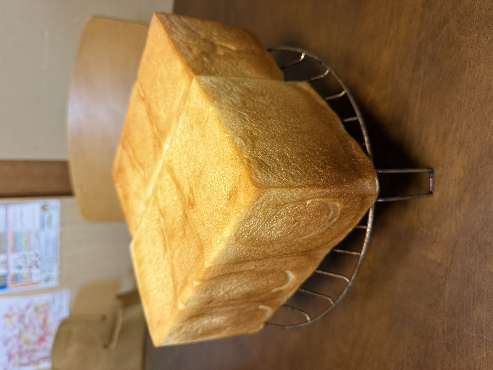

[5回目]()で**後半180℃にしたら焼きムラが再発**した。今回はその対策として後半を**190℃**に上げ、4回目（200℃）と5回目（180℃）の中間を狙う。粉構成・砂糖量・他工程は5回目と同じ。

## 今回の検証ポイント

**焼成後半温度**: 180℃ → **190℃**

| | 4回目 | 5回目 | 今回 |
|---|---|---|---|
| 粉 | ゆめちから 500g | ゆめちから250g + ブレンド250g | (5回目と同じ) |
| 砂糖 合計 | 37g | 25g | (5回目と同じ) |
| 焼成 前半 | 200℃ 20分 | 200℃ 20分 | 200℃ 20分 |
| 焼成 後半 | 200℃ 8分 | 180℃ 8分 | **190℃ 8分** |
| 焼きムラ | ほぼなし | 再発 | ? |
| 焼き色 | やや濃い | 浅い | ? |

## 条件

| 項目 | 5回目 | 今回 |
|---|---|---|
| 開始時刻 | 21:00 | <!-- TODO --> |
| 室温 | 23℃ | <!-- TODO --> |
| 天気 | 曇り | <!-- TODO --> |
| 日付 | 5/2 | 5/31 |

## 配合（5回目と同一）

| 材料 | 分量 |
|---|---:|
| プロフーズ ゆめちから | 250 g |
| ニップン ゆめちからブレンド | 250 g |
| 砂糖 | 20 g |
| 塩 | 7 g |
| ドライイースト（とかち野 予備発酵タイプ） | 12.5 g |
| 予備発酵用 お湯 | 100 g |
| 予備発酵用 砂糖 | 5 g |
| 牛乳 | 180 g |
| 水 | 70 g |
| 無塩バター（常温戻し） | 50 g |

## 工程

1. **予備発酵**: お湯100g + 砂糖5g にドライイースト12.5gを入れて予備発酵。
2. **一次こね**: ニーダーに小麦粉・砂糖・塩を入れ、予備発酵させたイーストと牛乳・水を加えて10分こね。
3. **バター投入**: 常温に戻した無塩バターを入れ、さらに5分こね。
4. **一次発酵**: オーブンの発酵機能、35℃ で **45分**（5回目で60分やってしまった反省）。
5. **分割・ベンチタイム**: 1斤側 400g / 1.5斤側 520g に分割、それぞれを3分割。ベンチタイム15分。
6. **成形 → 二次発酵**: 食パン型に入れ、35℃ で 60分（必要に応じて延長）。
7. **焼成**: **200℃ で 20分 → 前後を入れ替えて 190℃ で 8分**。

## 進行ログ

### 計量ミス・リカバリー

捏ね上がりまで進んだ後、**水分を100g多く入れていた**ことに気付いた（実際 450g、本来 350g）。生地は柔らかくベタつき強めだが一応まとまっている状態。

**リカバリー方針**: 完全に元のバランスに戻すには粉143g追加が必要だが、生地量が増えすぎると型に収まらない問題が出る。今回は**粉80g追加**に留めて、通常工程に戻して進めることにした。

**追加した粉**:
- プロフーズ ゆめちから: 40g
- ニップン ゆめちからブレンド: 40g

**最終的な配合（実態）**:

| 材料 | 量 | 粉比 | 元レシピ比 |
|---|---:|---:|---:|
| 粉合計 | 580 g | 100% | - |
| 砂糖（合計） | 25 g | 4.3% | 5.0% |
| 塩 | 7 g | 1.2% | 1.4% |
| イースト | 12.5 g | 2.2% | 2.5% |
| バター | 50 g | 8.6% | 10% |
| 水分合計 | 450 g | **77.6%** | 70% |

水分比率が**77.6%とやや高め**（元の70%より+7.6ポイント）になり、もっちり・しっとり寄りの仕上がりになる可能性。検証ポイント（後半190℃）の効果切り分けはこの事故で曖昧になるが、データとして記録しておく。

分割は通常通り 1斤側400g / 1.5斤側520g で予定通り進める。残った生地は型に少し多めに入れる or 別途処理する形で対応。

## 観察ポイント

- [ ] **焼きムラが解消するか**（今回の主目的）
- [ ] **焼き色が4回目と5回目の中間に来るか**
- [ ] 水分77.6%のもっちり・しっとり感が出るか
- [ ] ベタつき強めの生地が二次発酵で形を保てるか
- [ ] 仕上がりの形・腰折れの有無
- [ ] 焼き上がりに粉ダマがないか確認

## 仕上がり

- **焼き色が絶妙**。4回目（やや濃い）と5回目（浅め）のちょうど中間で、後半190℃の効果が予想通り。
- **焼きムラもほとんど見えない**。手前・奥の差がほぼ均一。
- **ボリュームが過去最大級**。両方の山がぎっしり詰まっている。水分多めの影響で生地が大きく伸びた可能性。
- 側面に水分多めらしい滑らかな質感と、軽くブリスター気味の凹凸。
- 角もしっかり立ち、腰折れなし。

## 振り返り

### 仮説検証の結果

| 項目 | 4回目 | 5回目 | 今回（6回目） |
|---|---|---|---|
| 後半焼成温度 | 200℃ | 180℃ | **190℃** |
| 焼き色 | やや濃い | 浅い | **絶妙な中間** ✓ |
| 焼きムラ | ほぼなし | 再発 | **ほぼなし** ✓ |
| ボリューム | 良好 | 良好 | **過去最大級** |
| 水分比率 | 70% | 70% | 77.6%（事故） |

**後半190℃が焼き色・ムラの両面で正解**だったことが確認できた。砂糖25g + 後半190℃の組み合わせが新しい定番候補。

### 水分多めの効果（思わぬ収穫）

計量ミスで水分77.6%という高水分パンになったが、結果的に**過去最大級のボリューム**が出た。水分が多いことで:

- 生地の伸展性が増し、二次発酵〜焼成での膨らみが大きくなった
- クラストが薄く繊細に仕上がった可能性（写真でもブリスター気味の質感）

ベタつき強めの生地でも、捏ねと成形をしっかりやれば十分焼ける、という気づき。次回以降、**意図的に水分を増やす方向**も検討の余地あり。

### 検証の切り分け

今回は変数が複数になった:
- 後半190℃（意図した変更）
- 水分77.6%（事故）
- 粉80g追加によるイースト・砂糖・塩・バターの粉比低下

焼き色とムラについては「**4回目との比較で焼成温度の効果が出た**」と言えるが、ボリュームについては水分多めの影響が大きい可能性。次回は水分70%に戻して再現性を確認したい。

## 次回に向けてのメモ

- [ ] **後半190℃を定番化候補として確定**
- [ ] 水分70%に戻して、後半190℃の効果が再現するか確認
- [ ] 余裕があれば水分75%程度で意図的に高水分パンも試してみたい
- [ ] 計量ミスを防ぐため**全材料を準備段階で並べる**運用に
- [ ] 断面写真を撮って気泡の様子を記録（高水分の影響確認）
