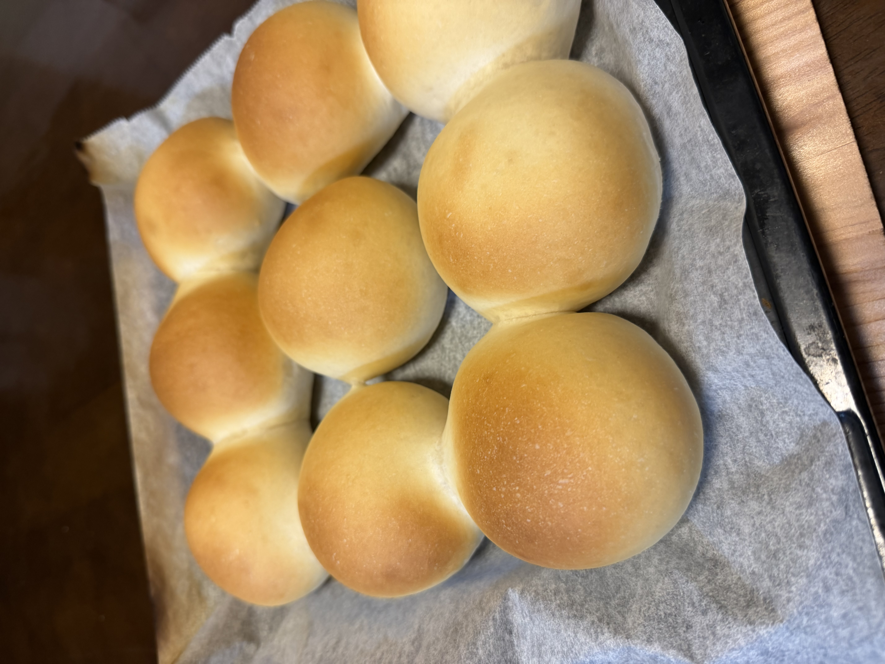

[7回目]()までで食パンの定番が固まったので、新しい形態として**丸パン**に挑戦する。配合は食パン定番をそのまま使い、成形だけ変える。

## 今回の検証ポイント

**形状変更**: 食パン → 丸パン（50g × 約18個）

| | 食パン定番 | 今回（丸パン） |
|---|---|---|
| 配合 | 食パン定番 | (同じ) |
| 工程（〜一次発酵） | 同じ | 同じ |
| **成形** | 食パン型に詰めて伸ばす | **50gに分割、丸める** |
| **二次発酵** | 35℃ 60分 | **35℃ 30〜40分**（小さい分早い） |
| **焼成** | 200℃ 20分→190℃ 8分 | **200℃ 10〜12分**（薄い分短い） |

## 予想される変化

**形状（食パン→丸パン）の影響**:
- **発酵が速い**: 生地が小さく表面積/体積比が大きいので、発酵も焼成も早く進む
- **焼き色が均一になる**: 小さくて熱が均等に入る
- **食感は食パンより軽やか**: 表面のクラスト比率が高くなる
- **焼き上がり後の冷めが早い**: 食パンより早く食べられる

**春よ恋100%の影響**（7回目はミックス、今回は単独）:
- **もっちり感が前面に出る**: 春よ恋の特性が強く出る
- **香りが豊か**になる可能性
- **クラム（中身）は白っぽい上品な色合い**
- **グルテン穏やか**で扱いやすい生地、初めての丸パン成形にも向いている

## 条件

| 項目 | 値 |
|---|---|
| 開始時刻 | 22:00 |
| 室温 | 24.2℃ |
| 湿度 | 69% |
| 天気 | 曇り |
| 日付 | 6/14 |

## 配合（食パン定番と同一）

| 材料 | 分量 |
|---|---:|
| プロフーズ 春よ恋 | 500 g |
| 砂糖 | 20 g |
| 塩 | 7 g |
| ドライイースト（とかち野 予備発酵タイプ） | 12.5 g |
| 予備発酵用 お湯 | 100 g |
| 予備発酵用 砂糖 | 5 g |
| 牛乳 | 180 g |
| 水 | 70 g |
| 無塩バター（常温戻し） | 50 g |

## 工程

1. **予備発酵**: お湯100g + 砂糖5g にドライイースト12.5gを入れて予備発酵。
2. **一次こね**: ニーダーに小麦粉・砂糖・塩を入れ、予備発酵させたイーストと牛乳・水を加えて10分こね。
3. **バター投入**: 常温に戻した無塩バターを入れ、さらに5分こね。
4. **一次発酵**: オーブンの発酵機能、35℃ で 45分。
5. **分割・ベンチタイム**: **50g × 約18個に分割**、軽く丸めてベンチタイム15分。
6. **成形**: 一個ずつ丁寧に丸め直し、表面をピンと張らせる。閉じ口は下に。
7. **二次発酵**: 天板に並べて35℃で **30〜40分**（生地が一回り大きくなり、軽く押して跡が戻ってくるくらい）。
8. **焼成**: コンベックモードで2段同時焼成。**190℃ で 10〜12分**（コンベックの定石通り、通常200℃から10℃下げ）。8分時点で色を確認、必要なら微調整。

## 丸パン成形のコツ

- 手のひらを軽くお椀型にして、生地を中で転がすように丸める
- 閉じ口（生地を引き寄せて閉じた部分）が下に来るように
- 表面の張りを意識：張りがあると焼成中に均一に膨らむ
- 並べるときは天板上で**間隔を3〜4cm**空ける（二次発酵+焼成で広がる）

## 観察ポイント

- [ ] 50g分割が均一にできたか
- [ ] 丸めの張りが綺麗に出るか
- [ ] 二次発酵がどれくらい速く進むか（室温24.2℃で予想より早いかも）
- [ ] 焼成時間の目安（10分？12分？）
- [ ] **2段コンベックで上下段の焼き色差**が出るか（差が大きければ次回温度調整）
- [ ] 中までしっかり火が通ったか（小さい分、生焼けリスクは低いはず）
- [ ] **春よ恋100%のもっちり感・香り**が単独使用でどう出るか
- [ ] クラムの色がいつもより白っぽくなるか

## 仕上がり

- **焼き色は理想的なきつね色**で均一。コンベック190℃の選択が正解だった。
- **春よ恋100%らしい滑らかで艶のある表面**。クラストの色合いも上品。
- **形・大きさが揃っている**。50g分割と丸めの精度が良かった。
- **2段焼成でも色ムラはなし**。コンベックの威力。
- 一方で**隣同士がくっついた**。間隔を3〜4cm空けたつもりでも、春よ恋の伸びが想像以上だった。

## 振り返り

### 仮説検証の結果

| 項目 | 想定 | 結果 |
|---|---|---|
| 50g分割×18個 | 均一に分割できるか | ◎ |
| 丸めの張り | 表面ピンと張る | ◎ |
| 二次発酵時間 | 30〜40分（室温24.2℃で短め） | 良好 |
| コンベック190℃ 10〜12分 | 焼き色・火通り両立 | ◎ |
| 2段焼成 | 上下段で色差 | **差なし、コンベックが効いた** |
| 春よ恋100%の特性 | もっちり&軽やか | 想定通り |
| **隣の間隔** | 3〜4cm | **不足、くっついた** ✗ |

### 確定したパラメータ

- **粉**: 春よ恋100%で食パン定番レシピは丸パンにも使える
- **焼成**: コンベック190℃ 10〜12分
- **2段焼成**: コンベックなら同時焼成で問題なし

### 残った課題

**隣同士がくっつく問題**: 配置時の間隔3〜4cmでは足りなかった。50g丸パンは焼成後に直径6〜7cmまで膨らむため、**5cm以上の間隔**が必要そう。

## 次回に向けてのメモ

- [ ] 配置間隔を**5cm以上**に広げる
- [ ] または**焼成を2回に分割**して天板の使用面積を増やす
- [ ] 焼成時間は10〜12分で固定（次回もこの範囲）
- [ ] 別の粉構成（キタノカオリ混入など）で食感・色の比較
- [ ] 断面写真を撮って気泡の様子を記録

## 次回試したいアレンジ

- [ ] 三角形から巻くロールパン型に挑戦
- [ ] ひも状に伸ばして結ぶ成形
- [ ] つや出しに溶き卵を塗ってバンズ風に
- [ ] レーズン入りミニ丸パン
- [ ] ハム&チーズを巻いた惣菜パン化
