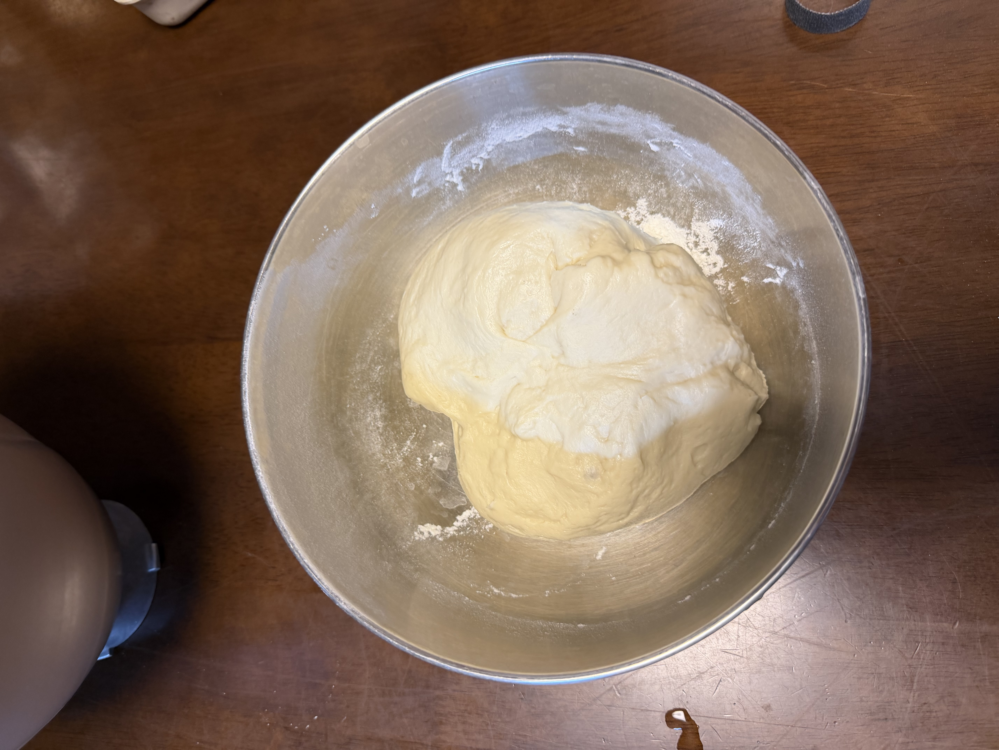
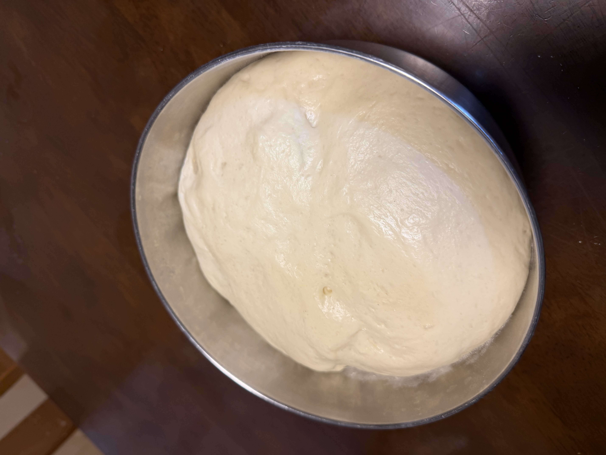
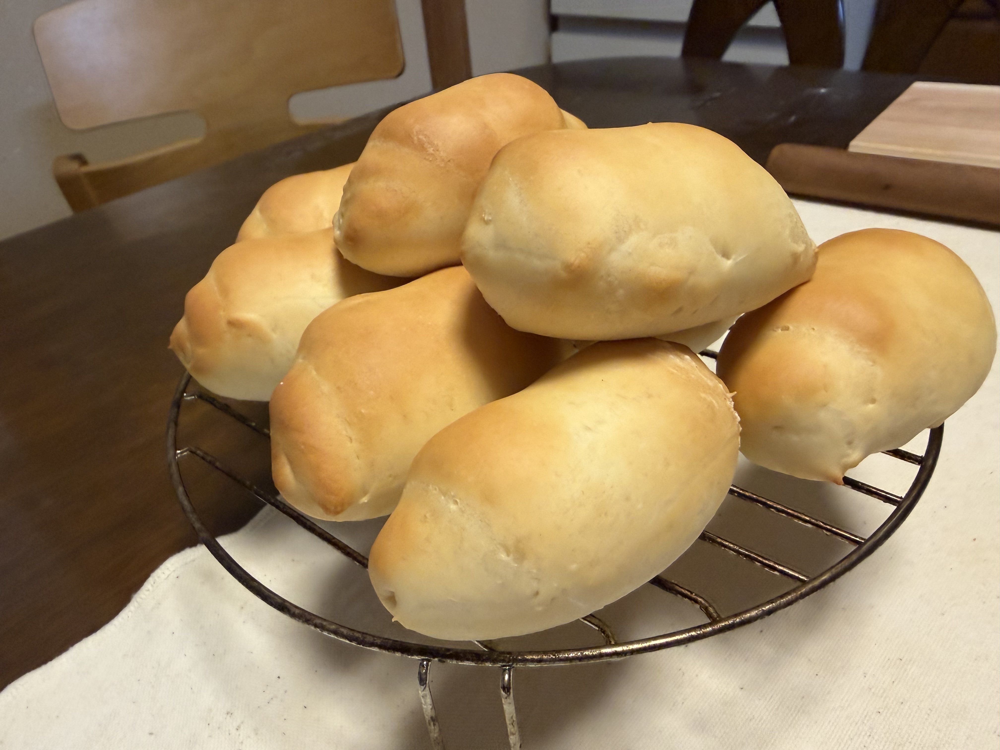

[8回目]()で初の丸パンに挑戦したが、**焼成中に隣同士がくっついた**反省から、今回は**焼成を2回に分割**して間隔を広めに取る。さらに**成形も丸めるだけから王道のロールパン形態（三角形に伸ばしてクルクル巻く）に変更**。粉も新しい組み合わせ（キタノカオリ+春よ恋）で挑戦。

## 今回の検証ポイント

1. **粉構成変更**: 春よ恋100% → **キタノカオリ50% + 春よ恋50%**（北海道の名品種ペア）
2. **成形変更**: 丸めるだけ → **ロールパン成形**（三角形に伸ばしてクルクル巻く）
3. **焼成を2回に分割**（前回くっついた対策）

| | 8回目 | 今回（9回目） |
|---|---|---|
| 粉構成 | 春よ恋 500g | **キタノカオリ250g + 春よ恋250g** |
| 形態 | 丸パン50g×18個 | **ロールパン50g×18個** |
| 成形 | 丸めるだけ | **三角形→巻き** |
| 焼成 | コンベック190℃ 2段同時 | **コンベック190℃ × 2回に分割** |
| 配合（粉以外） | 食パン定番 | (同じ) |

## 予想される変化

**粉構成の影響**（キタノカオリ追加）:
- **クラムが黄色みを帯びる**: キタノカオリ特有のカスタード色
- **独特の芳香**: バターのような香り
- **より強いもっちり感**: キタノカオリの個性
- 春よ恋の軽やかさとキタノカオリのコクが調和するか興味深い

**成形変更の影響**（丸めるだけ→ロールパン成形）:
- **見た目が本格的に**: 王道のロールパン形態
- **クラストと中身の対比**: 巻いた層が断面に出る
- **サンドイッチや具材を挟む用途に向く**: 楕円形で扱いやすい
- 成形時の張り出し方で焼き上がりの形が決まるので技術が必要

**焼成2回分割の影響**:
- **1個ずつの間隔が広く取れる** → くっつき防止
- **焼きムラがさらに減る**可能性
- 1回目焼成中の生地は二次発酵が進みすぎる懸念 → 2回目は冷蔵庫で待機させる手も

## 条件

| 項目 | 値 |
|---|---|
| 開始時刻 | 18:00 |
| 室温 | 25.7℃ |
| 湿度 | 81%（梅雨入り） |
| 天気 | <!-- TODO --> |
| 日付 | 6/20 |

**室温25.7℃・湿度81%は過去最高に発酵が進みやすい環境**。梅雨らしい条件で、発酵速度全般が速くなる予想。

## 配合（食パン定番と同一）

| 材料 | 分量 |
|---|---:|
| キタノカオリ | 250 g |
| プロフーズ 春よ恋 | 250 g |
| 砂糖 | 20 g |
| 塩 | 7 g |
| ドライイースト（とかち野 予備発酵タイプ） | 12.5 g |
| 予備発酵用 お湯 | 100 g |
| 予備発酵用 砂糖 | 5 g |
| 牛乳 | 180 g |
| 水 | 70 g |
| 無塩バター（常温戻し） | 50 g |

## 工程

1. **予備発酵**: お湯100g + 砂糖5g にドライイースト12.5gを入れて予備発酵。
2. **一次こね**: ニーダーに小麦粉・砂糖・塩を入れ、予備発酵させたイーストと牛乳・水を加えて10分こね。
3. **バター投入**: 常温に戻した無塩バターを入れ、さらに5分こね。
4. **一次発酵**: オーブンの発酵機能、35℃ で 45分（室温高めなので40分から様子見もあり）。
5. **分割・ベンチタイム**: 50g × 約18個に分割、軽く丸めてベンチタイム15分。
6. **成形**: ロールパン形態。**三角形（涙型）に伸ばし、底辺から先端に向けてクルクル巻く**。表面の張りを意識。
7. **二次発酵**: 天板に並べて35℃で 30〜35分（室温高めなので前回より短めの可能性）。
8. **焼成（1回目）**: 1枚目をコンベック190℃で 10〜12分。
9. **焼成（2回目）**: 1回目焼成中、2枚目は**冷蔵庫または涼しい場所で待機**（発酵進みすぎ防止）。1回目が終わったら2枚目を焼成。

## 待機分の発酵管理

2回目に焼く生地は、1回目焼成中に発酵が進みすぎないよう注意:

- **冷蔵庫に入れる**: 一番確実、発酵をほぼ止められる
- **常温の涼しい場所**: 部屋の中で一番涼しい場所
- **オーブンから離す**: 熱が伝わらないように

## 観察ポイント

- [ ] 室温25.7℃で一次発酵が早まるか
- [ ] 二次発酵が前回（30〜40分）より早く進むか
- [ ] 1回目焼成中、2回目待機の発酵管理がうまくいくか
- [ ] **キタノカオリの黄色みと香り**が出るか
- [ ] 春よ恋とのバランスがどう仕上がるか
- [ ] 1回目と2回目で仕上がりに差が出ないか
- [ ] **ロールパン成形が綺麗な層になるか**（断面で確認）
- [ ] **成形時の張り具合**が焼き上がりにどう影響するか
- [ ] くっつき問題が解消するか

## 進行ログ

### 予備発酵で事故

200ccカップで予備発酵中、子どもに本を読んでいたら**カップから溢れた**。室温25.7℃ではドライイースト+砂糖の活性が想像以上で、たった数分の油断が命取りだった。

→ **対策メモ**: 次回以降は **500cc以上の容器**で予備発酵すること。室温が高い時期は特に注意。

### 捏ね上げ

- 表面が滑らかでつやがあり、グルテンしっかり形成
- 色は**やや黄色みを帯びたクリーム色** → キタノカオリの色味が早くも出ている（7回目の春よ恋のみより明らかに黄色寄り）
- まとまり方良好、ベタつきも適度

### 一次発酵完了

- 綺麗な丸ドームで発酵、表面の滑らかさが維持されている
- 過発酵せず適切なタイミング
- 色味も均一で、キタノカオリの黄味が一次発酵後も健在
- 予備発酵で多少イースト量が減ったかもしれないが、結果として一次発酵は完璧

### 二次発酵で再びくっつき

「焼成は2回に分けるから1枚の天板でいいや」と18個を1枚に並べて二次発酵させたところ、**発酵終了時点で既に隣同士がくっついた**。

→ **次回からの修正方針**: 焼成を2回に分けるなら**二次発酵も2枚に分ける**。具体的には:

- 天板2枚を用意し、9個ずつに分けて発酵
- 1枚目は通常通り発酵 → 焼成
- 2枚目は**冷蔵庫で発酵を遅らせる**か、**少し遅れて発酵スタート**

焼成2回分割の本来の意味は「焼成中の間隔を確保する」ことだが、それは**二次発酵の時点から間隔を確保しないと達成できない**。今回の事故で明確になった。

### リカバリー: スケッパーで切り分け

このままだと焼成中にさらにくっつくので、**半分をスケッパーで切り離して**1回目焼成へ。残り半分は**キャンバス布で待機**。

判断の根拠:
- 焼成は10〜12分と短いので、待機中の過発酵リスクは限定的
- スケッパーで切り離した跡は焼き上がりに残るが、それも記録として観察する

### 1回目焼成完了

王道のロールパン成形が綺麗な**楕円形のロールパン**として焼き上がった。形状は狙い通り。

- 焼き色は8回目（丸パン）より少し控えめ、全体的に淡いきつね色
- 白っぽい部分が多く、クラスト（皮）が薄めに見える
- 巻き終わりが下になるよう成形した跡が側面に薄く残る
- 底面はしっかり焼けて形が崩れていない
- キタノカオリの黄みは表面では控えめ（クラム断面で確認したい）
- スケッパーで切り分けた箇所の跡は、ロールパン形態ではあまり目立たず良い意味で隠れた

**焼き色が薄めの考察**:
- 砂糖控えめ（25g）+ 春よ恋・キタノカオリの組み合わせは焼き色が付きにくい配合
- 成形時に粉を使った場合、表面に粉が残って焼き色が付きにくくなる可能性
- 次回は焼成時間を1〜2分延長、または最後の1〜2分だけ200℃に上げる選択肢あり

**ロールパン成形の感想**:
- 50gサイズで巻きパン形態にすると、食卓パンとして食べやすい
- サンドイッチには横にスライスして使える
- 成形に技術が要るが、慣れれば見栄えする

## 仕上がり

<!-- TODO: 焼き上がり後に追記 -->

## 振り返り

<!-- TODO: 焼き上がり後に追記 -->
