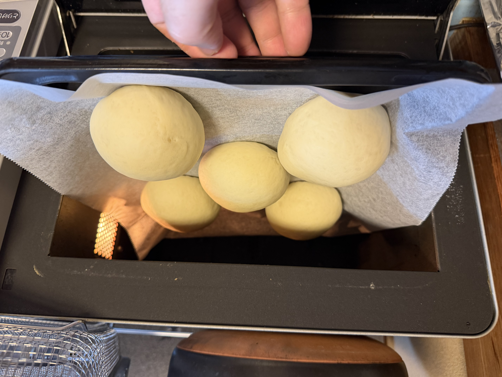
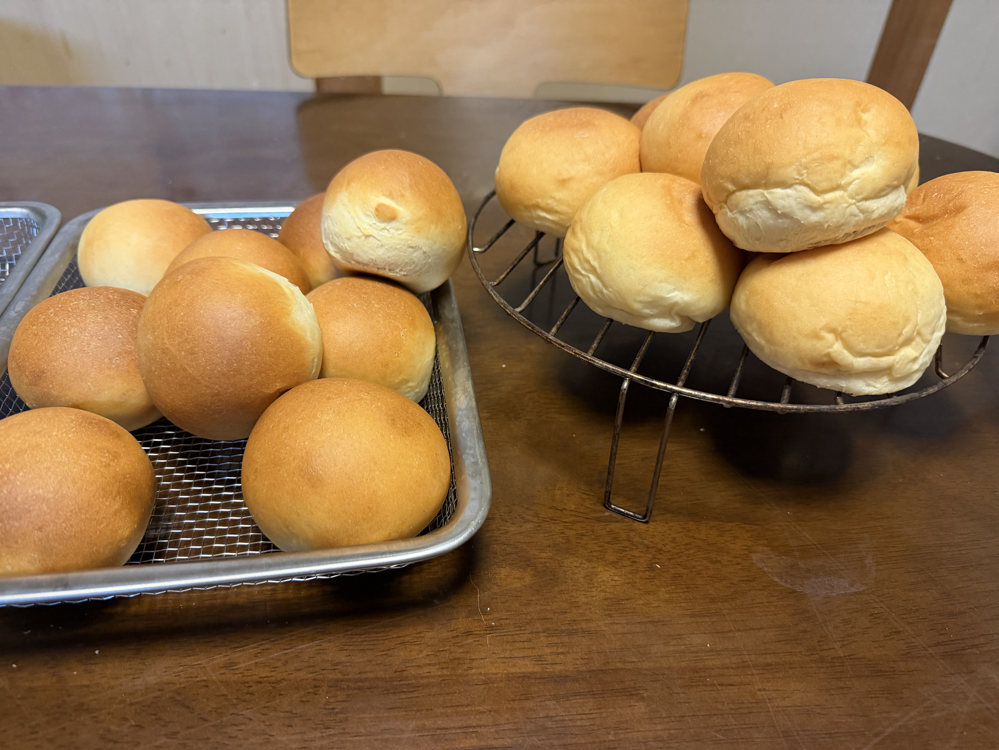

[9回目]()までで春よ恋・キタノカオリ・ブレンドを試してきたが、今回は**キタノカオリ100%**で丸パンに挑戦。さらに**二次発酵を2環境に分けて焼き色を比較**するという意図せず生まれた実験回になった。

## 今回の検証ポイント

1. **粉構成**: ついに**キタノカオリ100%**で試す
2. **二次発酵環境の比較**:
   - 9個: **オーブン庫内（35℃発酵機能）**
   - 9個: **室温（24.7℃）**
3. **成形**: 丸パン（8回目と同じ、丸めるだけ）

| | 8回目 | 9回目 | 今回（10回目） |
|---|---|---|---|
| 粉構成 | 春よ恋 500g | キタノカオリ250g + 春よ恋250g | **キタノカオリ 500g** |
| 形態 | 丸パン | ロールパン成形 | **丸パンに復帰** |
| 二次発酵 | オーブン35℃ | オーブン35℃ | **半分オーブン / 半分室温** |
| 焼成 | コンベック190℃ | コンベック190℃ × 2回分割 | コンベック190℃ × 2回分割 |

## 条件

| 項目 | 値 |
|---|---|
| 開始時刻 | 18:00 |
| 室温 | 24.7℃ |
| 湿度 | 70% |
| 天気 | <!-- TODO --> |
| 日付 | 6/22 |

## 配合（食パン定番と同一）

| 材料 | 分量 |
|---|---:|
| プロフーズ キタノカオリ | 500 g |
| 砂糖 | 20 g |
| 塩 | 7 g |
| ドライイースト（とかち野 予備発酵タイプ） | 12.5 g |
| 予備発酵用 お湯 | 100 g |
| 予備発酵用 砂糖 | 5 g |
| 牛乳 | 180 g |
| 水 | 70 g |
| 無塩バター（常温戻し） | 50 g |

## 工程

1. 予備発酵 → 一次こね → バター投入 → 一次発酵45分（食パン定番と同じ）
2. **分割・ベンチタイム**: 50g × 約18個に分割、軽く丸めてベンチタイム15分
3. **成形**: 丸めるだけ
4. **二次発酵の振り分け**:
   - **9個**を天板1枚目に並べてオーブン庫内（35℃発酵機能）で発酵
   - **9個**を天板2枚目に並べて室温（24.7℃）で発酵
5. **焼成**: コンベック190℃ で 10〜12分（2回に分けて焼成）

## 進行ログ

### オーブン発酵側 二次発酵後

オーブン庫内（35℃）で二次発酵を終えた5個。**キタノカオリ特有のカスタード色**が明確に出ている。クリーム〜薄い黄色で、過去の春よ恋やゆめちからとは明らかに違う色味。焼成前の段階でこの黄色みなら、**焼き上がりのクラム（中身）はもっと黄色く**なりそう。

表面は滑らかでぷっくり丸く、二次発酵の見極めは良好。

### 配置の知見: 1段5個はギリギリ、2段9個が最適

**5個を並べた時点で既に隣同士が触れそうな間隔**になっていることが明確に分かった。50gの丸パン生地は二次発酵で1.5〜2倍に膨らみ、直径6〜7cmまで広がる。

家庭用オーブンの天板（30×40cm相当）への現実的な配置:

- **1段あたり4〜5個**: 安全圏（5個はギリギリ、4個が無難）
- **6個以上**: ほぼ確実にくっつく

コンベックの**2段構成**を活かすと、**1段4〜5個 × 2段 = 9個** を1回の焼成で焼ける。18個ぶんを**9個×2回焼成**で完了するのが理想的なリズム。8回目で18個を1度に詰めてくっついた失敗の原因がはっきりした。

## 仕上がり（途中経過）

写真**左側が1回目焼成（室温発酵）**、**右側が2回目焼成（オーブン発酵）**:

- **室温発酵側（左）**: しっかりとしたきつね色、表面ツヤあり、ぷっくり膨らんで理想的
- **オーブン発酵側（右）**: 焼き色が明らかに薄く、白っぽい部分が多い

同じ温度・時間で焼いたにも関わらず、**発酵環境の違いだけで焼き色がここまで変わる**のは大きな発見。

## 焼き色差の考察

仮説:

1. **オーブン発酵中の表面乾燥**: オーブンの発酵機能（35℃の熱風）で生地表面がやや乾燥 → 表面の糖分が水分と反応しにくくなり、メイラード反応が弱まった可能性
2. **室温発酵のほうがゆっくり発酵 → 糖の分解が進みやすい**: 結果として焼き色付きの素材（還元糖）が表面により残った可能性
3. **発酵環境による含水率の違い**: オーブン発酵だと表面が乾く一方、室温だと適度に湿潤を保てた

過去9回はずっとオーブンの発酵機能を使っていたので、もしかすると今までも**もう少し焼き色を出せた可能性**がある。室温発酵が選択肢として浮上。

### 重要な気付き: 霧吹きの湿度要因仮説

これまで**二次発酵前の霧吹きをしてこなかった**ことに気付いた。霧吹きの役割を整理すると:

- 生地表面に水分を補給して**乾燥を防ぐ**
- 発酵中、生地が膨らんで表面が伸びるとき、乾燥していると**表面が引きつって膨らみが妨げられる**
- 焼成時の蒸気として作用し、**表面が滑らかに伸びる**＋**メイラード反応を促進**

今回の結果を再解釈すると:

| | 室温発酵 | オーブン発酵 |
|---|---|---|
| 周囲の湿度 | 70%（梅雨で高湿度） | 庫内は乾燥気味 |
| 生地表面 | 湿潤が保たれた | 35℃熱風で乾いた |
| 結果 | 焼き色しっかり | 焼き色薄い |

つまり、**梅雨の高湿度（70%）が結果的に「霧吹きと同じ効果」を生んだ**可能性が高い。オーブン庫内は密閉空間で35℃熱風が表面の水分を奪うので相対湿度が下がり、生地表面が乾燥。一方、室温の70%湿度は表面の乾燥を防ぐのに十分だった。

これは過去9回全体への波及効果のある気付き:

- 過去9回の食パンも、**霧吹きしていれば焼き色がもっと出ていたかも**しれない
- オーブン発酵でも、**霧吹きするとこの差は埋まる可能性が高い**
- 冬場の乾燥した室温（湿度40〜50%）だと、室温発酵でも今回みたいに焼き色しっかりは出ない可能性

## 振り返り

### 仮説検証の結果

| 項目 | 結果 |
|---|---|
| キタノカオリ100% | 仕上がり良好、もっちり感が前面に |
| 二次発酵環境の影響 | **明確に焼き色に差** ✓ |
| 室温発酵 24.7℃ | 焼き色しっかり、おすすめ |
| オーブン発酵 35℃ | 表面が乾燥気味、焼き色控えめ |
| **真の主因（仮説）** | **生地表面の湿潤度** |

### 新しい発見

**二次発酵環境の湿度が焼き色を決める**:

- 「オーブン発酵 vs 室温発酵」の差ではなく、**「生地表面が湿潤かどうか」**が本質
- 今回は梅雨の高湿度のおかげで、室温発酵でも生地表面の湿潤が保たれた
- オーブン発酵側は霧吹きをしていなかったため、庫内の乾燥で表面の水分が失われた
- **霧吹きを習慣化すれば、オーブン発酵でも焼き色しっかりが期待できる**はず

## 次回に向けてのメモ

- [ ] **二次発酵前に霧吹きを必ずする**ことを習慣化
- [ ] オーブン発酵 + 霧吹きで焼き色がしっかり出るか検証（湿度要因仮説の確認）
- [ ] 霧吹きあり / なしで2グループに分けて比較実験
- [ ] 冬場の乾燥期に室温発酵を試して、湿度の影響を再確認
- [ ] キタノカオリ100%の食感・香りを記録（断面写真も）
- [ ] 発酵途中（30分時点）にもう一度霧吹きする流派も試したい
- [ ] **天板1段4〜5個、2段で9個ルール**を採用（18個なら9個×2回焼成）
