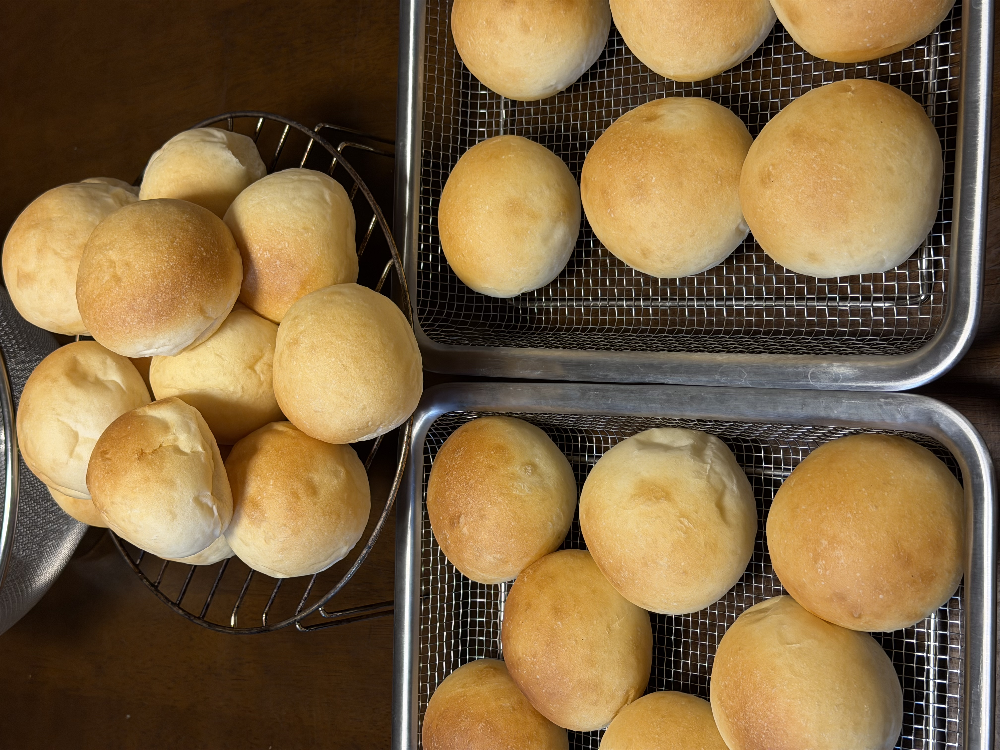

[10回目]()までの丸パン運用（50g×18個）から、今回は**生地量を1.2倍**にして40g×27個に変更。同時に**イーストも金サフに切り替え**（とかち野を使い切ったため）。運用リズムは変えず、個数を増やす方向。

## 今回の検証ポイント

1. **生地量1.2倍**: 粉500g → **600g**（KN-1000の上限1000gの6割程度で余裕）
2. **サイズ変更**: 50g → **40g**、やや小さめ食卓パン
3. **イースト変更**: とかち野 予備発酵タイプ → **金サフ（インスタント）**
4. **工程変更**: 予備発酵不要に

| | 10回目まで | 今回（11回目） |
|---|---|---|
| 粉量 | 500g | **600g（1.2倍）** |
| 1個の重量 | 50g | **40g** |
| 個数 | 18個 | **27個** |
| イースト | とかち野 予備発酵 | **金サフ インスタント** |
| 予備発酵工程 | あり | **なし** |

## 金サフの特徴

インスタントドライイーストで、これまでの予備発酵タイプとは使い方が異なる:

- **予備発酵不要**: 粉に直接混ぜる
- **糖分耐性が高い**: リッチ生地に強い
- **発酵力が強い**: とかち野より少ない量でOK（粉比1.2〜1.3%）

## 条件

| 項目 | 値 |
|---|---|
| 開始時刻 | 18:00 |
| 室温 | 25℃ |
| 湿度 | 78%（梅雨、高湿度） |
| 天気 | <!-- TODO --> |
| 日付 | 7/4 |

**室温25℃・湿度78%は発酵向きの条件**。10回目の気付き（湿度が焼き色に影響）を踏まえ、今回は霧吹きも意識的に試す予定。

## 配合（1.2倍、金サフ対応）

| 材料 | 分量 | 粉比 |
|---|---:|---:|
| ニップン ゆめちからブレンド | 600 g | 100% |
| 砂糖 | 30 g | 5.0% |
| 塩 | 8.4 g | 1.4% |
| 金サフ（インスタント） | 7〜8 g | 1.2〜1.3% |
| 牛乳 | 250 g | 41.7% |
| 水 | 170 g | 28.3% |
| 無塩バター（常温戻し） | 60 g | 10% |

水分合計: 420g（70%）→ 元レシピの水分比率を維持

## 工程

1. **一次こね**: ニーダー（KN-1000）に粉・砂糖・塩・**金サフ**を入れ、牛乳・水を加えて10分こね。
   - 予備発酵工程なし、金サフは粉と直接混ぜる
   - **注意**: 塩と金サフが直接触れないよう、粉と先に混ぜてから入れる
2. **バター投入**: 常温に戻した無塩バターを入れ、さらに5分こね。
3. **一次発酵**: オーブンの発酵機能、35℃ で 45分。
4. **分割・ベンチタイム**: **40g × 27個**に分割、軽く丸めてベンチタイム15分。
5. **成形**: 一個ずつ丁寧に丸め直し、表面をピンと張らせる。
6. **霧吹き + 二次発酵**: 天板に並べたら**霧吹きで表面を軽く湿らせる**、35℃で 28〜38分（40gサイズは少し早め）。
7. **焼成**: コンベック190℃ で **9〜11分**（40gサイズは少し短めから様子見）。1回15個 × 2回で焼成。

## 40gサイズの注意点

50gから40gへの変更で予想される変化:

- **焼き時間短縮**: 10〜12分 → **9〜11分**、様子を見て調整
- **二次発酵早い**: 表面積/体積比が上がるので発酵も早い
- **乾燥しやすい**: 霧吹き効果がより重要
- **クラスト比率高め**: サクッと感が増す

## 観察ポイント

- [ ] 金サフ + 予備発酵なしで生地の膨らみが問題ないか
- [ ] とかち野との発酵速度の違い
- [ ] 40gサイズの二次発酵時間の見極め
- [ ] 焼き時間9〜11分の中間値がベストか
- [ ] **霧吹き効果**: 10回目より焼き色が改善するか
- [ ] 1回15個 × 2回の運用が予定通り回るか

## 進行ログ

### 一次発酵完了（35℃・40分）

**予定の45分より5分早く綺麗に膨らんだ**ため、40分で分割へ移行。金サフの発酵力の速さがすでに現れている可能性。

- 従来の「とかち野 予備発酵タイプ」だと45分が標準
- **金サフでは40分でも十分**というのが今回の観察
- 二次発酵も同様に短めで見極める必要あり

## 仕上がり

**27個全部焼き上がり、家族が数日楽しめる量に。**

- **形が丸くて均一**、40gサイズがしっかり定着
- ふっくらとした膨らみ、金サフの発酵力が確認できる仕上がり
- **霧吹き効果**が焼き色にプラス（10回目より色付き良好）
- 表面に若干のフィッシュアイ（斑点状の色ムラ）あり、成形時のガス or 霧吹きムラが原因の可能性

### ターンごとの記録

| ターン | 二次発酵 | 焼成 | 仕上がり |
|---|---|---|---|
| 1 | 30分 | 8+2分 = 10分 | しっかりめの焼き色 |
| 2 | 20分（1ターン焼成中） | 8+2分 = 10分 | やや白っぽい個体あり |

## 振り返り

### 仮説検証の結果

| 項目 | 想定 | 結果 |
|---|---|---|
| 生地量1.2倍（粉600g） | KN-1000で問題なく捏ねられる | ◎ |
| 金サフ切り替え | 発酵速度アップ | 一次40分で完了 ✓ |
| 40gサイズ | 焼き時間短縮9〜11分 | **10分（8+2）で確定** ✓ |
| **霧吹き実施** | 焼き色改善 | ◎ 10回目より明らかに良好 |
| 27個の運用 | 15個×2回焼成で回る | ◎ |

### 確定したパラメータ

- **粉600g・分割40g・27個**の生地量が現在のニーダー運用の理想値
- **金サフ 7〜8g**（粉比1.2〜1.3%）で予備発酵不要、発酵速度アップ
- **焼成: コンベック190℃で10分**（8分チェック+2分追加）
- **霧吹きを二次発酵前に必ず実施**（湿度要因の対策）

### 気付き

**1ターン目と2ターン目で焼き色に差が出た**:

- 1ターン目の発酵30分 vs 2ターン目の発酵20分（1ターン焼成中の待機時間）
- 発酵時間差が焼き色の素材（糖分解）に影響した可能性
- 次回は2ターン目も**25分以上の発酵**を確保すると均一になるかも

**フィッシュアイ（斑点状の色ムラ）**:

- 表面に小さな白い点々が散らばる箇所あり
- 原因候補: 成形時の閉じ込めガス / 霧吹きの水滴ムラ / バターの偏り
- 次回は霧吹きをより細かい霧で、成形時のガス抜きを丁寧に

## 次回に向けてのメモ

- [ ] 27個運用を継続、粉600g・分割40gを定番化
- [ ] 2ターン目の二次発酵を**25分以上**確保して焼き色均一化
- [ ] **細かい霧の霧吹き**でフィッシュアイ対策
- [ ] 成形時のガス抜きを丁寧に
- [ ] 金サフの適正量（7g or 8g）を次回の記事で確定させる
- [ ] KN-1000の外れた足を修理（大正電機 0120-357-515）
- [ ] 断面写真で気泡の様子を記録
