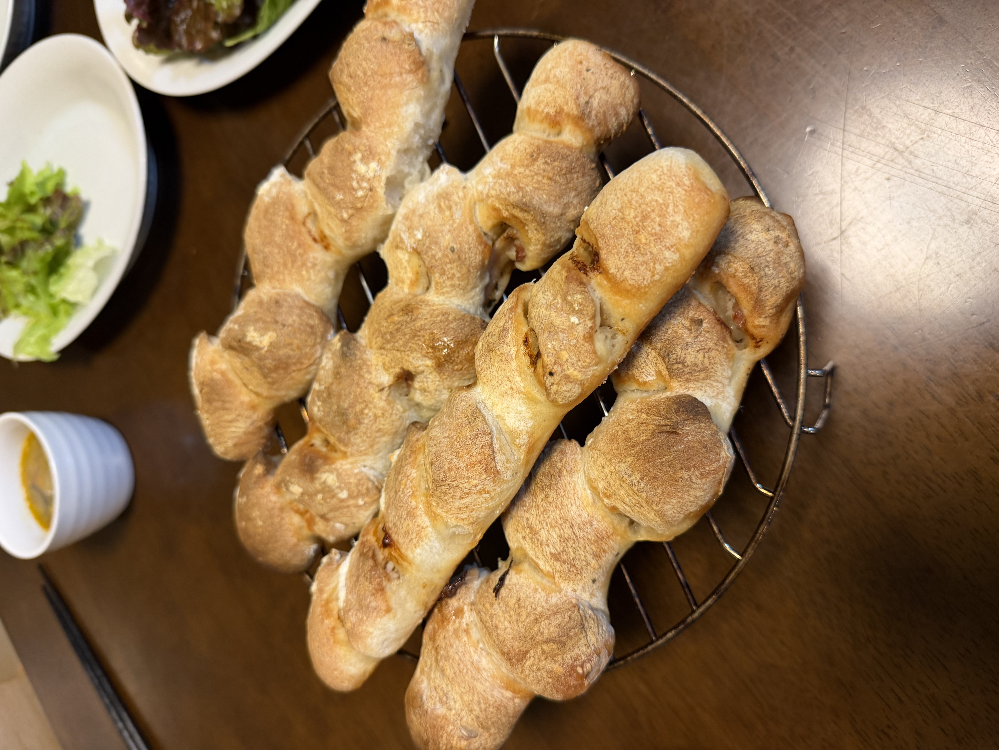

11回目までは食パン・丸パンなどソフト系が中心だったが、今回は**ハード系のベーコンエピ**に初挑戦。プロフーズから**モルトパウダー**と**0.1g精密スケール**が届き、本格派の配合が組めるようになった。

## 今回の検証ポイント

1. **初めてのハード系パン**: リッチ系ソフトからリーン系ハードへの転換
2. **リスドォル100%**: 準強力粉の使用感を確認
3. **モルトパウダー0.3%**: 0.1gスケールでの精密計量
4. **金サフ少量（0.6%）**: リーン系はイーストを少なくしてゆっくり発酵
5. **ベーコンエピの穂状成形**: キッチンばさみで45度カット

## 予想される変化（食パン系との違い）

- **リーン系**: 砂糖・バター・牛乳なしで水と粉のみ、素材の味が前面に
- **クラストがパリッと**: 高温焼成で香ばしい皮
- **クラムに大きな気泡**: ハード系特有の穴あきクラム
- **加水68%**: 食パンより高加水、扱いにコツが必要

## 条件

| 項目 | 値 |
|---|---|
| 開始時刻 | 16:00 |
| 室温 | 26.2℃ |
| 湿度 | 82%（梅雨、雨天） |
| 天気 | 雨 |
| 日付 | 7/5 |

**室温26.2℃・湿度82%は発酵にとって好条件**。むしろ発酵が早く進む可能性があるので、90分の一次発酵時間は生地の様子を見ながら短縮も検討。

## 配合（5本ぶん、粉500g）

| 材料 | 分量 | 粉比 |
|---|---:|---:|
| リスドォル（準強力粉） | 500 g | 100% |
| 塩 | 10 g | 2.0% |
| 金サフ（インスタント） | 3 g | 0.6% |
| **モルトパウダー** | **1.5 g** | **0.3%** |
| 水 | 340 g | 68% |
| ハーフスライスベーコン | 10〜15枚 | 1本2〜3枚 |
| 粗挽き黒胡椒 | 適量 | 巻き込み用 |

## 工程

1. **粉類混合**: ニーダーにリスドォル・塩・金サフ・モルトを入れて軽く混ぜる
   - 塩と金サフは直接触れないよう、粉と先に混ぜる
   - モルトパウダーは0.1gスケールで正確に1.5g計量
2. **一次こね**: 水340gを加えて10〜12分こね（食パンより短め、グルテン出しすぎない）
3. **一次発酵**: **27〜28℃で90分**（今回はシンプルにパンチなし）
4. **分割**: 5等分（約170gずつ）、軽く丸めてベンチタイム20分
5. **成形**:
   - 生地を長方形（15×20cm）に手で伸ばす
   - ベーコン2〜3枚を並べ、粗挽き胡椒を散らす
   - 手前からきっちり巻いて、閉じ目を下に
6. **二次発酵**: 27〜28℃で **40〜50分**
7. **クープ（穂状カット）**:
   - キッチンばさみを**45度に寝かせて**深く切り込みを入れる
   - 左右交互に開いていく（麦の穂の形になる）
   - 5〜7箇所くらいカット
8. **焼成**: **コンベック240℃で20〜25分**（追い水なし）

## 成形のコツ

- 生地を伸ばす前に打ち粉を軽く（多すぎると生地同士がくっつかない）
- ベーコンは**端まで並べない**（1cm程度余白を残す、巻き終わりが弱くなる）
- 巻いた後、閉じ目を指でしっかり閉じる
- 二次発酵後の生地は柔らかいので、キッチンばさみは**思い切って深く**

## 観察ポイント

- [ ] リスドォル生地の感触（食パン生地との違い）
- [ ] 加水68%生地のハンドリング
- [ ] モルトパウダーの効果（焼き色・香り）
- [ ] 一次発酵90分での膨らみ具合
- [ ] 成形での巻き加減（きつすぎず緩すぎず）
- [ ] 穂状カットの成功度合い
- [ ] 240℃焼成でのクラスト・クラムの仕上がり
- [ ] ベーコンの塩気と胡椒の風味の調和

## 仕上がり

**初回で見事な穂状のベーコンエピが5本焼き上がった**。食卓に並べて家族と一緒に食事へ。

- **穂の形がしっかり出ている**: キッチンばさみの切り込みが機能、初回とは思えない仕上がり
- **クラストが本格フランスパンの色**: まだらな焼き色でハード系らしい表情
- **ゴツゴツした表面**: リスドォル+モルトパウダーの効果、砂糖なしのリーン系ならでは
- **ベーコンが穂の隙間から顔を出す**: 巻き加減も適切だった

### 家族の評価

**「外はカリッと中はもっちりで大好評」** ✓

- クラスト（皮）のパリッと感 ◎
- クラム（中身）のもっちり食感 ◎
- **ベーコンへの粗挽き胡椒のアクセントが特に好評**、味の締めに効いた
- 5本作ったが食卓での勢いが良く、あっという間になくなる勢い

## 振り返り

### 仮説検証の結果

| 項目 | 想定 | 結果 |
|---|---|---|
| ハード系初挑戦 | 難易度高め | ◎ 見事にクリア |
| リスドォル100% | 準強力粉の使用感確認 | もちもち+パリッとの両立 |
| モルトパウダー0.3% | 焼き色・香り促進 | ◎ 本格的な焼き色 |
| 金サフ0.6% | 少量でゆっくり発酵 | ◎ 一次90分でちょうど良い膨らみ |
| 加水68% | 高加水でクラム気泡出す | ◎ もっちり食感 |
| **穂状カット** | 45度深めに切る | **◎ 初回で綺麗に開いた** |
| 240℃焼成 | パリッと仕上げる | ◎ クラストの理想形 |
| ベーコン+胡椒 | 味のアクセント | ◎ 家族評価特に高い |

### 確定したベーコンエピレシピ

**初回で成功したので、これを定番として確定**:

- リスドォル 500g、塩10g、金サフ3g、モルトパウダー1.5g、水340g（加水68%）
- 一次発酵 27〜28℃で90分
- 5等分（約170g）、ベンチタイム20分
- 成形: 15×20cm長方形にベーコン2〜3枚+粗挽き胡椒、手前から巻く
- 二次発酵 27〜28℃で40分
- キッチンばさみで45度深めにカット
- コンベック240℃で20分

### 難儀した点

**加水68%のリスドォル生地の扱いにくさ**:
- 食パン生地とは別物、かなり水っぽく感じる
- 成形時のベタつきが強い
- 打ち粉多めで対応した

**改善案**（次回試したい）:
- 加水を65%に下げて扱いやすさを取る
- 打ち粉に強力粉ではなくセモリナ粉を使う（表面のパリッと感アップ）
- オートリーゼ（粉と水だけで先に30分休ませる）で扱いやすくする手も

## 次回に向けてのメモ

- [ ] このレシピを**ベーコンエピの定番として確定**
- [ ] 加水を65%に下げて成形しやすさを比較
- [ ] オートリーゼを取り入れて生地扱いを改善
- [ ] ラム酒漬けレーズン入りエピなどアレンジも試したい
- [ ] クルミ+チーズ、オリーブ+ハーブなど具材バリエーション
- [ ] クープ（穂状カット）の写真を撮る（成形の記録）
- [ ] 断面写真でクラム気泡を記録
