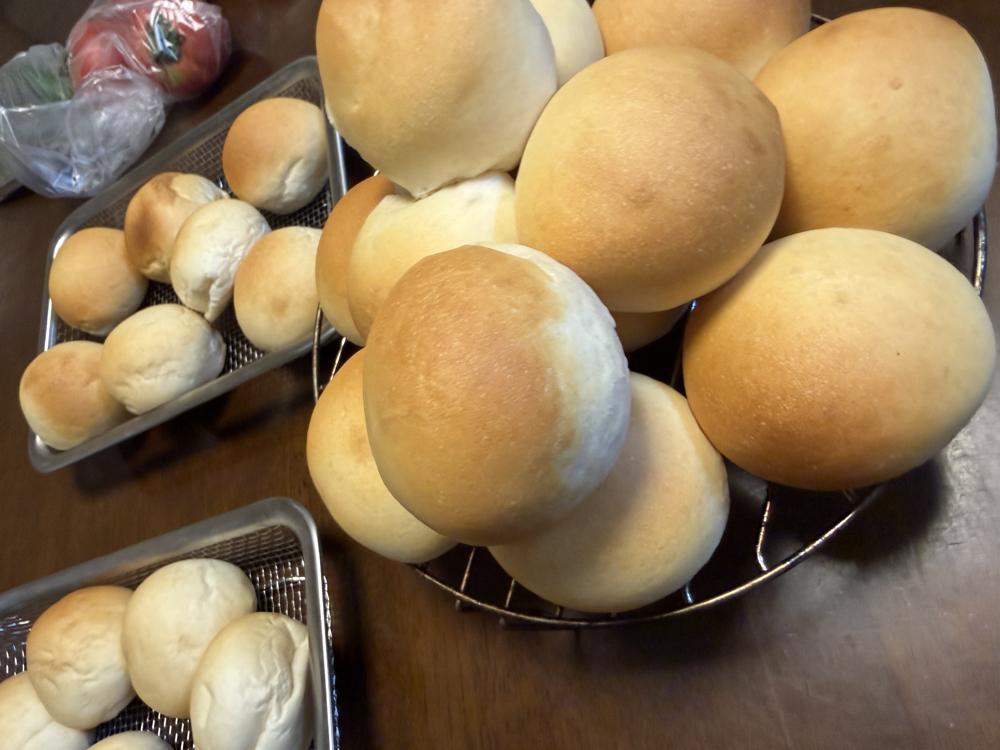

[11回目]()で確立した丸パンの定番運用を再現する回。粉は**富澤商店の春よ恋100%**で、8回目・9回目で使ったプロフーズの春よ恋との差が出るかも気になるところ。

## 今回の検証ポイント

1. **11回目の定番運用の再現性**: 粉600g・40g×27個の運用が安定して回るか
2. **金サフを6gに減量**: 高温環境（28.4℃）で少量ゆっくり発酵の効果を検証
3. **富澤商店 春よ恋の使用感**: プロフーズの同品種との比較
4. **霧吹き習慣の継続**: 10回目の気付き（湿度が焼き色に影響）を実践

## 条件

| 項目 | 値 |
|---|---|
| 開始時刻 | 22:00 |
| 室温 | 28.4℃ |
| 湿度 | 74% |
| 天気 | 晴れ |
| 日付 | 7/11 |

**室温28.4℃は過去最高レベル**、梅雨明け前後の暑さ。発酵が速く進む可能性があるので、一次発酵は生地の様子を見ながら短縮も検討。

## 配合（11回目の定番、粉600g）

| 材料 | 分量 | 粉比 |
|---|---:|---:|
| 富澤商店 春よ恋 | 600 g | 100% |
| 砂糖 | 30 g | 5.0% |
| 塩 | 8.4 g | 1.4% |
| 金サフ（インスタント） | 6 g | 1.0% |
| 牛乳 | 250 g | 41.7% |
| 水 | 170 g | 28.3% |
| 無塩バター（常温戻し） | 60 g | 10% |

## 工程

1. **一次こね**: KN-1000に粉・砂糖・塩・金サフを入れ、牛乳・水を加えて10分こね。
   - 塩と金サフは直接触れないよう、粉と先に混ぜる
2. **バター投入**: 常温に戻した無塩バターを入れ、さらに5分こね。
3. **一次発酵**: オーブンの発酵機能、35℃ で **40〜45分**（金サフ6gなので気持ち長めから見る、室温高いので短縮も検討）。
4. **分割・ベンチタイム**: 40g × 27個に分割、軽く丸めてベンチタイム15分。
5. **成形**: 丸めるだけ、表面をピンと張らせる。
6. **霧吹き + 二次発酵**: 天板に並べたら霧吹きで表面を軽く湿らせる、35℃で 25〜30分（室温高め+金サフの速さで短めから見る）。
7. **焼成**: コンベック190℃ で 10分（8+2）。1回15個 × 2回で焼成。

## 観察ポイント

- [ ] 金サフ6gでの発酵速度（7〜8gとの比較）
- [ ] 富澤商店 春よ恋の使用感（プロフーズとの違い）
- [ ] 室温28.4℃での発酵速度（過去最高の環境）
- [ ] 11回目のフィッシュアイ（色ムラ）は改善するか
- [ ] 2ターン目の焼き色を1ターン目と揃えられるか

## 進行ログ

### 発酵時間の実績

- **一次発酵**: 35℃で **40分**
- **二次発酵**: 35℃で **35分**

金サフ6g（11回目より減量）+ 室温28.4℃（過去最高）の組み合わせは、結果的に11回目（金サフ7〜8g・一次40分・二次30分）とほぼ同じリズムに落ち着いた。イースト減量と高温の効果が相殺した形。

**知見**: 金サフの適正量は環境に応じて調整可能。夏場（室温28℃以上）は**6g（粉比1.0%）**、通常時は**7g（粉比1.17%）**が目安として使い分けできそう。

## 仕上がり

**27個綺麗に焼き上がり**。

- 手前の丸ザル（1ターン目）: **きれいなきつね色**、焼き色は理想的
- 奥のメッシュトレイ（2ターン目）: **焼き色がやや薄く白っぽい**
- 形はふっくら均一、40gサイズの安定運用が定着
- **フィッシュアイ（斑点色ムラ）は今回ほぼ見られない** → 霧吹きの精度が上がった
- **1ターン目と2ターン目の焼き色差は11回目と同じパターン**で再現（2ターン目の発酵時間短さ影響）

### 味の所見

**塩味がやや強めに感じられた**（美味しく食べられる範囲ではある）。

考察:

- 塩の粉比は11回目と同じ1.4% → 塩そのものの量は変わらないはず
- **富澤商店の春よ恋の風味特性**（プロフーズと比べて粉の甘みや旨みが控えめだと相対的に塩気が前に出る）が影響した可能性
- **金サフ6gの減量**で発酵の旨味成分が控えめになった可能性
- **室温28.4℃で発酵時間が短めだった**ため、熟成による風味の複雑さが少なめで、塩がクリアに主張した

## 振り返り

### 仮説検証の結果

| 項目 | 想定 | 結果 |
|---|---|---|
| 11回目の定番運用の再現性 | 安定して回る | ◎ |
| 金サフ6gでの発酵 | 7〜8gよりゆっくり | 一次40分・二次35分でOK |
| 富澤商店 春よ恋 | プロフーズとの差 | **塩気がやや前に出る傾向** |
| 高温環境（28.4℃）での発酵 | 過発酵リスク | ◎ 金サフ6gと相殺、問題なし |
| 霧吹き効果 | フィッシュアイ抑制 | ◎ 11回目より改善 |

### 新しい発見

**富澤商店の春よ恋はプロフーズより風味が控えめかも**:
- 同じ配合で塩気がストレートに感じられる
- 粉自体の甘み・旨みが少ないぶん、塩や砂糖の量で味の調整が必要かも
- ただし個体差の可能性もあるので次回以降で再検証

## 次回に向けてのメモ

- [ ] 塩を7g（粉比1.17%）に減らして富澤春よ恋向けの調整を試す
- [ ] または砂糖を35gに増やして甘みで塩味を和らげる
- [ ] 一次発酵を50分に伸ばして旨味成分の生成を促す実験
- [ ] プロフーズ春よ恋を購入して同条件で焼き、比較する
- [ ] 2ターン目の焼き色対策として、発酵時間の均等化を再検討
