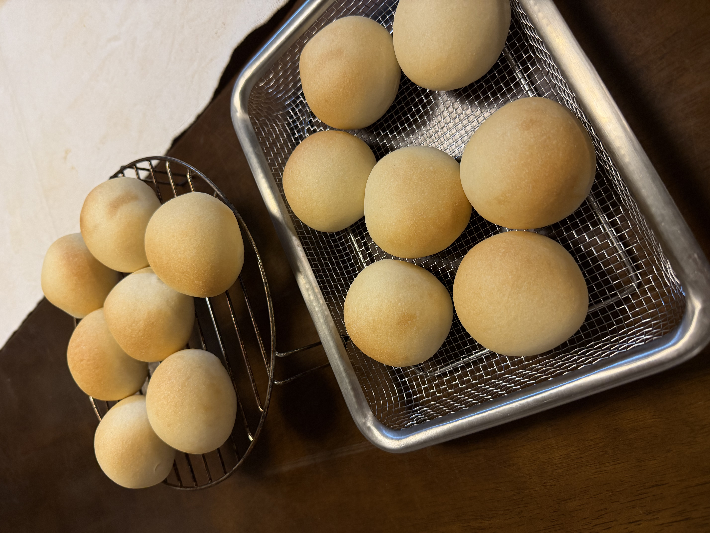

[13回目]()で塩気がやや強く感じられた反省から、塩を**8.4g→7g**（粉比1.4%→1.17%）に減量。加えて、気付いた点として**無塩バターの銘柄が四葉→大山に切り替わっていた**ため、この影響も記録する。

## 今回の検証ポイント

1. **塩の減量**: 8.4g → **7g**（粉比1.17%）で塩気の調整
2. **バター銘柄の変化**: 四葉（十勝）→ **大山（鳥取）**の影響
3. **エアコン下の発酵環境**: 26.9℃・湿度55%の安定環境

## 予想される変化

**塩減量の影響**:
- 塩気がマイルドに
- ただし発酵のコントロール（塩はイーストの働きを抑制する役割）が微妙に変わる可能性
- 発酵が気持ち早まるかも

**バター銘柄の影響**（推察）:
- 四葉はミルク感がリッチで風味豊か（コク深め）
- 大山はあっさり系でクリーミー（上品で軽やか）
- 無塩同士なので塩そのものは変わらないが、**バターの風味量の違いが塩気の感じ方に間接的に影響**する可能性

**エアコン下の発酵環境**:
- 昨日（28.4℃・74%）より低温低湿で発酵が安定
- 過発酵リスクなし
- 霧吹きは引き続き有効な湿度（55%）

## 条件

| 項目 | 値 |
|---|---|
| 開始時刻 | 18:00 |
| 室温 | 26.9℃（エアコン稼働中） |
| 湿度 | 55% |
| 天気 | 晴れ |
| 日付 | 7/12 |

## 配合（13回目から塩のみ減量）

| 材料 | 分量 | 粉比 | 13回目比 |
|---|---:|---:|---|
| 富澤商店 春よ恋 | 600 g | 100% | 同じ |
| 砂糖 | 30 g | 5.0% | 同じ |
| **塩** | **7 g** | **1.17%** | **↓ 8.4g→7g** |
| 金サフ（インスタント） | 6 g | 1.0% | 同じ |
| 牛乳 | 250 g | 41.7% | 同じ |
| 水 | 170 g | 28.3% | 同じ |
| **無塩バター（大山）** | 60 g | 10% | **銘柄変更** |

## 工程

1. **一次こね**: KN-1000に粉・砂糖・塩・金サフを入れ、牛乳・水を加えて10分こね。
2. **バター投入**: 大山の無塩バターを常温に戻してから投入、さらに5分こね。
3. **一次発酵**: 35℃で40〜45分（13回目と同じリズムを想定）。
4. **分割・ベンチタイム**: 40g × 27個に分割、ベンチタイム15分。
5. **成形**: 丸めるだけ、表面をピンと張らせる。
6. **霧吹き + 二次発酵**: 天板に並べて霧吹き、35℃で 30〜35分。
7. **焼成**: コンベック190℃ で 10分（8+2）。15個×2ターン。

## 観察ポイント

- [ ] 塩7gで塩味がちょうど良くなるか
- [ ] 大山バターの生地への影響（風味・食感）
- [ ] 塩減量で発酵が早まるか
- [ ] エアコン下の安定環境での焼き上がり

## 仕上がり

- **焼き色は淡いきつね色**、13回目より薄め
- 形はふっくら綺麗、膨らみは十分
- 表面ツヤあり、霧吹きは効いている
- 1ターン目・2ターン目ともに焼き色は控えめ

### 味の評価

**「塩加減が絶妙、味はシンプル系だがベストバランス」** ✓

- 塩味が13回目の強めから**理想的なバランス**に着地
- 味はシンプル系だが、余計な尖りがなく粉本来の風味と塩気が調和
- **パン単体で美味しく、具材（バター・ジャム・ハムなど）と合わせても喧嘩しない汎用性**

## 振り返り

### 仮説検証の結果

| 項目 | 想定 | 結果 |
|---|---|---|
| 塩7g（1.17%）への減量 | 塩気マイルドに | **◎ ベストバランス** |
| バター銘柄変更（大山） | 影響不明 | 明確な差は感じず |
| エアコン下の発酵 | 過発酵リスクなし | ◎ 安定発酵 |
| 焼き色 | 従来通り期待 | **✗ 薄めになった** |

### 大きな発見: 塩と焼き色の関係

**「塩味絶妙・味シンプル」と「焼き色薄め」はセットで発生**:

- 塩を減らす → イースト抑制が弱まる → 発酵がスムーズに進む
- スムーズな発酵 → 生地内の糖が消費されやすい → 焼き色の素材（還元糖）が少なめに
- 結果: メイラード反応が控えめ → クラストの色付き・複雑な風味成分ともに薄めに
- **味の傾向とクラスト色は因果的に繋がっている**

**焼き色が濃い** = 味も複雑・力強い
**焼き色が薄い** = 味もシンプル・素直

つまり「シンプルで塩加減絶妙」という評価は、焼き色薄めと表裏一体。**「素材の味が素直に出る配合」の完成**とも言える。

### 確定した新定番レシピ（春よ恋用）

- 富澤商店 春よ恋 600g
- 砂糖 30g（粉比5%）
- **塩 7g（粉比1.17%）** ← 変更ポイント
- 金サフ 6g（粉比1.0%）
- 牛乳 250g、水 170g（合計加水70%）
- 無塩バター 60g（銘柄問わず）
- コンベック190℃で10分（8+2）

## 次回に向けてのメモ

- [ ] このレシピを**春よ恋用の新定番として確定**
- [ ] もう少し焼き色欲しいなら焼成+1〜2分または200℃に上げる選択肢
- [ ] 一次発酵を50分に延長して風味の複雑さを増す実験（味シンプル系維持しつつ）
- [ ] 他の粉（ゆめちからブレンド等）でも塩7gが最適か検証
- [ ] 断面写真でクラム気泡を記録
