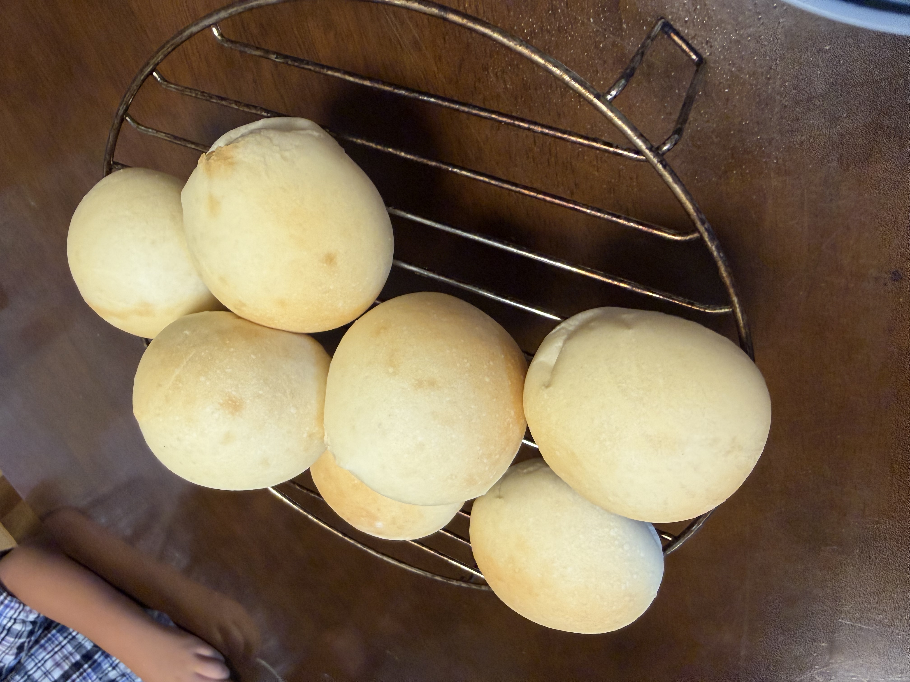
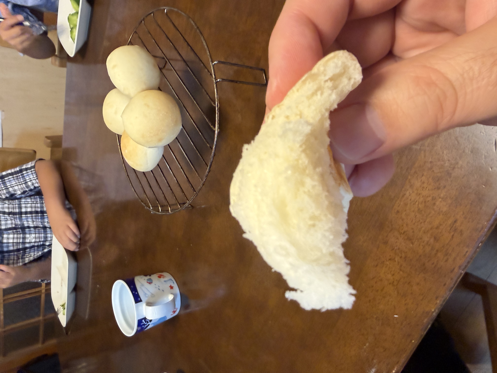

[14回目]()から6日空いて、今夜7月18日23時から仕込みを始める。今から焼くには遅いので、**オーバーナイト発酵**を初めて試す。低温長時間発酵の風味アップと、14回目の課題だった**焼き色薄めの改善**も期待。

さらに準備中に**春よ恋が380gしか残っていない**ことが発覚。ベーコンエピ用に買っていた**リスドォル220gを混ぜて600gにする**という思わぬブレンド構成になった。

## 今回の検証ポイント

1. **オーバーナイト発酵初挑戦**: 冷蔵庫で7〜8時間の低温長時間発酵
2. **春よ恋+リスドォルのブレンド初挑戦**: 強力粉63% + 準強力粉37%
3. **金サフを3gに減量**: 6g → **3g**（1袋ぶん、粉比0.5%）
4. **深夜仕込み→朝焼きの運用**: 家事の分散と朝の焼きたて実現
5. **風味と焼き色の変化**: 14回目のシンプル系からの発展

## オーバーナイト発酵とは

一次発酵を冷蔵庫（4〜6℃）で長時間行う方法。イーストの活動を極めてゆっくりにして、7〜24時間かけて発酵させる。

**期待される効果**:
- 低温長時間発酵で乳酸菌や酵素が働き、**深い味わい**に
- 糖分解がじっくり進むので還元糖が増える → **焼き色が濃くなる**
- 生地が扱いやすい（冷えた生地はベタつきにくい）
- **朝焼きたてが食べられる**

## 条件

| 項目 | 値 |
|---|---|
| 仕込み開始 | 23:00 |
| 焼成予定 | 翌朝 6:00〜7:00 |
| 冷蔵庫時間 | 約7〜8時間 |
| 室温 | 28.1℃（エアコン稼働中） |
| 湿度 | 62% |
| 冷蔵庫温度 | 約4〜6℃ |
| 日付 | 7/18〜7/19 |

## 配合（14回目ベース、粉不足でブレンド + 金サフ減量）

| 材料 | 分量 | 粉比 | 14回目比 |
|---|---:|---:|---|
| 富澤商店 春よ恋 | 380 g | 63% | **↓ 600→380g** |
| **リスドォル** | **220 g** | **37%** | **新規追加** |
| 砂糖 | 30 g | 5.0% | 同じ |
| 塩 | 7 g | 1.17% | 同じ（14回目確定値） |
| **金サフ** | **3 g** | **0.5%** | **↓ 6g→3g（1袋ぶん）** |
| 牛乳 | 250 g | 41.7% | 同じ |
| 水 | 170 g | 28.3% | 同じ |
| 無塩バター（大山） | 60 g | 10% | 同じ |

## ブレンド構成の予想される特徴

- 春よ恋（強力粉、タンパク約11.5%）+ リスドォル（準強力粉、タンパク約10.7%）
- 平均タンパク質が下がる → **やや軽やかな食感**に
- 春よ恋のもっちり感 + リスドォルの歯切れの良さ
- クラストがやや**パリッと**する方向
- オーバーナイト発酵との相性◎（リスドォル特有の風味が長時間発酵で引き出される）

## 工程

### 今夜（7/18 23:00〜）

1. **一次こね**: KN-1000で10分こね
2. **バター投入**: 大山バターを常温戻し済み、さらに5分こね
3. **冷蔵庫へ**: 予備発酵なしで、そのままラップして冷蔵庫へ（23:45頃）

### 明朝（7/19 6:00〜）

5. **冷蔵庫から出す**: 発酵状態を確認、2倍程度に膨らんでいればOK
6. **室温復温**: 30分放置（生地を扱いやすい温度に戻す）
7. **分割・ベンチタイム**: 40g × 27個、ベンチタイム15分
8. **成形**: 丸めるだけ、表面をピンと張らせる
9. **霧吹き + 二次発酵**: 天板に並べて霧吹き、35℃で30〜40分
10. **焼成**: コンベック190℃で 10分（8+2）、15個×2ターン

## 観察ポイント

- [ ] 冷蔵庫で7〜8時間の発酵度合い（膨らみ、生地の状態）
- [ ] 生地の扱いやすさ（14回目より扱いやすいか）
- [ ] **焼き色が14回目より濃くなるか**（オーバーナイトの主目的の一つ）
- [ ] 風味の変化（14回目のシンプル系からの変化）
- [ ] 朝焼きたての家族評価
- [ ] 金サフ3g（1袋）で長時間発酵が成立するか
- [ ] **春よ恋+リスドォルブレンドの食感**（もっちりと歯切れの両立）
- [ ] クラストがパリッとする方向に振れるか

## 注意点・失敗パターン

- **冷蔵庫が暖かめだと過発酵**: 野菜室ではなく通常庫内へ
- **金サフ3g（粉比0.5%）は少なめだが十分**: 一般的なオーバーナイト発酵の下限に近い値、1袋分でちょうど使い切り
- **朝の復温時間を短縮しすぎない**: 冷えた生地は扱いにくい、30分は確保
- **二次発酵の見極めが重要**: 生地が冷えてる分、発酵が遅めに進む可能性

## 仕上がり

**朝焼きたてを家族と一緒に朝食**。オーバーナイト発酵初挑戦、無事成功。

- **クラム（中身）の気泡が細かくてふわふわ** → オーバーナイト発酵の本領発揮
- 手で軽くちぎれる柔らかさ
- 断面が真っ白で美しい、リスドォル混合の効果か
- 表面は滑らか、ツヤあり
- 焼き色は**14回目と同じく淡いきつね色**（塩7g + 金サフ3g + 冷蔵庫発酵の相乗効果）
- 形はふっくら綺麗、膨らみは十分

### 家族の評価

**「食感も味もベスト、家族も大好評」** ✓ ✓

- 朝焼きたての幸福感
- クラムのしっとりふわふわ食感
- 塩加減も引き続き好バランス
- リスドォル混合の風味も自然に馴染む

## 振り返り

### 仮説検証の結果

| 項目 | 想定 | 結果 |
|---|---|---|
| **オーバーナイト発酵** | 風味アップ+焼き色改善 | **味◎ / 焼き色は改善せず** |
| **春よ恋+リスドォルブレンド** | 軽やか+歯切れの両立 | ◎ 違和感なく仕上がる |
| **金サフ3g（1袋）** | 長時間発酵の下限 | ◎ 十分に発酵 |
| **深夜仕込み→朝焼きの運用** | 家事分散 | **◎ 朝食に焼きたてが実現** |
| **クラムの繊細さ** | 気泡細かく | ◎ オーバーナイトの本領発揮 |

### 大きな発見

**焼き色は薄いまま**だったが、**「味・食感の完成度が段違い」**という別次元の成果:

- 14回目（塩7g + 通常発酵）でも「シンプルで塩加減絶妙」だったが
- 15回目（塩7g + オーバーナイト）は「食感も味もベスト」に進化
- 焼き色の濃淡と味の完成度は**別軸で評価すべき**という気付き

つまり:
- **焼き色濃い = 香ばしさが強い**（力強い味）
- **焼き色薄い = クラストが薄い**（クラムが主役、繊細な味）

オーバーナイト発酵は**クラム主役の繊細系パン**に振り切る方向で完成度が高まった。

### イースト臭が少ないという新しい気付き

食べていて感じたのが **「イースト臭が少なめ」** という点。オーバーナイト発酵の仕組みからすると理にかなっている:

**イースト量が少ない → 副産物の絶対量が少ない**:
- イースト（サッカロマイセス）は発酵時にエタノール、アセトアルデヒド、硫化水素、アセトン系ケトンなどの副産物を生成
- これらが「イーストっぽい香り」の正体
- 3g（半量）なので、そもそも生成量が半分に

**低温長時間発酵で副産物が抜ける**:
- 冷蔵庫内で7時間かけてゆっくり発酵
- 揮発性の高い成分（アルコール、アセトアルデヒド）が時間経過で自然に飛ぶ
- 一方で乳酸菌や酵素が働いて**旨味・香ばしい香り**が生成される

**バランスが逆転**:
- 通常発酵: イースト臭 > 旨味成分
- オーバーナイト: **旨味成分 > イースト臭**

つまり「イースト臭が少ない=雑味が消えて素材の風味が前に出る」現象。プロのパン屋が低温長時間発酵を好む理由の一つがこれ。

### 新運用の位置づけ

**深夜仕込み→朝焼き**は生活パターンに完全にハマった:

- 前日夜: 23時にニーダー10+5分捏ね、そのまま冷蔵庫へ
- 翌朝: 復温30分、分割・成形、二次発酵、焼成
- **朝食に焼きたてが並ぶ**という家庭の理想が実現

これは家族にとって最高の朝食体験。焼き色が薄いことより、この体験価値の方が圧倒的に大きい。

## 次回に向けてのメモ

- [ ] **オーバーナイト発酵を新定番運用として確定**
- [ ] **焼く前の生地の匂いを意識して嗅ぐ**（ヨーグルト系の酸味、フルーティーな甘い香り、麦の穀物香が混ざった「熟成香」を体感）
- [ ] 春よ恋100%（600g）でオーバーナイトを試して、リスドォル混合との比較
- [ ] 焼き色欲しい場合は焼成温度を195℃に上げる or 焼成時間+2分
- [ ] クラムの気泡・しっとり感の断面写真を記録
- [ ] ゆめちからブレンド、キタノカオリなど他の粉でもオーバーナイト実験
- [ ] 冷蔵庫時間を延ばす（12時間、24時間）と味がどう変わるか
- [ ] イースト量をさらに減らす実験（2gまで下げられるか）
