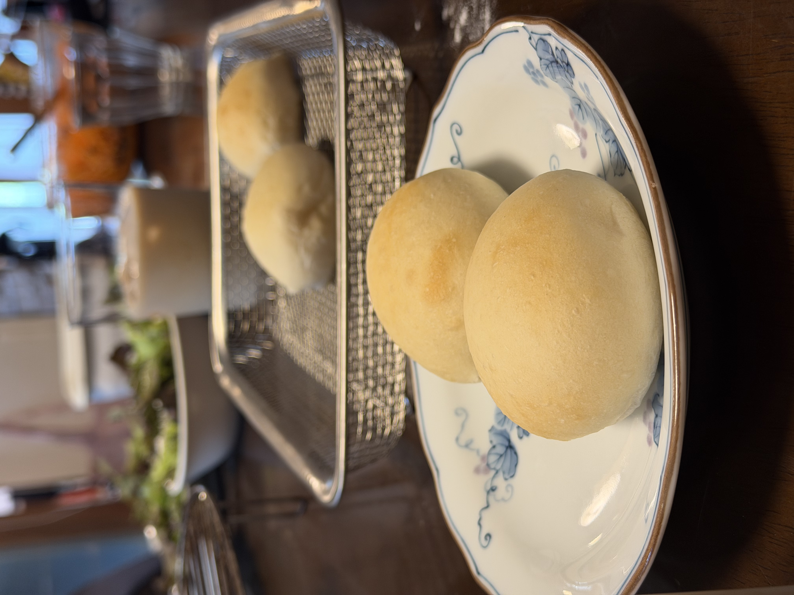
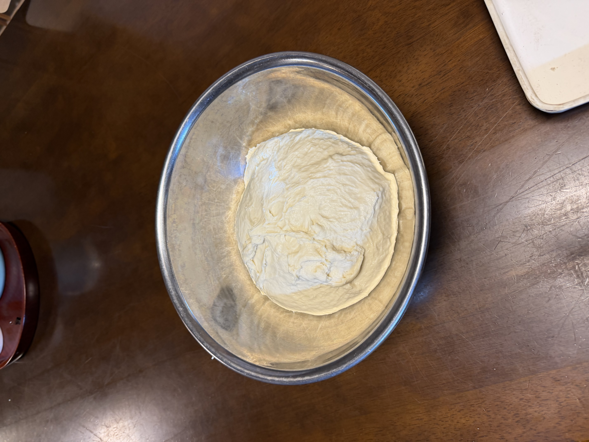

18〜21回目で定番化したオーバーナイトレシピを今度は**食パン+丸パンのハイブリッド運用**へ。1〜7回目で使っていた**プロフーズ食パン型（1斤1650cc + 1.5斤2700cc）が久々の復活**。粉900gの生地を食パン用920g、丸パン用約754gに振り分ける。

## 前回までの経緯: 定番レシピの4回連続成功

18回目で確立した「**とかち野+塩1.0%+四葉+はるゆたかブレンド900g**」レシピを19・20・21回目と**4回連続で回して家族大好評**。もはや我が家の朝食パンの定番運用として完全に定着した。

- **18回目（8/11→8/12）**: 初回、とかち野+塩1.0%+四葉復活の新レシピ → 成功
- **19回目（8/21→8/22）**: 同レシピ2回目、再現性確認 → 成功
- **20回目（8/22→8/23）**: 同レシピ3回目、家族「完璧に美味しい」 → 成功
- **21回目（8/22→8/23の別バッチ or 継続）**: 同レシピの継続運用 → 定番化

写真は8/23朝の朝食風景。ふっくら綺麗に焼き上がった丸パンが食卓の主役に。**これが我が家の新しい朝の景色**。

今回（22回目）は、その定番レシピを**食パン型にも展開**する挑戦。

## 今回の検証ポイント

1. **食パン型の久々の復活**: 5〜6月以来
2. **オーバーナイト発酵で食パンを焼く**: 日誌初挑戦
3. **はるゆたかブレンドで食パン**: 過去の食パンはゆめちからブレンド、粉違いの検証
4. **ハイブリッド運用**: 1回の生地で食パン+丸パンの2種類
5. **同じレシピの汎用性**: 丸パンレシピが食パンでも通用するか
6. **砂糖の変更（甜菜糖→グラニュー糖）**: 予備発酵の速度に違いあり

## 生地の振り分け

| 用途 | 型 | 生地量 |
|---|---|---:|
| 食パン 1斤 | 1650cc型 | 400g |
| 食パン 1.5斤 | 2700cc型 | 520g |
| 丸パン | 天板×3ターン | 約754g（40g × 19個弱） |
| **合計** | | **約1674g** |

## 条件

| 項目 | 値 |
|---|---|
| 仕込み開始 | 21:00頃 |
| 冷蔵庫イン | 21:30 |
| 焼成予定 | 翌朝9:00頃 |
| 冷蔵庫時間 | **約11時間30分**（過去最長） |
| 室温 | 28℃ |
| 湿度 | <!-- TODO --> |
| 天気 | 晴れ |
| 日付 | 8/23〜8/24 |

## 配合（18回目からの定番レシピを継承）

| 材料 | 分量 | 粉比 |
|---|---:|---:|
| プロフーズ はるゆたかブレンド | 900 g | 100% |
| 砂糖（生地用）※今回はグラニュー糖 | 40 g | 4.4% |
| 塩 | 9 g | 1.0% |
| とかち野酵母（予備発酵タイプ） | 7 g | 0.78% |
| 予備発酵用 お湯（40℃） | 120 g | - |
| 予備発酵用 砂糖 ※今回はグラニュー糖 | 5 g | - |
| 牛乳 | 375 g | 41.7% |
| 水 | 135 g | 15% |
| 無塩バター（四葉主体） | 90 g | 10% |

## 工程

### 今夜

1. **予備発酵**: お湯120g + 砂糖5g にとかち野7g、5〜10分待って泡立ちを確認
2. **一次こね**: KN-1000で粉・砂糖40g・塩9g、予備発酵液・牛乳・水を加えて10分こね
3. **バター投入**: 四葉バターを常温戻し済み、さらに5分こね
4. **冷蔵庫へ**: そのままラップして冷蔵庫へ

### 明朝

5. **冷蔵庫から出す** → 復温30分
6. **食パン生地を先に分割**: 400g（1斤）+ 520g（1.5斤）
7. **食パン成形**: 軽く丸めて型に入れる（1斤は分割せず1個、1.5斤は分割して2個入れる等、好みで）
8. **丸パン用生地を分割**: 40g × 約19個
9. **食パン先に二次発酵**: 35℃で30〜40分、型の8分目まで膨らめばOK
10. **食パンを焼成**: **200℃×20分 → 190℃×8分**（過去の定番）
11. **食パン焼成中に丸パンの二次発酵完了**
12. **丸パンを焼成**: コンベック190℃で10分（8+2）、15個×2ターン弱

## 過去食パンのおさらい（1〜7回目より）

- **1斤型（1650cc）**: 400g配分（3回目で確定）
- **1.5斤型（2700cc）**: 520g配分
- 焼成: **200℃×20分 → 途中入れ替え → 190℃×8分**（6回目で確定）
- 後半190℃が焼き色ムラを解消する正解

## 予想される変化

**はるゆたかブレンドでの食パン、ゆめちからブレンドとの違い**:
- はるゆたかは春よ恋系、**もっちり感がゆめちからより強い可能性**
- 香りは芳醇、**焼き上がりの匂いが強く出る**予想
- グルテンの弾性がやや違うので、**膨らみが控えめになる可能性**

**オーバーナイトで食パンを焼く効果**:
- **クラム（中身）が細かい気泡になる**
- **しっとり感が増す**
- **香りが深くなる**（熟成香）
- 焼き色は薄めになる傾向（塩1.0%との相乗効果）

## 観察ポイント

- [ ] オーバーナイト発酵の食パンの膨らみ具合
- [ ] はるゆたかブレンドの食パン適性
- [ ] 食パン型8分目まで膨らむか
- [ ] ハイブリッド運用の作業時間管理
- [ ] 食パンと丸パンで味わいがどう違うか
- [ ] 食パンでも神津牧場ジャージーバターとの相性が良いか
- [ ] 過去最長11時間30分発酵での味の変化

## 進行ログ

### 予備発酵時の気付き（21:00頃）

**甜菜糖が切れていたのでグラニュー糖に変更したところ、予備発酵の泡立ちがいつもより遅めに感じた**。

砂糖の違いによる影響として考えられる要因:
- **甜菜糖**: オリゴ糖（ラフィノース等）+ ミネラル分（カリウム・リン）含有 → イーストの活性化を助ける
- **グラニュー糖**: ショ糖ほぼ100%、ミネラル・オリゴ糖ほぼゼロ → 立ち上がりが穏やか

いつも甜菜糖でやってきたからこそ気付けた違和感。**イーストは砂糖の種類にも反応する**ことを実感できた回。

### 冷蔵庫イン時点（21:30）

- 表面はトロッとした質感で、加水多めの生地感がよく出ている
- ツヤっぽく光る表面、予備発酵タイプのイーストで水分がしっかり吸われた様子
- 軽く波打つ表情、バターが完全に馴染む一歩手前
- 900g生地に対してボウルサイズも適切、冷蔵庫内で膨らむ余地あり
- **朝9時取り出しなら約11時間30分の発酵、過去最長**
- グラニュー糖使用でイースト起動がやや遅めだった分、**発酵は少しゆっくり進む可能性**（過発酵リスクは逆に下がる方向）

## 仕上がり

<!-- TODO: 明朝焼き上がり後に追記 -->

## 振り返り

<!-- TODO: 明朝焼き上がり後に追記 -->
