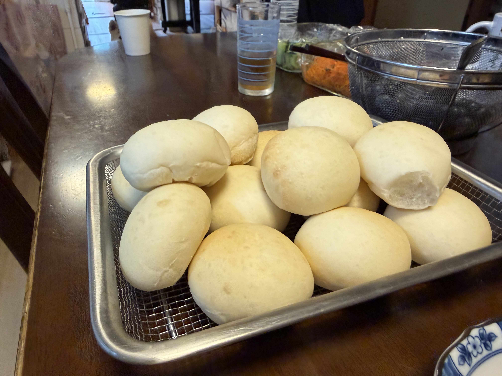

18回目以降の定番レシピ「はるゆたかブレンド900g + とかち野7g + 塩9g」を今夜も継続。**約10時間のオーバーナイト発酵**で明朝焼成、家族の朝食パンへ。

## 経緯

- **18〜21回目（8月）**: 定番レシピを4回連続で回して確立
- **22回目（8/23）**: 食パン+丸パンのハイブリッド運用、食パン型復活
- **23回目（9/5、今夜）**: 定番レシピの継続運用

夏の間に完成した定番運用が、9月に入っても安定して回っている。

## 条件

| 項目 | 値 |
|---|---|
| 仕込み開始 | 今夜 |
| 焼成予定 | 翌朝 |
| 冷蔵庫時間 | **約10時間** |
| 室温 | <!-- TODO --> |
| 湿度 | <!-- TODO --> |
| 天気 | <!-- TODO --> |
| 日付 | 9/5〜9/6 |

## 配合（定番レシピ、変更なし）

| 材料 | 分量 | 粉比 |
|---|---:|---:|
| プロフーズ はるゆたかブレンド | 900 g | 100% |
| 砂糖（生地用） | 40 g | 4.4% |
| 塩 | 9 g | 1.0% |
| とかち野酵母（予備発酵タイプ） | 7 g | 0.78% |
| 予備発酵用 お湯（40℃） | 120 g | - |
| 予備発酵用 砂糖 | 5 g | - |
| 牛乳 | 375 g | 41.7% |
| 水 | 135 g | 15% |
| 無塩バター | 90 g | 10% |

## 工程

### 今夜

1. **予備発酵**: お湯120g + 砂糖5g にとかち野7g、5〜10分待って泡立ちを確認
2. **一次こね**: KN-1000で粉・砂糖40g・塩9g、予備発酵液・牛乳・水を加えて10分こね
3. **バター投入**: 常温戻し済み、さらに5分こね
4. **冷蔵庫へ**: そのままラップして冷蔵庫へ

### 明朝

5. **冷蔵庫から出す** → 復温30分
6. **分割・ベンチタイム**: 40g × 45個、ベンチタイム15分
7. **成形**: 丸めるだけ
8. **霧吹き + 二次発酵**: 35℃で30〜40分
9. **焼成**: コンベック190℃で 10分（8+2）、15個×3ターン

## 観察ポイント

- [ ] 9月に入って気候が変わってきた影響（気温低下）
- [ ] 定番運用の再現性が続いているか
- [ ] 前回（8月）との違い

## 仕上がり

<!-- TODO: 明朝焼き上がり後に追記 -->

## 振り返り

<!-- TODO: 明朝焼き上がり後に追記 -->

## 仕上がり

**綺麗に焼き上がり、定番運用が9月に入っても完全に安定して回っている**ことを確認。

- 形がふっくら丸く、均一
- 表面はしっとりツヤあり、霧吹きの効果もしっかり
- 焼き色は淡いきつね色、いつもの塩1.0%+オーバーナイトの色合い
- **フィッシュアイ（斑点色ムラ）ほぼなし** → 成形と霧吹きが精度良く決まっている
- 45個の量産、朝食+お裾分けに十分な量

## 振り返り

### 8月から5回連続成功の意味

18→19→20→21→23回目で**5回連続の成功再現**。定番運用が完全に手癖化して、季節の変化（8月→9月、気温低下）にも安定した仕上がりが得られる状態に到達した。

### この日誌の到達点

- **1〜7回**: 食パン期（試行錯誤で基礎確立）
- **8〜10回**: 丸パン初期（湿度・霧吹きの発見）
- **11〜12回**: 定番運用の確立、ハード系開拓
- **13〜14回**: 味覚検証期（塩加減の最適化）
- **15〜17回**: オーバーナイト発酵の獲得
- **18〜23回**: 定番運用の日常化 ← **今ここ**

家庭パン作りが「試行錯誤の実験」から「**家族の朝食を作る技術**」に完全に移行した。

## 次回に向けてのメモ

- [ ] 秋・冬になったら室温低下でオーバーナイト発酵が変化するか観察
- [ ] 冬場の室温15℃前後で予備発酵の起動が変化するか
- [ ] レーズン・くるみ・チーズなどアレンジ丸パンも試したい
- [ ] SK-15発酵器のデビュー（16回目からの継続宿題）
