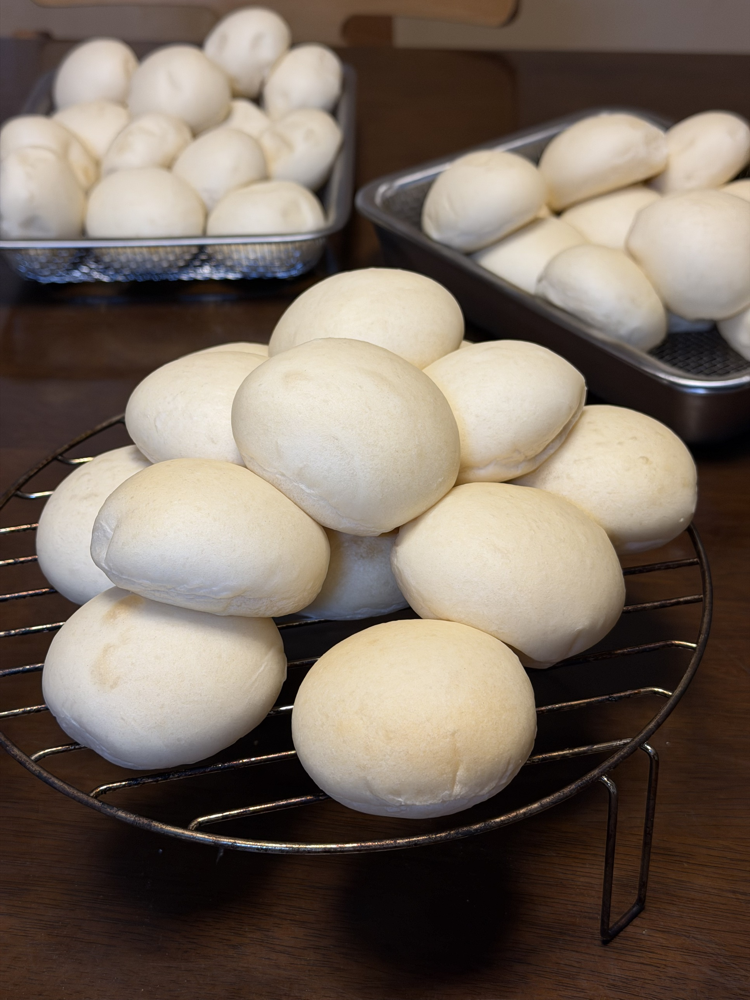

[23回目]()のオーバーナイト発酵と**同じレシピ・同じ量で、発酵時間だけを変える**通常発酵版。オーバーナイト運用が定着してから久々の当日焼き（17回目・7/20以来、約1ヶ月半ぶり）。同じ条件でオーバーナイトと通常発酵の**直接比較**ができる貴重な回。

## 今回の検証ポイント

1. **通常発酵に戻す**: 一次発酵45分+二次発酵35分の従来運用
2. **23回目との直接比較**: 同じレシピで発酵時間だけ違う
3. **同日焼きの完結感**: 3時間程度で完結、焼きたてが夜に楽しめる
4. **オーバーナイトとの味・食感の違い**: シンプル系vs熟成系

## 23回目（オーバーナイト）との対比

| 項目 | 23回目 | 今回（24回目） |
|---|---|---|
| 粉 | はるゆたかブレンド 900g | 同じ |
| 塩 | 9g（1.0%） | 同じ |
| とかち野 | 7g | 同じ |
| バター | 四葉主体 90g | 同じ |
| **一次発酵** | 冷蔵庫10時間 | **35℃で40〜45分** |
| **二次発酵** | 35℃で30〜40分 | **35℃で30〜35分** |
| 焼成 | 190℃10分×3ターン | 同じ |
| 完成までの時間 | 約11時間 | **約3時間** |

## 条件

| 項目 | 値 |
|---|---|
| 仕込み開始 | 20:30頃 |
| 焼成予定 | 22:30〜23:00 |
| 発酵環境 | オーブン35℃ |
| 室温 | 27℃ |
| 湿度 | 76%（雨模様） |
| 天気 | 雨 |
| 日付 | 9/6 |

## 配合（23回目と完全同一、変更なし）

| 材料 | 分量 | 粉比 |
|---|---:|---:|
| プロフーズ はるゆたかブレンド | 900 g | 100% |
| 砂糖（生地用） | 40 g | 4.4% |
| 塩 | 9 g | 1.0% |
| とかち野酵母（予備発酵タイプ） | 7 g | 0.78% |
| 予備発酵用 お湯（40℃） | 120 g | - |
| 予備発酵用 砂糖 | 5 g | - |
| 牛乳 | 375 g | 41.7% |
| 水 | 135 g | 15% |
| 無塩バター（四葉主体） | 90 g | 10% |

## 工程

1. **予備発酵**（20:30〜）: お湯120g + 砂糖5g + とかち野7g、5〜10分待つ
2. **一次こね**: KN-1000で粉・砂糖40g・塩9g、予備発酵液・牛乳・水を加えて10分
3. **バター投入**: 常温戻し済み、さらに5分
4. **一次発酵**: 35℃で **40〜45分**
5. **分割・ベンチタイム**: 40g × 45個、ベンチタイム15分
6. **成形**: 丸めるだけ、大理石ボード使用
7. **霧吹き + 二次発酵**: 35℃で **30〜35分**、15個ずつ3ターンに分けて発酵時刻をずらす
8. **焼成**: コンベック190℃で 10分（8+2）、15個×3ターン

## 予想される変化（オーバーナイトとの違い）

**通常発酵で予想されること**:
- **イースト臭がやや強めに残る**（低温で揮発する時間がない）
- **クラムが少し粗い気泡**（急速発酵の特徴）
- **味は素直、熟成感なし**
- **甘みは控えめ**（デンプン分解が浅い）
- **焼き色は同じくらい薄め**（塩1.0%の影響）

**オーバーナイトの特徴（比較用）**:
- 熟成香、甘い発酵香
- しっとり感が強い
- サワードウ的な旨味
- クラムが細かい

**「焼きたてのフレッシュさ」vs「熟成の深み」**、どちらが家族の好みか改めて確認する機会。

## 観察ポイント

- [ ] 通常発酵での一次発酵時間（金サフ時代は40分、とかち野で7gだと45分予想）
- [ ] 焼き色・食感がオーバーナイト23回目と比較してどう違うか
- [ ] 家族の反応（オーバーナイトと比較して）
- [ ] イースト臭の強さ
- [ ] 焼きたてのフレッシュ感

## 仕上がり

<!-- TODO: 焼き上がり後に追記 -->

## 振り返り

<!-- TODO: 焼き上がり後に追記 -->

## 仕上がり

**通常発酵でも綺麗に45個が焼き上がった**。

- 形はふっくら丸く均一、通常発酵でも安定した仕上がり
- 焼き色は淡いきつね色、23回目（オーバーナイト）とほぼ同じ
- 表面はしっとりツヤあり、霧吹きの効果も同様
- 見た目上、オーバーナイトとの違いはほぼ判別できない

## 振り返り

### 大きな発見: オーバーナイトと通常発酵で味の違いが少ない

**家族評価「オーバーナイトと同じくらい美味しい（違いは少なめ）」** ✓

23回目（オーバーナイト10時間）と24回目（通常発酵45分）を1日違いで比較したところ、家族の実感としては**味の差はほぼ感じられなかった**。

**この発見の意味**:

1. **選択肢が2つに広がった**
   - オーバーナイト = 朝食用（前日夜に仕込む）
   - 通常発酵 = 夕食用or夜のおやつ（当日3時間で完結）
   - **どちらもクオリティは同等**という安心感

2. **生活リズムに合わせて選べる**
   - 朝食に焼きたてが欲しい → オーバーナイト
   - 夕食に焼きたてが欲しい → 通常発酵
   - 深夜に仕込む余裕がない日 → 通常発酵

3. **とかち野酵母 7gの汎用性**
   - 通常発酵の40〜45分でも、オーバーナイト10時間でも、どちらでもうまく回る
   - **金サフより穏やかな発酵曲線**が、両パターンに対応できる要因

### 日誌全体への影響

15〜23回目で「オーバーナイト発酵こそ至高」という流れがあったが、この24回目の実験で**「通常発酵も十分優秀」**という気付きを得た。

これは日誌の質的転換とも言える発見:
- 「複雑・熟成」だけが正解ではない
- **「シンプル・フレッシュ」もまた等しく価値がある**
- 選択肢を持てることが、家庭パン作りの豊かさ

## 次回に向けてのメモ

- [ ] 断面写真での気泡比較（オーバーナイト vs 通常）
- [ ] 翌日以降の保存性の違い
- [ ] 冷凍後の食感の違い
- [ ] 夕食のおかずパンとしての通常発酵の活用
- [ ] 週の中の使い分けパターン（オーバーナイト/通常のバランス）
