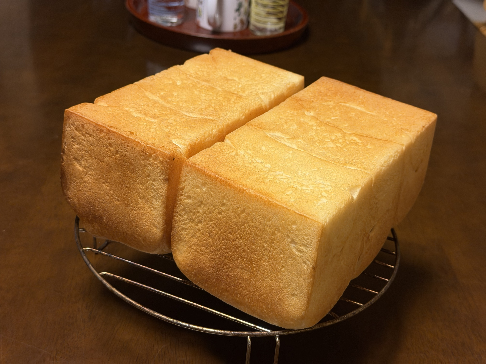

[24回目]()で「通常発酵とオーバーナイトが同等クオリティ」と分かった直後、今夜は久々の**食パン専用回**。過去1〜7回目の食パン運用（1斤+1.5斤の2型）を復活させつつ、レシピは現定番丸パンレシピ（はるゆたかブレンド・とかち野・塩1.0%）を**500gにスケールダウン**して使う。

## 今回の検証ポイント

1. **食パン専用回**: 丸パンなし、型2つに配分
2. **現定番レシピのスケールダウン**: 900g配合を500gに比例縮小
3. **粉違いの食パン検証**: 過去はゆめちからブレンド → 今回はるゆたかブレンド
4. **通常発酵で食パン**: 22回目のオーバーナイトハイブリッドとの対比

## 過去の食パン（1〜7回目）との違い

| 項目 | 過去（1〜7回目） | 今回（25回目） |
|---|---|---|
| 粉 | ゆめちからブレンド | **はるゆたかブレンド** |
| 塩 | 8g（粉比1.6%） | **5g（粉比1.0%）** |
| イースト | とかち野12.5g | **とかち野4g（0.8%）** |
| バター | 四葉 50g | 四葉 50g（同じ） |
| 粉量 | 500g | 500g（同じ） |
| 焼成 | 200℃×20分→190℃×8分 | 同じ |

粉と塩・イースト量に大きな違い。**現代の低塩・少量イーストレシピ**をどう食パンに落とし込めるかの検証。

## 生地の逆算計算

食パン用の生地量を決めるところから:

- 1斤型（1650cc）: 生地400g
- 1.5斤型（2700cc）: 生地520g
- **食パン用生地合計: 920g**

現定番配合の粉→生地比率（1670÷900 = 1.856倍）から逆算:

**920 ÷ 1.856 ≈ 495.7g → キリよく粉500g**

生地総量: 約934g → 型2つで920g、余り約14g（型に含めて調整）

## 条件

| 項目 | 値 |
|---|---|
| 仕込み開始 | 20:30頃 |
| 焼成予定 | 23:00頃 |
| 発酵環境 | オーブン35℃ |
| 室温 | 28.1℃ |
| 湿度 | <!-- TODO --> |
| 天気 | 曇り |
| 日付 | 9/13 |

## 配合（現定番500gスケールダウン版）

| 材料 | 分量 | 粉比 | 計算根拠 |
|---|---:|---:|---|
| プロフーズ はるゆたかブレンド | 500 g | 100% | 基準 |
| 砂糖（生地用） | 22 g | 4.4% | 40g × 500/900 |
| 塩 | 5 g | 1.0% | 9g × 500/900 |
| とかち野酵母（予備発酵タイプ） | 4 g | 0.8% | 7g × 500/900 |
| 予備発酵用 お湯（40℃） | 67 g | - | 120g × 500/900 |
| 予備発酵用 砂糖 | 3 g | - | 5g × 500/900 |
| 牛乳 | 208 g | 41.6% | 375g × 500/900 |
| 水 | 75 g | 15% | 135g × 500/900 |
| 無塩バター（四葉主体） | 50 g | 10% | 90g × 500/900 |

**生地総量: 約934g**

## 工程

1. **予備発酵**: お湯67g + 砂糖3g にとかち野4g、5〜10分待って泡立ちを確認
2. **一次こね**: KN-1000で粉・砂糖22g・塩5g、予備発酵液・牛乳・水を加えて10分こね
3. **バター投入**: 四葉バター常温戻し済み、さらに5分こね
4. **一次発酵**: 35℃で **40〜50分**（とかち野4gなので少し長めに）
5. **分割**: **400g（1斤用）+ 520g（1.5斤用）+ 余り**
6. **ベンチタイム**: 15分
7. **成形**: 1斤は1つに丸めて型へ、1.5斤は2〜3分割して並べる（角食用）
8. **二次発酵**: 35℃で30〜40分、**型（or 蓋）の8分目**まで
9. **焼成**: **200℃×20分 → 型の位置入れ替え → 190℃×8分**（過去4〜6回目で確定）

## 過去食パンのおさらい（4〜6回目より）

- **1斤400g、1.5斤520g**の生地配分（3回目で確定）
- **200℃×20分→入れ替え→190℃×8分**（6回目で確定）
- 4回目で焼き入れ替えの効果確認、生地量400gで1斤の伸び不足解消

## 予想される変化

**過去食パン期との違い（塩1.6%→1.0%、イースト2.5%→0.8%）**:
- **塩控えめでシンプル系の味**（丸パン14回目以降と同傾向）
- **イースト少なめでイースト臭控えめ**
- **クラムがしっとりする可能性**（低イーストの効果）
- **焼き色は薄めに出る可能性**（塩1.0%との相乗効果）

**通常発酵での食パン**:
- 22回目のオーバーナイト食パンとの比較材料に
- フレッシュ感がある食パン

## 観察ポイント

- [ ] 粉500gでのニーダー捏ねやすさ（900gからのスケールダウン感）
- [ ] とかち野4gでの一次発酵時間
- [ ] はるゆたかブレンド食パンのクラム色・食感
- [ ] 塩1.0%食パンの味わい（過去食パンとの比較）
- [ ] 焼き色（200℃20分→190℃8分の効果）
- [ ] 家族の評価（食パン単独として）

## 仕上がり

<!-- TODO: 焼き上がり後に追記 -->

## 振り返り

<!-- TODO: 焼き上がり後に追記 -->

## 仕上がり

**プロレベルの角食2つが焼き上がった**。過去1〜7回目の食パン定番運用の完全復活+現定番レシピの融合が大成功。

- **綺麗な角食2つ、四角い形が美しい** → 蓋を閉めて焼いた本格派
- **焼き色がしっかりきつね色** → 塩1.0%レシピなのに、しっかり色付き
- **表面がツヤツヤ** → 熱がしっかり通って、外はカリッと系のクラスト
- **側面の焼き色も均一** → 前後入れ替えの効果、焼きムラなし
- **サイズも1斤・1.5斤が並んで壮観**
- 角がピシッと立っていて、型にしっかり詰まった証拠

## 振り返り

### 重要な発見: 「塩と焼き色の関係」は焼成条件次第で変わる

24回目で「塩1.0%だと焼き色薄めになる」と結論していたが、**それは丸パンの190℃×10分焼成の場合**。今回の食パン200℃×20分+190℃×8分の高温長時間焼成なら、**塩1.0%でもしっかり焼き色が出る**ことが証明された。

**新知見**:
- 塩の量だけで焼き色は決まらない
- **焼成温度と時間が焼き色の主要因**
- 高温長時間焼成 → メイラード反応が強く進む → 焼き色濃く
- 低温短時間焼成 → メイラード反応が弱い → 焼き色薄く

### 過去食パンとの比較

| 項目 | 過去（1〜7回目） | 今回（25回目） | 差 |
|---|---|---|---|
| 粉 | ゆめちからブレンド | はるゆたかブレンド | 見た目差なし |
| 塩 | 8g（1.6%） | 5g（1.0%） | 見た目差なし |
| イースト | 12.5g（2.5%） | 4g（0.8%） | 発酵時間の違いのみ |
| 焼き色 | しっかり | しっかり | 同等 |
| 焼成条件 | 200℃×20分→190℃×8分 | 同じ | 同じ |

**結論**: 塩と酵母量が半分以下でも、焼成条件が同じなら食パンとしての完成度は同等以上。

### 過去食パンレシピの見直し

過去1〜7回目のレシピは塩・イースト量が今考えるとかなり多め。**今回の500gスケールダウンレシピを新定番食パンレシピとして確定**する価値あり。

## 次回に向けてのメモ

- [ ] このレシピを**新定番食パンレシピとして確定**
- [ ] オーバーナイト版も試して比較（今回は通常発酵）
- [ ] 角食 vs 山食の比較（型のみ変更）
- [ ] レーズン入り、くるみ入りなどアレンジ食パン
- [ ] 過去のバンズレシピもこの新定番で作り直す
