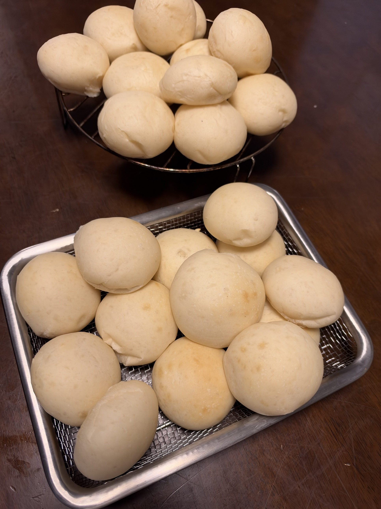

[25回目]()の食パン専用回から1週間、今夜はオーバーナイト丸パンだが、料理で使った**生クリーム130gが残っていた**ので、それを活用するリッチ版に。水を85g減らし、バターを40g減らして生クリームで置き換え、総水分・総脂肪はほぼ定番と同等キープの設計。

## 経緯

- 18〜21回目（8月）: 定番レシピの確立
- 22回目（8/23）: 食パン+丸パンハイブリッド
- 23回目（9/5）: 定番オーバーナイトの継続
- 24回目（9/6）: 通常発酵版、オーバーナイトとの比較で「同等クオリティ」発見
- 25回目（9/13）: 食パン専用回、新食パンレシピ確立
- **26回目（9/19、今夜）**: 定番オーバーナイトの継続運用

## 条件

| 項目 | 値 |
|---|---|
| 仕込み開始 | 20:30頃 |
| 焼成予定 | 翌朝 |
| 冷蔵庫時間 | 約10時間 |
| 室温 | 27℃ |
| 湿度 | 70% |
| 日付 | 9/19〜9/20 |

## 配合（今夜の特別版：生クリーム活用）

料理で使った生クリーム130gが残っていたので、水とバターの一部を差し替えてリッチ寄りに。

| 材料 | 分量 | 粉比 | 変更点 |
|---|---:|---:|---|
| プロフーズ はるゆたかブレンド | 900 g | 100% | 定番 |
| 砂糖（生地用） | 40 g | 4.4% | 定番 |
| 塩 | 9 g | 1.0% | 定番 |
| とかち野酵母（予備発酵タイプ） | 7 g | 0.78% | 定番 |
| 予備発酵用 お湯（40℃） | 120 g | - | 定番 |
| 予備発酵用 砂糖 | 5 g | - | 定番 |
| 牛乳 | 375 g | 41.7% | 定番 |
| 水 | **50 g** | 5.6% | **135g→50g** |
| **生クリーム（乳脂肪35%）** | **130 g** | **14.4%** | **新規追加** |
| 無塩バター（四葉主体） | **50 g** | 5.6% | **90g→50g** |

### 差し替えの根拠

生クリーム130g（乳脂肪35%と仮定）の内訳:
- 乳脂肪: 約45g
- 水分: 約85g

差し替え計算:
- **水を85g減らす**（135g→50g）→ 生クリームの水分85gでカバー
- **バターを40g減らす**（90g→50g）→ 生クリームの脂肪45gでカバー

**総水分・総脂肪はほぼ定番と同等**、乳成分の質だけ変わる。

### 期待される変化

- 口溶けがふわっと良くなる
- **ブリオッシュ寄りの上品な味わい**
- 香りが豊か（生クリームの乳製品感）
- クラム（内相）がしっとり

## 工程

### 今夜

1. **予備発酵**: お湯120g + 砂糖5g にとかち野7g、5〜10分待つ
2. **一次こね**: KN-1000で10分こね
3. **バター投入**: 常温戻し済み、さらに5分こね
4. **冷蔵庫へ**: そのままラップして冷蔵庫へ

### 明朝

5. **冷蔵庫から出す** → 復温30分
6. **分割・ベンチタイム**: 40g × 45個、ベンチタイム15分
7. **成形**: 丸めるだけ
8. **霧吹き + 二次発酵**: 35℃で30〜40分
9. **焼成**: コンベック190℃で 10分（8+2）、15個×3ターン

## 仕上がり

**生クリーム入りリッチ版オーバーナイト、大成功**。手前のトレイと奥のザルで合計約30個の丸パンが焼き上がった。

- 焼き色は淡いきつね色〜白っぽめ、いつもの定番丸パンと同等
- ふっくらツヤツヤした表面、生クリームの効果で口溶けが良さそう
- 形は綺麗な丸、大きさも均一
- 手前中央の1つに少し焼き色が濃い部分あり（天板の位置による差）

## 振り返り

### レシピ設計は成功

生クリーム130gで水85gとバター40gを置き換えたB案は、**総水分・総脂肪をほぼ同等キープ**しながら乳成分の質だけを豊かにする狙いが的中。焼き上がりは定番丸パンと同じレベルの安定感で、失敗リスクなく余り物を活用できた。

### 家族の反応: 翌日のプチパン（27回目）に軍配

翌日（9/20夜〜9/21朝）に焼いたプチパン（27回目）と比較して、**家族評価は「フランスパンの方が良いね！」**と、ハード系リーンに軍配。

**なぜプチパンの方が好評だったか、考察**:

1. **粉本来の香ばしさ**
   - リスドォル100%＋モルト、余計な脂肪・糖なし
   - 小麦の風味が前面に出る
   - 丸パンは牛乳・バター・砂糖でマスクされる部分あり

2. **食感のコントラスト**
   - 外カリッ・中もちもちの明確な対比
   - 丸パンは全体的にふわふわ均一で、印象が単調

3. **オーバーナイト熟成の風味**
   - リーン系はイースト・小麦の風味がダイレクト

4. **食事パンとしての存在感**
   - 丸パンは「おやつ・朝食のお供」ポジション
   - プチパンは「料理と対等に並ぶパン」

### 重要な発見: 家族はハード系リーンが好み

**「祥平さんちの家族はハード系リーンが好み」という日誌の大きな発見**。今後のレシピ開発の方向性が見えてきた。

**リッチ版丸パンの位置付け**:
- 単独では大成功、口溶けも良く上品な仕上がり
- ただし**家族の好みではハード系がリードする**ことが判明
- 生クリーム余り物の活用としては優秀、また作る価値あり

## 次回に向けてのメモ

- [ ] **ハード系レギュラー化**を検討（丸パン一辺倒からの転換）
- [ ] バゲット・カンパーニュへの発展
- [ ] ライ麦・全粒粉入りリーン系
- [ ] リッチ版と定番丸パンの直接比較（生クリームなしと）
- [ ] 生クリーム余った時の第2の活用先も探る（バターと同時に置き換えパターンの派生）
