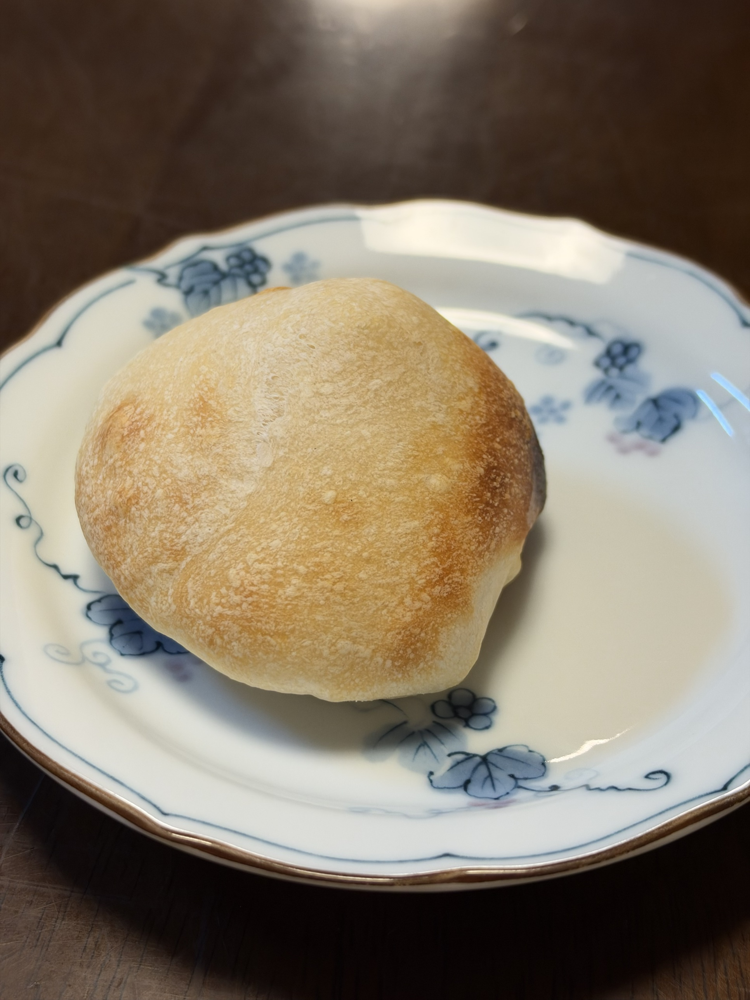
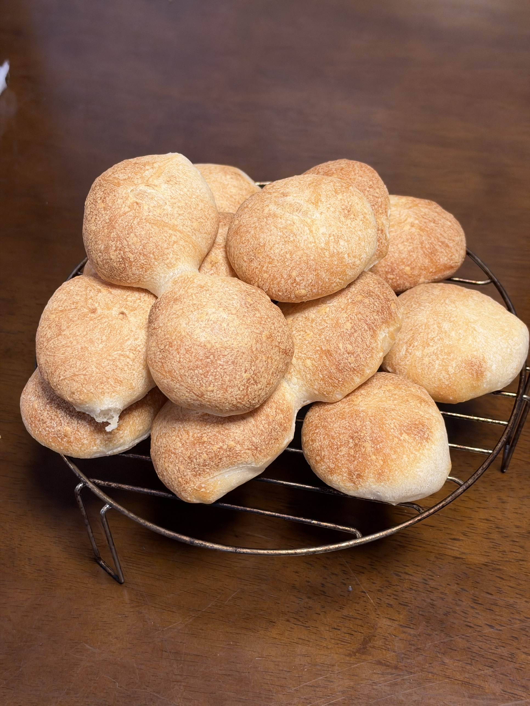
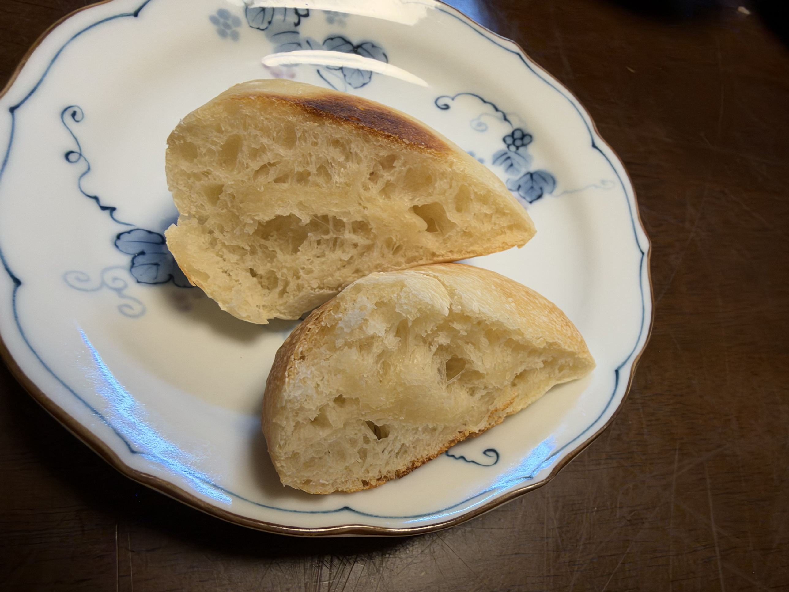

[12回目のベーコンエピ]()以来のハード系リターン。今回は**丸くて小さめのプチパン**に初挑戦、目指すのは「**外カリッ・中もちもち**」のセミハード路線。オーバーナイトで熟成させて、明朝焼き上げる。

## 経緯

- 12回目（7/5）: ベーコンエピ初挑戦、大成功
- 13〜26回目: 丸パン・食パンの定番運用に集中
- **27回目（今夜）**: プチパン初挑戦、ハード系拡張

## 今回の検証ポイント

1. **リスドォル100%でのオーバーナイト**（12回目エピは通常発酵）
2. **セミハード路線**（加水68%、フルハードの72〜75%より抑え目）
3. **粉・水・塩・イーストのみのリーン配合**（バター・砂糖・乳製品なし）
4. **明朝焼成でクープ入れの練習**
5. **丸パンとのコントラスト**（同じ丸型なのに全く違う世界）

## 過去のハード系（12回目エピ）との違い

| 項目 | 12回目エピ | 今回27回目プチパン |
|---|---|---|
| 発酵方式 | 通常発酵（一次90分） | **オーバーナイト（10〜12時間）** |
| 形 | エピ（穂の形） | **プチ丸パン** |
| 加水 | 68% | 68%（同じ） |
| 塩 | 2.0% | 2.0%（同じ） |
| 焼成 | 240℃×20分 | 240℃×15〜18分（小型なので短め） |
| クープ | ハサミで穂状 | ナイフで十字 or 一本 |

## 条件

| 項目 | 値 |
|---|---|
| 仕込み開始 | 20:30頃 |
| 焼成予定 | 明朝 |
| 焼成実績 | **240℃×10分 + 追加5分 = 合計15分** |
| 冷蔵庫時間 | 約10〜12時間 |
| 発酵環境 | 冷蔵庫 → 明朝復温60分 |
| 室温 | <!-- TODO --> |
| 湿度 | <!-- TODO --> |
| 日付 | 9/20〜9/21 |

## 配合（セミハードプチパン、リーン基本）

| 材料 | 分量 | 粉比 | 備考 |
|---|---:|---:|---|
| プロフーズ リスドォル | 500 g | 100% | 準強力粉、フランスパン用 |
| 塩 | 10 g | 2.0% | 12回目エピと同じ |
| とかち野酵母（予備発酵タイプ） | 4 g | 0.8% | 少なめでゆっくり発酵 |
| 予備発酵用 お湯（40℃） | 60 g | - | 予備発酵起動 |
| 予備発酵用 砂糖 | 2 g | - | 予備発酵起動用のみ |
| モルトパウダー | 1.5 g | 0.3% | 焼き色・発酵補助 |
| 水 | 280 g | 56% | 予備発酵液と合わせて加水68% |

**加水合計: 340g（68%）** — 12回目エピと同じ加水率
**生地総量: 約858g** → **40g × 21個**（丸パンと同じ分割サイズで統一）

## 工程

### 今夜

1. **予備発酵**: お湯60g + 砂糖2g + とかち野4g、10分待って泡立ちを確認
2. **一次こね**: KN-1000で
   - 粉500g + 塩10g + モルトパウダー1.5g を軽く混ぜる
   - 予備発酵液 + 水280g を加える
   - **10〜12分こね**（バターなしなのでシンプル）
3. **軽く丸めてラップ**、そのまま冷蔵庫へ

### 明朝

4. **冷蔵庫から出す** → **復温60分**（リーン系は復温長め、生地温度を上げないと発酵が渋る）
5. **分割**: **40g × 21個**（丸パンと同じサイズで統一、比較しやすい）
6. **ベンチタイム**: 15〜20分（張らせすぎない）
7. **成形**: **軽く丸める**（丸パンほど張らせない、素朴な形でOK）
8. **二次発酵**: 30℃で **40〜50分**（低めの温度でゆっくり、35℃だと過発酵の懸念）
9. **クープ**: ナイフで**十字 or 一本切り込み**（浅めに、素早く）
10. **焼成準備**: **コンベック240℃予熱** + 天板に霧吹き
11. **焼成**: **240℃ × 15〜18分**

## セミハード路線のポイント

### 加水68%を選んだ理由

- フルハード（72〜75%）は気泡が大きく、水分感が強い
- **加水68%**なら「もっちり」感を残しつつ、リーンの香ばしさは十分
- 12回目エピと同じ加水率、勝手が分かってる

### モルトパウダー0.3%の役割

- 麦芽由来の**麦芽糖・α-アミラーゼ**が入り
- **α-アミラーゼ**がデンプンを糖化 → イーストの餌になり発酵補助
- **麦芽糖**が焼成時のメイラード反応を強化 → 焼き色が濃く出る
- リーン系（砂糖なし）でも焼き色が出るのはモルトのおかげ

### クープ入れの意味

- 生地の**膨張方向をコントロール**
- クープ部分から蒸気が抜けることで、他の部分が予測不能に破裂するのを防ぐ
- 見た目のフランスパンらしさを演出

### 240℃×15〜18分の高温焼成

- **クラスト（皮）を素早くパリッと固める**
- 内部の水分は完全に飛ばさず「もちもち」を残す
- 小型（40g）なので中まで火が通りやすい、20分は焼きすぎ

## 予想される変化・観察ポイント

- [ ] リスドォル100%オーバーナイトの生地の状態
- [ ] 復温60分でどこまで生地が動くか
- [ ] 二次発酵30℃×40〜50分での膨らみ具合
- [ ] クープの開き具合
- [ ] 焼き色（モルトの効果、240℃15〜18分）
- [ ] クラム（内相）の気泡分布 — 丸パンとの差
- [ ] クラスト（皮）のカリッと感
- [ ] 家族評価 — 丸パンとの好み比較

## 仕上がり

<!-- TODO: 明朝焼き上がり後に追記 -->

## 振り返り

<!-- TODO: 明朝焼き上がり後に追記 -->

## 仕上がり

**240℃で10分焼成 → 1個切って断面確認 → 中央部の火通りに不安を感じたので追加5分焼成、合計15分**。

- 焼き色は均一なきつね色、追加5分で完璧に仕上がった
- 上面はグラデーション、打ち粉の白い斑点が残る（フランスパンらしい）
- ぷっくり丸く膨らみ、素朴な形
- 表面はツヤなしのマット質感（リーン系の特徴）
- クープの跡が薄っすら見える

## 全景

**焼き上がり後、冷却の網の上で山積みにして撮影**。**40g × 約21個**、フランスパンらしい打ち粉の白と焼き色のコントラストが美しい。焼成時は天板に並べて（間隔あけて）焼いたが、冷却中に一つに集めた光景。

## 消費実績

**家族5人の朝食1回で21個すべて完食**。1人あたり4個ペースという驚異的な消費速度。

**過去のパンとの比較**:

| パン | 粉量 | 個数 | 消費のされ方 |
|---|---:|---:|---|
| 定番丸パン | 900g | 45個 | 朝食1回で消えない、数日かけて食べる |
| 26回目 生クリーム入り丸パン | 900g | 約30個 | 通常ペース |
| **27回目 プチパン** | **500g** | **21個** | **朝食1回で完食** |

同じサイズ（40g）・同じオーバーナイト発酵なのに、消費速度が明らかに違う。これは:
- 「もう1個食べたい」と思わせる魅力
- 食事パンとしての機能性（おかずと合わせやすい）
- リーン系の食べ飽きなさ

**家族の「フランスパンの方が良いね！」評価の定量的裏付け**とも言える結果。

## 断面（クラム）

**初挑戦とは思えないレベルの理想的な内相** — フランスパン系リーン生地の教科書的な仕上がり。

- **大小の気泡が不均一に分布** — バゲット・カンパーニュ系の典型
- **大きな空洞（1〜2cm）と細かい気泡が混在** — オーバーナイト長時間発酵の効果
- 丸パンの均一で細かい気泡とは全く違う世界
- クラムは白〜クリーム色でツヤあり、半透明感
- 気泡膜が薄くて光る — グルテン膜が薄く伸びた良質な発酵の証
- クラストは薄めで境界がはっきり、セミハードの理想

## 振り返り

### 大成功、初挑戦の完成度が高い

**フランスパン初挑戦とは思えない完成度**。特に断面のクラム構造は理想的で、加水68%・オーバーナイト・モルト0.3%の設計が的中した形。

### 成功要因の分析

1. **オーバーナイト発酵の威力**
   - 大きな気泡は長時間発酵でグルテン網が薄く伸びた証
   - リーン系こそオーバーナイトが真価を発揮する
   - 丸パン以上にオーバーナイトの効果が明確

2. **加水68%の設定が的中**
   - 加水低いと気泡は小さく、高すぎると崩れる
   - 12回目エピと同じ加水率、勝手が分かっていた
   - 「外カリッ・中もちもち」のセミハード路線に最適

3. **モルト0.3%の効果**
   - リーン配合（砂糖なし）でも焼き色がしっかり出た
   - α-アミラーゼによる発酵補助、麦芽糖によるメイラード反応強化
   - 12回目エピからの継続採用が正解

4. **240℃×15分（10分+追加5分）の最終着地**
   - 当初計画の15〜18分は結果的にほぼ正しかった
   - 10分で1個切って断面確認 → 中央部の火通りに不安 → 追加5分
   - 単体・間隔広めで焼いても、小型プチパンは10分では中央がまだ、15分で完璧
   - 断面確認 → 追加焼成の判断は家庭パン作りの正しい対処法

### 新知見: 小型プチパンの焼成時間

**小型プチパン（40g、リーン配合、加水68%）は240℃×15分**が適正着地。当初計画の15〜18分の下限に落ち着いた。

**判断のプロセス**:
1. 10分でオーブンから出して、1個切って断面確認
2. 中央部の火通りに不安があった → 追加5分
3. 合計15分で完璧に焼き上がった

**運用ルール**:
- **240℃×15分を基準**とする
- 大きさや個数で調整（今回より小さければ12〜13分でも可能性）
- **1個切って断面確認する習慣**は正解、家庭パン作りの正しい対処法

### 丸パンとの比較

| 項目 | 定番丸パン | プチパン27回目 |
|---|---|---|
| 気泡 | 均一・細かい | 不均一・大小混在 |
| クラスト | 薄くしっとり | 薄めだが存在感あり |
| クラム | ふわふわ | もちもち・半透明感 |
| 香り | バター・乳製品 | 粉本来の香ばしさ |
| 用途 | 朝食のお供 | 食事パン、スープ・ワインと |

**世界観が全く違うパン**、両方のレシピを持てることで家庭パン作りが一段深まる。

### 12回目エピからの継続進化

- **12回目**: 通常発酵、ハード系の基本を学ぶ
- **27回目**: オーバーナイト、ハード系の熟成を学ぶ
- **次**: バゲット、より長い成形と本格クープに挑戦？

## 次回に向けてのメモ

### 最優先: 粉900g量産体制へのスケールアップ

**家族5人が朝食1回で完食した実績**を踏まえ、次回は**粉900gにスケールアップして丸パンと同じ量産体制へ**。

**粉900gプチパン配合（500g→900g比例スケール）**:

| 材料 | 500g版 | **900g版** |
|---|---:|---:|
| プロフーズ リスドォル | 500 g | **900 g** |
| 塩 | 10 g | **18 g**（2.0%） |
| とかち野酵母 | 4 g | **7 g**（0.78%） |
| 予備発酵お湯 | 60 g | **108 g** |
| 予備発酵砂糖 | 2 g | **3.6 g** ≒ 3.5 g |
| モルトパウダー | 1.5 g | **2.7 g** ≒ 2.5〜3 g |
| 水 | 280 g | **504 g** |

生地総量: 約1543g → **40g × 約38個**（丸パンと同じ量産規模）

**焼成の想定**:
- 天板1回で焼ける個数（過去実績: 15個/天板）
- **38個 = 3ターン**（丸パンと同じ）
- 240℃×15分 × 3ターン = **合計焼成時間45分程度**
- 一次発酵〜焼成完了まで、丸パンより長時間の作業になる

### その他のアイデア

- [ ] 焼成時間の再検証（40g・単体配置で240℃10〜12分は足りるか）
- [ ] バゲット挑戦（プチパンの応用、成形が難しくなる）
- [ ] カンパーニュ挑戦（大型ブール、加水70〜75%）
- [ ] ライ麦入りプチパン（風味の広がり）
- [ ] クルミ・レーズン入りリーン系
- [ ] クープの入れ方の練習（十字、一本、複数）
- [ ] ダッチオーブンやスチーム機能の活用検討
- [ ] 丸パンとの週次バランス（プチパン主軸、丸パンは週1程度に？）
