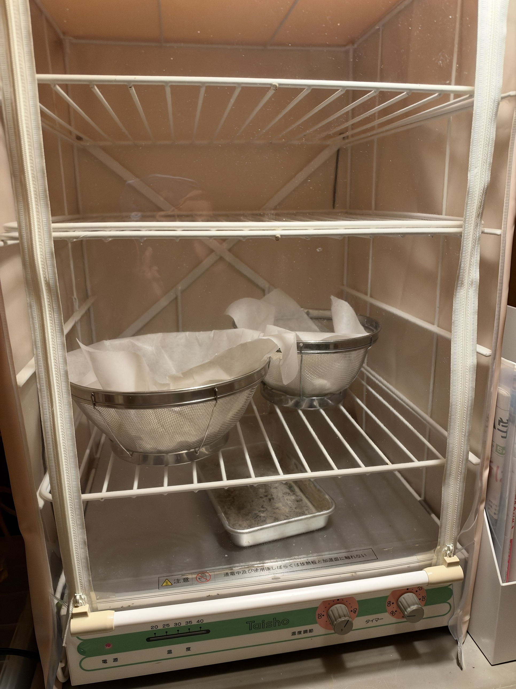
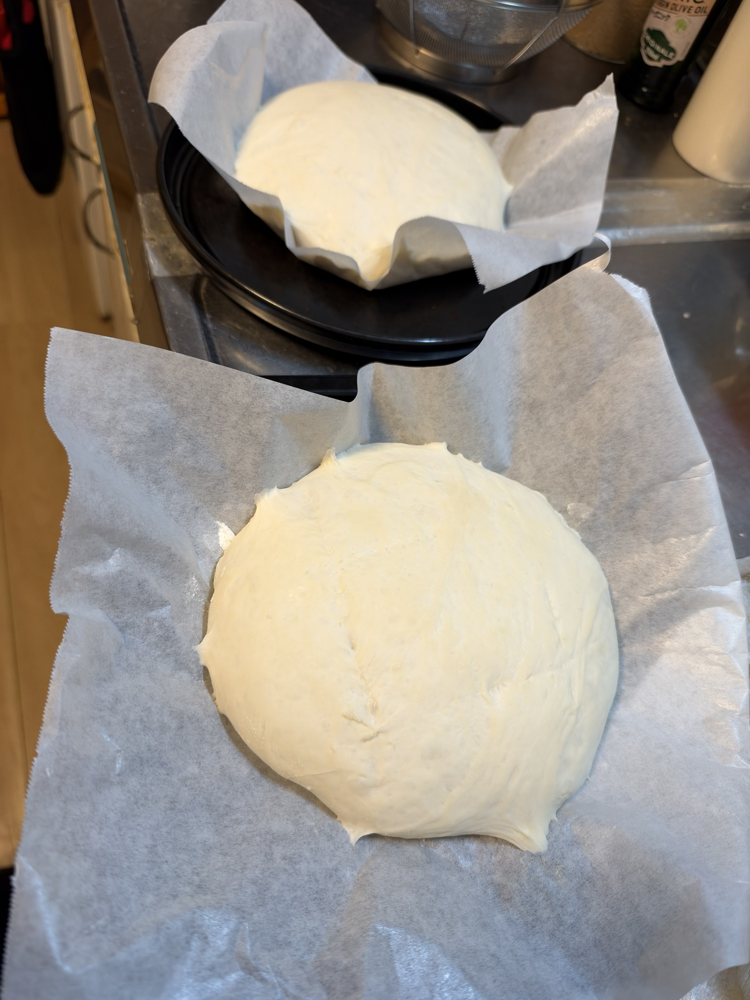
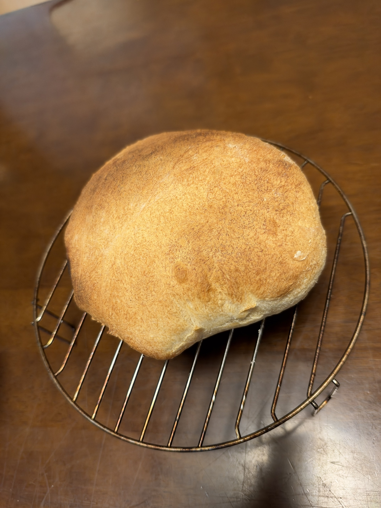
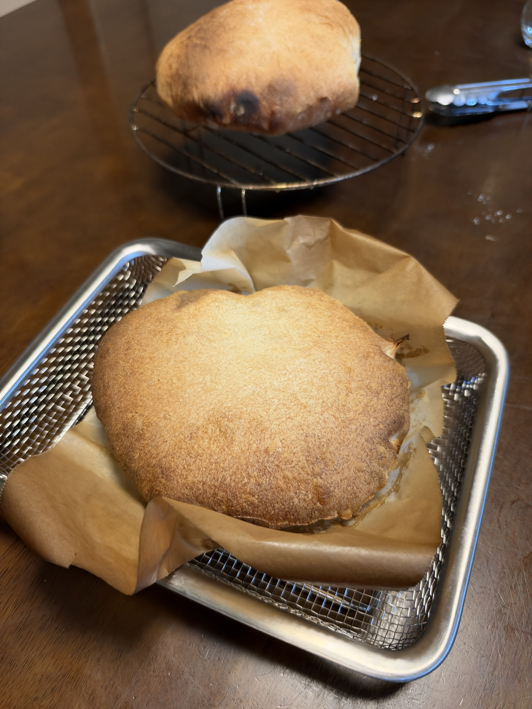
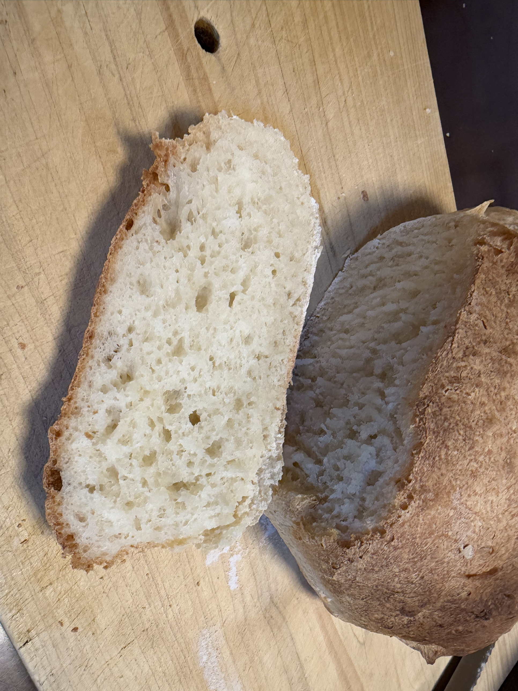

[27回目プチパン]()が家族に大好評（朝食1回で完食）だったので、リスドォル路線を継続。今回は**分割の手間を減らしたい**という祥平さんの意向を受けて、粉500gで**カンパーニュ2個（1個約430g）**に挑戦。通常発酵で今夜中に焼き上げる。

**さらに今回、倉庫に眠っていた大正電機SK-15発酵器がついにデビュー**。日誌の重要マイルストーン、初仕事がカンパーニュという絶妙なタイミング。

## 今回の検証ポイント

1. **リスドォルで大型ブール**の焼き上がり
2. **通常発酵での挑戦**（プチパンはオーバーナイト、今回は当日完結）
3. **分割1回のみ**という楽な運用
4. **加水69%の大型パン**での焼成時間・温度
5. **家族4人以上向けの大型リーンパン**の実力

## SK-15発酵器デビュー

**大正電機 Taisho SK-15発酵器**、倉庫に眠っていたものがついにデビュー。母から譲り受けたお古で、日誌開始から「デビュー未実施」としてずっとPENDINGだった一台。初仕事がカンパーニュという絶妙なタイミング。

**SK-15の特徴**:
- 温度調節ダイヤル: 20〜40℃
- タイマー付き
- ボトムに水受けの角バット → **お湯を張って湿度確保**
- 白と緑のクラシックなデザイン
- ジップアップ式の透明カバー → 中身が見える

**今回の使い方**:
- 設定温度: 30℃
- 湿度確保: 底に水受けバット
- **ザル2個 + キッチンペーパーの簡易バヌトン** — カンパーニュ成形の伝統テクニック
  - 本来は籐製のバヌトン（発酵かご）を使う
  - ザル+キッチンペーパーで代用、粉つけて生地を支える
  - 大型カンパーニュは自重で潰れやすいので、支えが必要

**オーブン発酵との違い（今後の運用）**:
- オーブン発酵は他の作業と競合する（同時進行不可）
- **SK-15は発酵専用機**、オーブンで焼成しながら次のバッチを発酵できる
- 温度・湿度の安定性が段違い
- 特に大型パンや複雑な工程で威力発揮

## 過去のハード系（27回目プチパン）との違い

| 項目 | 27回目プチパン | **28回目カンパーニュ** |
|---|---|---|
| 発酵方式 | オーバーナイト（10時間） | **通常発酵（一次60〜80分）** |
| 分割 | 40g × 21個 | **約430g × 2個** |
| 加水 | 68% | **69%**（1%増、大型で水分キープ） |
| 発酵環境 | オーブン35℃ | **SK-15発酵器 30℃**（デビュー） |
| 焼成 | 240℃×15分 | **240℃×約25〜30分**（大型で長時間） |
| クープ | 十字 or 一本 | **今回はクープなし**（高加水で失敗、次回リベンジ） |

## 成形後・二次発酵完了

SK-15発酵器30℃で二次発酵完了、ザル+キッチンペーパーの簡易バヌトンから、パーチメントペーパー敷きの天板へひっくり返して移動。**2個ともいい膨らみで丸く出来上がった**、二次発酵は完璧。

### クープ入れの失敗と判断

**加水69%の高加水生地はクープが難しい**と実感。手前のパンにナイフを入れたが:
- **ナイフに生地がくっつく** → 引っ張られて綺麗に切れない
- **表面が湿っている** → 切り口がすぐ閉じる
- **切り込みが浅くて広がってしまう**

包丁ではダメと判断、**カッターや剃刀の刃も準備していなかった**。無理に何度も切って生地を傷めるより、**今回はクープなしのブールとして焼く決断**。

**この判断の意味**:
- 田舎パンの原型はもともとクープなし、クープは装飾要素
- 表面のなめらかさを活かした素朴な姿
- 失敗を認めて次に持ち越さない
- クープなしでも焼成中に自然な割れ目が出る可能性

### 次回への学び

- **加水69%は表面が湿ってクープが難しい**
- クープを優先するなら**加水を65〜66%に下げる**
- **カッターナイフ or 剃刀の刃 + 油**を必ず準備
- **成形後、少し表面を乾かしてから**クープを入れる
- **今回のように高加水を優先するなら、クープなしで焼く割り切りもアリ**

## 条件

| 項目 | 値 |
|---|---|
| 仕込み開始 | 18:00頃 |
| 焼成予定 | 21〜22時頃 |
| 発酵環境 | オーブン35℃ |
| 室温 | <!-- TODO --> |
| 湿度 | <!-- TODO --> |
| 日付 | 9/22 |

## 配合（リスドォル100%、加水69%）

| 材料 | 分量 | 粉比 | 備考 |
|---|---:|---:|---|
| プロフーズ リスドォル | 500 g | 100% | 準強力粉 |
| 塩 | 10 g | 2.0% | 27回目と同じ |
| とかち野酵母（予備発酵タイプ） | 4 g | 0.8% | 27回目と同じ |
| 予備発酵用 お湯（40℃） | 60 g | - | 27回目と同じ |
| 予備発酵用 砂糖 | 2 g | - | 27回目と同じ |
| モルトパウダー | 1.5 g | 0.3% | 27回目と同じ |
| 水 | 285 g | 57% | +5g（27回目の280gから微増） |

**加水合計: 345g（69%）** — プチパンより1%増
**生地総量: 約860g** → **約430g × 2個**

## 工程（通常発酵版）

1. **予備発酵**: お湯60g + 砂糖2g + とかち野4g、10分待って泡立ちを確認
2. **一次こね**: KN-1000で
   - 粉500g + 塩10g + モルトパウダー1.5g を軽く混ぜる
   - 予備発酵液 + 水285g を加える
   - **10〜12分こね**（バターなし）
3. **一次発酵**: 35℃で **60〜80分**（2倍以上に膨らむまで、通常発酵なので気持ち長め）
4. **分割**: **約430g × 2個**、キッチンスケールで正確に
5. **ベンチタイム**: **20〜25分**（大型ブールは長めのベンチタイム推奨）
6. **成形**: **表面を張らせて丸める**（プチパンより丁寧に、大型なので張り不足だと膨らみが悪い）
7. **二次発酵**: 30℃で **50〜60分**（大型は膨らみに時間がかかる）
8. **クープ**: **十字 or ハッシュタグ（＃）**、田舎パンらしく大胆に
9. **焼成準備**: **コンベック240℃予熱** + 天板に霧吹き
10. **焼成**: **240℃×25分 → 断面確認 → 必要に応じて追加5分**

## 大型カンパーニュならではのポイント

### 加水69%の意味

- プチパンより1%だけ増やして水分キープ
- 大型パンは焼成中の水分蒸発が多い、加水少ないとパサつく
- 70%以上にすると成形が難しくなる、69%が扱いやすい上限

### ベンチタイム・二次発酵を長めに

- 大型パンはグルテンの緩みに時間がかかる
- 二次発酵不足だと、焼成中に生地が裂けやすい
- 逆に過発酵だと、焼き上がりに空洞ができやすい

### クープの入れ方（田舎パンの美学）

- **十字**: 最もシンプル、初めての大型ブールに最適
- **ハッシュタグ（＃）**: 4本のクープで正方形の中心を作る、田舎パンの定番
- **クロス（Ｘ）**: 対角線2本、モダンな印象
- 深さ5〜7mm、生地表面から45度の角度で

### 240℃×25〜30分の焼成

- プチパン（15分）の約2倍の時間
- 中まで火を通すため
- 途中で焼き色が濃くなりすぎたら、220℃に落として調整
- **底面の音でチェック**: 指でトントン叩いて軽い音（乾いた音）なら完成

## 予想される変化・観察ポイント

- [ ] 通常発酵での生地の膨らみ具合（60〜80分で2倍以上か）
- [ ] 430gの成形の張らせ方
- [ ] 二次発酵50〜60分での膨らみ
- [ ] クープの開き具合（十字 or ハッシュタグ）
- [ ] 焼成時間の適正（25分 or 追加必要）
- [ ] クラスト（皮）のガリガリ感
- [ ] クラム（内相）の気泡分布 — プチパンとの差
- [ ] 家族評価 — プチパンとの好み比較

## 仕上がり

**240℃で25分焼成、綺麗な焼き色**。しかし**まんまるにはならず、饅頭のように横に広がった**。

- 焼き色は均一なきつね色、田舎パンらしい落ち着いた色合い
- 表面のマット質感、打ち粉の跡と焼き色のグラデーション
- クープなしでも表面に大きな破裂なく、なめらかに膨らんだ
- サイドがやや広がって、ドームというより饅頭型
- 底のフチが少し外に広がった → 生地が横方向に流れた

2個の焼き色に差があった：手前は薄めのきつね色でパンケーキ状に平べったく、奥は濃いめのきつね色でところどころ焦げ気味の斑点あり。**オーブン内の熱ムラ、または前後入れ替えの有無**が原因と推測。

## 断面（クラム）

**見た目は横に広がっても、クラムは完璧な仕上がり** — フランス系ハードパンの理想的な内相。

- **大小の気泡が不均一に分布** — フランス系ハードパンの理想
- **上部（クラスト側）に大きめの気泡** — 焼成中の膨張で上に集まった
- **下部は少し細かめ** — 自重で気泡が押しつぶされた自然な差
- **色は白〜クリーム色でツヤあり** — 焼き加減完璧、しっとり感キープ
- **気泡膜が薄くて光ってる** — 良質な発酵の証、グルテン膜が伸びている
- **クラストは薄めで境界がはっきり** — セミハードの理想

## 振り返り

### 大成功: 「外カリッ・中もちもちの理想の食感」を達成

**家族の食感評価「外カリッ・中もちもちの理想の食感」** ✓

見た目は横に広がったが、パンとして最も大事な食感が完璧に達成された。**見た目より本質が大事**という良い教訓。

### 理想の食感を達成した要因

1. **加水69%の高加水** — 中のもちもち感を生む
2. **リスドォル100%** — 準強力粉のしっかりしたグルテン
3. **240℃×25分の高温焼成** — 外のカリッと感を作る
4. **モルト0.3%** — クラストのメイラード反応強化
5. **SK-15発酵器の安定した二次発酵** — グルテン網が理想的に伸びた

### 見た目 vs 食感の整理

| 項目 | 評価 | 原因 |
|---|---|---|
| 見た目（形） | △ | 加水69%で横に広がった |
| 焼き色 | ○ | モルト + 高温焼成 |
| クラスト | ○ | カリッと理想通り |
| クラム | ◎ | 気泡分布が完璧 |
| **食感** | **◎ 理想** | 全要素の総合結果 |
| クープ | × | 高加水で失敗 |

### プチパン（27回目）との違い

| 項目 | プチパン | カンパーニュ |
|---|---|---|
| 形 | 個別小型（40g） | 大型（430g） |
| クラム気泡 | 中〜細かめ、均一寄り | 大小混在、上下でグラデーション |
| クラスト | 全体的にカリッと | サイドはカリッ、底は少し重い |
| 食感 | 外カリッ・中もちもち | **外カリッ・中もちもち（理想）** |
| 食べ方 | 手軽なおやつ・食事パン | 切り分けて食卓の主役に |

### SK-15発酵器デビューの評価

- **温度・湿度が安定** — オーブン発酵より制御しやすい
- **オーブンと並行運用可能** — 効率アップ
- **今後の量産・複雑な工程で必須の存在**に
- 母から譲り受けたお古が現役復帰、日誌の重要マイルストーン

### 今回の失敗ポイント

1. **クープ入れの失敗** — 加水69%の高加水生地には包丁が不適
   - カッターナイフ or 剃刀の刃を準備すべきだった
   - 表面が湿ってクープが広がってしまう
2. **2個の焼き色に差** — オーブン内の熱ムラ
   - 途中で前後入れ替えすべきだった
3. **まんまるにならない** — 加水69%で横広がり
   - 見た目重視なら加水66〜67%が推奨

## 次回に向けてのメモ

### カンパーニュ・リベンジ計画

**「食感」を優先するなら**：
- [ ] 今回のレシピをそのまま定番化（加水69%キープ）
- [ ] クープなしor簡易クープで割り切る
- [ ] 見た目は「素朴な田舎パン」で受け入れる

**「まんまる & クープ入り」を優先するなら**：
- [ ] 加水を66〜67%に下げる
- [ ] 成形を強く張らせる
- [ ] カッターナイフ or 剃刀の刃を準備、刃に油を塗る
- [ ] 成形後、表面を少し乾かしてからクープ

### その他のアイデア

- [ ] 焼成途中で前後入れ替え（焼き色ムラ解消）
- [ ] 断面気泡のプチパンとの比較写真
- [ ] 家族の食味評価（プチパンとの比較）
- [ ] ライ麦・全粒粉入りカンパーニュ
- [ ] クルミ・レーズン入りアレンジ
- [ ] ダッチオーブンでの焼成（まんまる & 蒸気確保）
- [ ] 粉900gでカンパーニュ4個（家族5人朝食完食対応）
