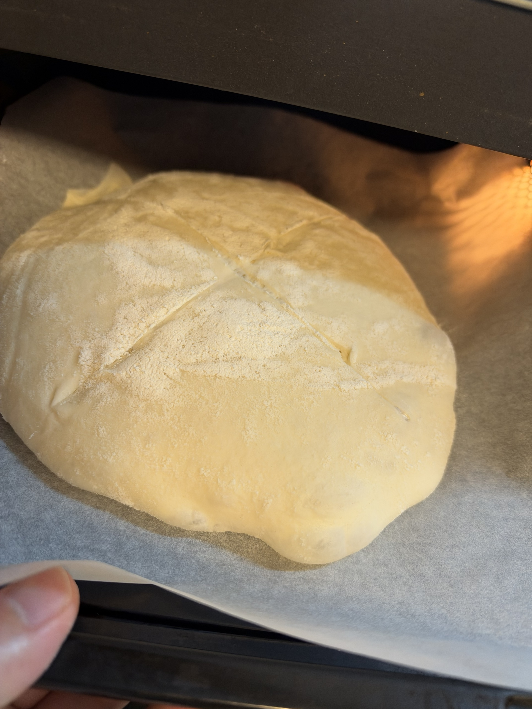
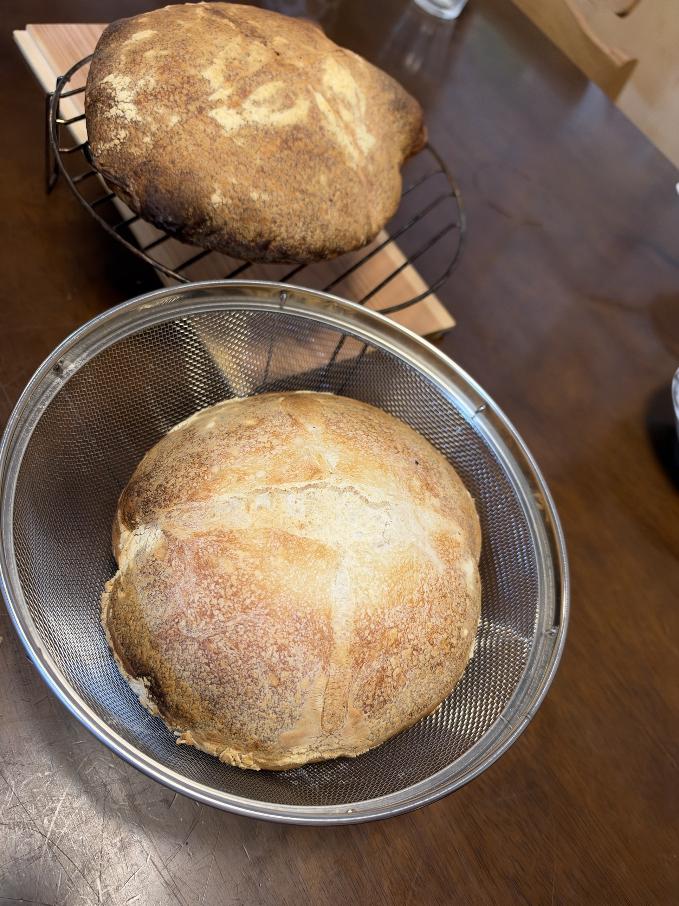
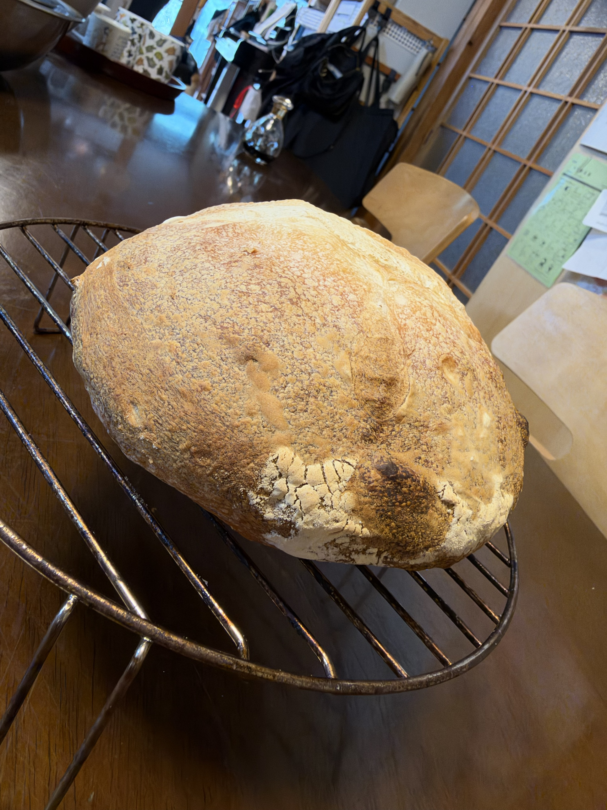

[28回目カンパーニュ]()で「外カリッ・中もちもち」の理想の食感を達成した一方、**加水69%の生地が横に広がって饅頭型になる**問題を発見。この解決策として**本物のバヌトン（発酵かご）を購入**、今夜デビュー。

同じ生地から2個作り、**バヌトンあり・なしで直接比較**する日誌的A/Bテスト。バヌトンの効果を定量的に評価する。

**さらに今回はオーバーナイト方式**：一次発酵後、バヌトンごと冷蔵庫へ入れて明朝焼成。これは**プロのカンパーニュ製法そのもの**、パン屋さんが夜に仕込んで翌朝焼く定番手順。

## 今回の検証ポイント

1. **バヌトン初使用** — 籐製オーバル型、布ライナー付き
2. **バヌトンあり vs なしの直接比較** — 同じ生地で条件を揃える
3. **プロ製法のオーバーナイト** — 一次発酵後にバヌトンごと冷蔵
4. **クープリベンジ** — カッターの刃 or 剃刀を準備
5. **加水69%の運用継続** — 食感優先の路線

## 28回目の課題と29回目の対応策

| 28回目の課題 | 29回目の対応 |
|---|---|
| 加水69%で横に広がる | **バヌトンで形状保持**（片方のみ） |
| ザル+キッチンペーパーで形が甘い | **プロ仕様のバヌトン** |
| 見た目が「饅頭型」 | **綺麗な楕円**を目指す |
| クープ失敗（包丁で切れず） | **カッターナイフ or 剃刀の刃 + 油** |
| 2個の焼き色に差（熱ムラ） | **途中で前後入れ替え** |
| 通常発酵で当日完結 | **オーバーナイト熟成でより深い風味** |

## 条件

| 項目 | 値 |
|---|---|
| 仕込み開始 | 18:00頃 |
| 冷蔵庫イン | 20:20頃 |
| 焼成予定 | 明朝 |
| 冷蔵庫時間 | 約10〜12時間 |
| 発酵環境（一次） | SK-15発酵器 30℃ |
| 発酵環境（二次） | 冷蔵庫4〜6℃ → 明朝復温 |
| 室温 | <!-- TODO --> |
| 湿度 | <!-- TODO --> |
| 日付 | 9/23〜9/24 |

## 配合（28回目と完全同一）

| 材料 | 分量 | 粉比 | 備考 |
|---|---:|---:|---|
| プロフーズ リスドォル | 500 g | 100% | 準強力粉 |
| 塩 | 10 g | 2.0% | 28回目と同じ |
| とかち野酵母（予備発酵タイプ） | 4 g | 0.8% | 28回目と同じ |
| 予備発酵用 お湯（40℃） | 60 g | - | 28回目と同じ |
| 予備発酵用 砂糖 | 2 g | - | 28回目と同じ |
| モルトパウダー | 1.5 g | 0.3% | 28回目と同じ |
| 水 | 285 g | 57% | 28回目と同じ |

**加水合計: 345g（69%）**
**生地総量: 約860g** → **約430g × 2個**

**配合を28回目と完全同一にすることで、バヌトン + オーバーナイトの効果のみを検証する**。

## 工程（オーバーナイト・A/B比較）

### 今夜

1. **予備発酵**: お湯60g + 砂糖2g + とかち野4g、10分待つ
2. **一次こね**: KN-1000で
   - 粉500g + 塩10g + モルトパウダー1.5g
   - 予備発酵液 + 水285g を加える
   - 10〜12分こね
3. **一次発酵**: SK-15発酵器30℃で **60〜80分**（2倍以上に膨らむまで）
4. **分割**: **約430g × 2個**（できるだけ同量に）
5. **ベンチタイム**: **20〜25分**
6. **成形**: 表面を張らせて丸める・楕円にまとめる（両方とも同じ成形）
7. **セット**:
   - **A: バヌトン**（1個目） — 布ライナーに打ち粉、閉じ目を上にセット
   - **B: 天板成形**（2個目） — パーチメントペーパーの上に閉じ目を下にセット
8. **ラップして冷蔵庫へ**（両方とも）
   - バヌトンはシャワーキャップ or ラップで覆う
   - 天板もラップで覆う
   - 冷蔵庫4〜6℃で **約10〜12時間**

### 明朝

9. **冷蔵庫から出す** → **復温60分**（生地温度16〜20℃くらいまで）
10. **必要に応じて二次発酵の追い込み**: SK-15 30℃で30分（発酵が足りない場合のみ）
11. **バヌトンから取り出し**: パーチメントペーパー敷き天板に**ひっくり返して**移す
    - 籐の縞模様が転写されているはず
12. **クープ**: **カッターナイフ or 剃刀の刃 + 油**でリベンジ
    - 楕円の長軸に沿って一本クープ or 十字
    - 素早く一気に
13. **焼成準備**: コンベック240℃予熱 + 天板に霧吹き
14. **焼成**: **240℃×20分 → 前後入れ替え → 5分**（熱ムラ対策）

## 比較の観察ポイント

### バヌトンあり（A）の予想

- **綺麗な楕円形をキープ**
- 表面に**籐の縞模様**が転写される
- 高さがしっかり出る（横広がりを防ぐ）
- クープが綺麗に開きやすい（生地が張っているため）
- **オーバーナイト効果でイースト臭少なく、旨味が濃い**

### 天板成形（B）の予想

- 28回目と同じく**横に広がる饅頭型**（ただしオーバーナイトなので若干違うかも）
- 表面は打ち粉のマット質感
- 高さは出にくい
- クープが広がって浅くなる可能性

### 家族評価の比較ポイント

- **見た目**: どちらが「パンっぽい」か
- **食感**: バヌトンで縦に伸びた方がふんわりする？
- **クラム気泡**: 縦横の伸びで気泡分布が変わるか
- **オーバーナイト効果**: 28回目（通常発酵）との味の違い

## プロ製法「バヌトンごと冷蔵」の意義

**利点**:

1. **プロ製法そのもの** — カンパーニュの本格的な手順
2. **バヌトンと生地が長時間馴染む** — 籐の香りが移る、形が完全に決まる
3. **翌朝の作業が最小限** — 復温 → クープ → 焼成
4. **朝食に焼き立て** — 家族が起きた頃に完成
5. **オーバーナイトの熟成効果** — イースト少量+低温長時間で旨味アップ
6. **クープが入れやすい** — 冷蔵で表面が硬めになる → 切りやすい！

**「加水69%でクープ失敗」問題も、オーバーナイトで解決する可能性大**：
- 冷蔵で表面が締まる
- 加水は高いままだが、生地表面はナイフに引っかかりにくい

## クープリベンジのための準備

1. **カッターナイフ or 剃刀の刃** — キッチンばさみでも可
2. **刃に薄く油を塗る** — サラダ油で十分
3. **冷蔵庫から出したてなら表面が硬め** — 復温しすぎない
4. **素早く一気に、45度の角度で** — 迷わない

## 予想される変化・観察ポイント

- [ ] バヌトン下準備の効果（打ち粉、匂い抜き）
- [ ] 布ライナーへの生地のくっつき具合
- [ ] 冷蔵庫内での生地の形状保持（10〜12時間）
- [ ] バヌトンひっくり返しの成否
- [ ] 籐の縞模様の転写具合
- [ ] クープリベンジの成否（冷蔵で表面が締まっているか）
- [ ] 焼き色の均一性（前後入れ替えの効果）
- [ ] 2個の形の違い（バヌトン vs 天板）
- [ ] 2個の断面比較（クラム構造の差）
- [ ] 家族評価（見た目・味・食感、28回目との比較）

## 仕上がり

### 焼成前（オーブン投入直前）

十字クープを入れてオーブンに投入する直前。カッターナイフ+油の効果で、28回目より遥かに綺麗にクープが入った。ただしこの時点では水切りカゴ組かバヌトン組かは特定していない。

### 焼き上がり2個並び

**当初の想定と真逆の結果**：
- **手前（メッシュザル）= 水切りカゴ組、ラップなし** → **綺麗な楕円で成功** ⭕️
- **奥（ワイヤーラック）= バヌトン組、ラップあり** → **形が崩れて失敗** ❌

### 水切りカゴ組（成功）のアップ

**綺麗な楕円形、パンとしての完成度が非常に高い**。
- 側面のクラックがワイルド、田舎パンらしい「エレファントイヤー」現象
- 焼き色は理想的、きつね色〜濃いめ、モルトの効果もばっちり
- 打ち粉の白と焼き色のコントラストが美しい
- クープの跡が薄っすら見える、カッター使用のクープリベンジ成功

## 振り返り

### 想定外の大逆転：バヌトン失敗、水切りカゴ大成功

**当初仮説**：バヌトンで形状保持 → 綺麗な楕円

**実際の結果**：バヌトン組は形崩れ、**ラップなしの水切りカゴ組の方が綺麗に成功**

### バヌトン組が失敗した本当の原因

- **ラップで密閉した** → 冷蔵庫内でも発酵がゆっくり進行
- **10時間で過発酵気味** → 生地が緩んで籐にくっつく
- **ラップに生地が触れて剥がしにくく**、ひっくり返す時に形が崩れた

### 水切りカゴ組が成功した理由

- **ラップなし** → 表面が冷蔵庫内でほどよく乾燥
- **表面が締まる** → 形状保持しやすくなった
- **メッシュカゴで底からも通気** → 湿気がこもらない
- **打ち粉が定着** → 転写しやすい状態に

### 新知見：オーバーナイト冷蔵ではラップで密閉しない方が良い

**反直感的な結論**。一般的には「乾燥防止でラップ必須」と言われるが、**冷蔵庫内は湿度が意外と高く**、**リーン系ハードパン+加水69%**の場合は:
- ラップあり → 過発酵+くっつき
- ラップなし → 表面が締まって扱いやすい

**28回目→29回目で「バヌトンの効果検証」のはずが、実は「ラップの有無」の効果検証**になった。日誌としては最高に面白い展開。

### クープリベンジは成功

- **カッターナイフ + 刃に油**の効果は絶大
- 28回目の包丁失敗が嘘のように、綺麗に切れた
- 冷蔵庫から出したての表面が硬めなことも追い風

## 次回への学び

### バヌトンの正しい運用（次回リベンジ）

- **ラップは絶対に生地に触れないように**
- **シャワーキャップ or 大きなボウルを逆さにかぶせる**（生地に触れない構造）
- **または、ラップなしで冷蔵庫**（今回の水切りカゴ組と同じ）
- **オーバーナイトは冷蔵庫内で「乾燥」を活用する**発想

### カンパーニュ運用の新ルール

- **オーバーナイト冷蔵時はラップなし、または生地に触れない覆い**
- **カッターナイフ + 油**でクープする
- **水切りカゴのようなメッシュ容器も十分実用的**（バヌトンなしで代用可能）

### 今後の実験候補

- [ ] バヌトン + シャワーキャップ（生地に触れない覆い）でリベンジ
- [ ] バヌトン + ラップなしで直接冷蔵
- [ ] 水切りカゴ vs バヌトンの「本来の意味の比較」（両方ラップなしで）
- [ ] 冷蔵庫内の湿度計測（意外と高いはず）

## 保存方針（今日〜今後）

- **水切りカゴ組**: 今朝〜今日中、切り口を伏せて紙袋 常温
- **バヌトン組**: 形は崩れたが食感は問題ないはず、切り口を伏せて紙袋 常温
- 明日以降残ったら: **半分カットして冷凍**（1cm厚スライス → ラップ密着 → ジップロック）
- **冷蔵はNG**（デンプン老化最速）
- 冷凍からの復活: **霧吹き → トースター5〜7分**でカリッと
