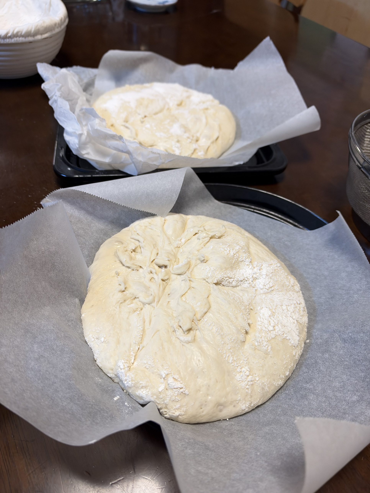

[29回目カンパーニュ]()の学びを活かしてのリベンジ回。あの回で判明した**「ラップで密閉がバヌトン失敗の真の原因」**を踏まえて、今夜は**両方ともラップなし**で条件を揃える。

さらに**加水を66%に下げる**（-3%、水を15g減）。「同じだったら面白くない」の精神で、扱いやすさと食感に明確な違いが出るラインを狙う。ハード系の範囲内にとどめつつ、クープ・成形の楽さと横広がり抑制を両立させる設計。

## 今回の検証ポイント

1. **バヌトンの真の効果検証** — 両方ラップなしで条件を揃える
2. **加水66%で扱いやすさ向上** — クープ・成形が楽になるか
3. **食感の変化検証** — 加水3%減で「もちもち」がどう変わるか
4. **通常発酵で当日完結** — 29回目のオーバーナイトから戻す
5. **クープリベンジ継続** — カッター + 油の運用定着

## 29回目からの改善点

| 項目 | 29回目 | **30回目** |
|---|---|---|
| 加水 | 69% | **66%（-3%）** |
| バヌトン組の覆い | ラップあり（失敗要因） | **ラップなし** |
| 水切りカゴ組の覆い | ラップなし | ラップなし（変わらず） |
| 発酵方式 | オーバーナイト（10時間） | **通常発酵（60〜80分一次）** |
| クープ | カッター + 油 ✓ | 同じ |

## 条件

| 項目 | 値 |
|---|---|
| 仕込み開始 | 18:00頃 |
| 焼成予定 | 21〜22時頃 |
| 発酵環境 | SK-15発酵器 30℃ |
| 室温 | <!-- TODO --> |
| 湿度 | <!-- TODO --> |
| 日付 | 9/24 |

## 配合（加水66%、水を15g減らす）

| 材料 | 分量 | 粉比 | 29回目との差 |
|---|---:|---:|---|
| プロフーズ リスドォル | 500 g | 100% | 同じ |
| 塩 | 10 g | 2.0% | 同じ |
| とかち野酵母（予備発酵タイプ） | 4 g | 0.8% | 同じ |
| 予備発酵用 お湯（40℃） | 60 g | - | 同じ |
| 予備発酵用 砂糖 | 2 g | - | 同じ |
| モルトパウダー | 1.5 g | 0.3% | 同じ |
| 水 | **270 g** | 54% | **-15g** |

**加水合計: 330g（66%）**
**生地総量: 約845g** → **約420g × 2個**

## 予想される変化（29回目との比較）

| 項目 | 29回目（加水69%） | **30回目（加水66%）** |
|---|---|---|
| 生地の柔らかさ | かなり柔らかい | **明確に扱いやすい** |
| 成形 | 難しい | **楽になる** |
| クープ | かなり難しい | **綺麗に開くはず** |
| 横広がり | 強い | **少なくなる、丸に近づく** |
| もっちり感 | 理想 | **少し軽い方向へ、でも十分もちもち** |
| 気泡分布 | 大小混在で大きめ | **やや細かめ寄り** |
| 家族評価予想 | 「理想」 | **未知数（分岐点）** |

## 工程（通常発酵・A/B比較）

1. **予備発酵**: お湯60g + 砂糖2g + とかち野4g、10分待つ
2. **一次こね**: KN-1000で
   - 粉500g + 塩10g + モルトパウダー1.5g
   - 予備発酵液 + 水270g を加える
   - 10〜12分こね
3. **一次発酵**: SK-15発酵器30℃で **60〜80分**（2倍以上に膨らむまで）
4. **分割**: **約420g × 2個**（できるだけ同量に）
5. **ベンチタイム**: **20〜25分**
6. **成形**: 表面を張らせて楕円にまとめる（両方とも同じ成形）
7. **セット**:
   - **A: バヌトン**（1個目） — 布ライナーに打ち粉、閉じ目を上にセット
   - **B: 水切りカゴ**（2個目） — キッチンペーパー敷き、閉じ目を上にセット
   - **両方ともラップなし**、覆いは軽く布巾程度
8. **二次発酵**: SK-15発酵器30℃で **50〜60分**（両方同時に）
9. **バヌトンから取り出し**: パーチメントペーパー敷き天板に**ひっくり返して**移す
    - 籐の縞模様が転写されているか確認
10. **クープ**: **カッターナイフ + 油**でリベンジ継続
    - 楕円の長軸に沿って一本クープ or 十字
    - 素早く一気に
11. **焼成準備**: コンベック240℃予熱 + 天板に霧吹き
12. **焼成**: **240℃×20分 → 前後入れ替え → 5分**

## 予想される結果

### バヌトンあり（A）の予想

- **綺麗な楕円形をキープ**（ラップなし+加水66%で安定）
- 表面に**籐の縞模様**が転写される（29回目失敗、今回こそ）
- 高さがしっかり出る
- **クープが綺麗に開く**（加水低めの効果大）

### 水切りカゴ（B）の予想

- 29回目と同様、**綺麗な楕円形で成功**
- ラップなしで表面が締まる
- **加水66%でさらに扱いやすくなる**
- 焼成時の「エレファントイヤー」現象は残るか

### 加水66%の食感予想

- 29回目の「もちもち理想」から少し軽い方向へ
- でも**プチパン以上の存在感**は維持
- **家族評価が分岐点**、これはやってみないと分からない
- 「もっちり派」なら加水69%好み、「軽やか派」なら加水66%好み

## 予想される変化・観察ポイント

- [ ] 加水66%での生地の扱いやすさ（69%との違い）
- [ ] バヌトン下準備（打ち粉、匂い抜き）
- [ ] 布ライナーへの生地のくっつき具合（ラップなしで改善するか）
- [ ] 二次発酵中の生地の形状保持（両容器）
- [ ] バヌトンひっくり返しの成否
- [ ] 籐の縞模様の転写具合（真のバヌトン効果）
- [ ] クープの開き具合（加水66%で劇的改善するか）
- [ ] 焼き色の均一性（前後入れ替えの効果）
- [ ] 2個の形の違い（バヌトン vs 水切りカゴ、公平な条件で）
- [ ] 2個の断面比較（クラム構造の差）
- [ ] 家族評価（29回目との食感比較）

## トラブル: 布ライナーへのくっつき

**バヌトンから取り出す際、生地が布ライナーに激しくくっついた**。手前がバヌトン組、奥（黒天板）が水切りカゴ組。特に手前は表面が引きちぎられて、うねうねした跡がべっとり残る状態に。打ち粉はそれなりに振ったつもりだったが、明らかに不足。

### 失敗の原因分析

**通常発酵 + 布ライナーが最悪の組み合わせ**だった：

1. **通常発酵は生地表面が湿ってる時間が長い**
   - 発酵中〜バヌトン内で常に「湿った状態」
   - オーバーナイト（冷蔵）だと表面が冷えて締まる時間がある
   - 通常発酵はそのままの湿り気で長時間接触

2. **打ち粉が加水66%でも足りなかった**
   - 加水を減らしても、生地表面の湿り気は残る
   - 布ライナーの繊維が湿った生地をキャッチ
   - **打ち粉だけでは不十分な湿り気レベル**

3. **29回目水切りカゴ成功の要因の再確認**
   - **ラップなし + 冷蔵庫の乾燥 + キッチンペーパー**
   - キッチンペーパーは布より繊維が細かく、生地が食い込みにくい
   - 冷蔵で表面が締まった状態でひっくり返せた

### 対策メモ（次回への学び）

1. **打ち粉を「強力粉 + 米粉 1:1」に変える**
   - 米粉が最強のくっつき防止（プロの技）
   - 米粉はグルテンなし、水を吸わず表面をコーティング
2. **打ち粉を「布ライナーが白くなるくらい」振る**
3. **バヌトン + 布ライナーはオーバーナイト向き**
   - 通常発酵で使うなら、より念入りな打ち粉が必須
4. **布ライナーを外して直接籐に打ち粉**もアリ
5. **今回はこのまま焼いて食感検証を優先**

### この失敗の日誌的な意義

- **29回目「ラップNG」の教訓に加え、「通常発酵×布ライナーの相性」も判明**
- バヌトン運用の難しさが立体的に見えてきた
- **見た目マイナスでも、食感検証は完全にできる**（クラム構造は成形後の表面状態にほぼ影響されない）

## 仕上がり

<!-- TODO: 焼き上がり写真の追記 -->

## 振り返り

### 重要な結論: 加水66%でも扱いやすさは変わらなかった

**今回の主要検証ポイントだった「加水66%で扱いやすさアップ」は、体感的にほぼ変化なし**という結果。加水を3%下げたにもかかわらず、成形時・分割時・バヌトンからの取り出し時の難しさは29回目（加水69%）と変わらず。

### この結論の意味

- **加水を66%まで下げる意味が薄い**
- **食感の理想を優先して加水69%に戻すのが合理的**
- 「扱いやすさ」の改善は加水率以外の要素（打ち粉、覆い、発酵方式）で追求すべき
- **カンパーニュの定番加水は69%で確定**

### 3回連続カンパーニュ実験の学び（28〜30回目）

| 回 | 加水 | 発酵 | 覆い | 主な学び |
|---|---|---|---|---|
| 28回目 | 69% | 通常 | なし | 加水69%で理想の食感、形は饅頭型 |
| 29回目 | 69% | オーバーナイト | ラップあり→失敗 | **ラップ密閉NG**、水切りカゴ+ラップなしで成功 |
| 30回目 | 66% | 通常 | ラップなし | **加水66%でも扱いやすさ変わらず**、布ライナーくっつき |

### 次回（31回目）への方針

- **加水を69%に戻す**（食感優先）
- **通常発酵で再挑戦**
- **布ライナー対策**: 打ち粉を米粉ミックスに、または量を大幅増
- **バヌトンあり vs 水切りカゴの真の比較**を仕切り直し
