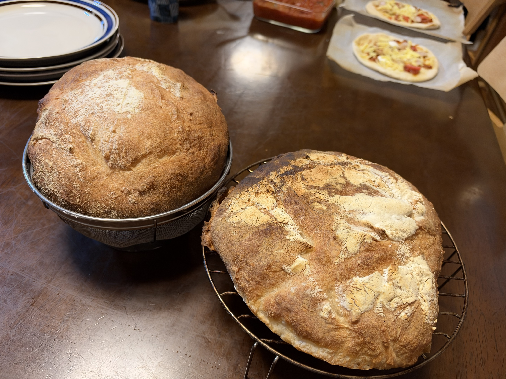

[30回目カンパーニュ]()で判明した**「加水66%でも扱いやすさは変わらない」**という結論を受けて、加水を69%に戻すことに。食感優先の姿勢で28〜29回目の配合に回帰する。

30回目の布ライナーくっつき問題への対策として、今回は**打ち粉を大幅に増量**。強力粉のまま量で対応する方針。

## 今回の検証ポイント

1. **加水69%リターン** — 30回目の結論を踏まえた回帰
2. **打ち粉大幅増量** — 布ライナーくっつき対策のシンプルな解決
3. **バヌトンあり vs 水切りカゴの再挑戦** — 30回目のリベンジ
4. **夕食に間に合わせる当日運用** — 14:30仕込み→18:20焼き上がり

## 30回目からの改善点

| 項目 | 30回目 | **31回目** |
|---|---|---|
| 加水 | 66% | **69%（元に戻す）** |
| 打ち粉の量 | 通常量 → 不足 | **大幅増量、布ライナーが白くなるまで** |
| バヌトン組の覆い | ラップなし ✓ | ラップなし（変わらず） |
| 水切りカゴ組の覆い | ラップなし ✓ | ラップなし（変わらず） |
| 発酵方式 | 通常発酵 | 通常発酵（変わらず） |
| クープ | カッター + 油 ✓ | カッター + 油（変わらず） |

## 条件

| 項目 | 値 |
|---|---|
| 仕込み開始 | 14:30頃 |
| 焼成予定 | 18:00〜18:20頃 |
| 発酵環境 | SK-15発酵器 30℃ |
| 室温 | <!-- TODO --> |
| 湿度 | <!-- TODO --> |
| 日付 | 9/27（日） |

## 配合（28・29回目と同じ、加水69%）

| 材料 | 分量 | 粉比 | 30回目との差 |
|---|---:|---:|---|
| プロフーズ リスドォル | 500 g | 100% | 同じ |
| 塩 | 10 g | 2.0% | 同じ |
| とかち野酵母（予備発酵タイプ） | 4 g | 0.8% | 同じ |
| 予備発酵用 お湯（40℃） | 60 g | - | 同じ |
| 予備発酵用 砂糖 | 2 g | - | 同じ |
| モルトパウダー | 1.5 g | 0.3% | 同じ |
| 水 | **285 g** | 57% | **+15g** |

**加水合計: 345g（69%）** — 28・29回目と同じ
**生地総量: 約860g** → **約430g × 2個**

## 工程（通常発酵・A/B比較）

1. **予備発酵**: お湯60g + 砂糖2g + とかち野4g、10分待つ
2. **一次こね**: KN-1000で
   - 粉500g + 塩10g + モルトパウダー1.5g
   - 予備発酵液 + 水285g を加える
   - 10〜12分こね
3. **一次発酵**: SK-15発酵器30℃で **60〜80分**
4. **分割**: **約430g × 2個**
5. **ベンチタイム**: **20〜25分**
6. **成形**: 表面を張らせて楕円にまとめる（両方とも同じ成形）
7. **打ち粉の大幅増量準備**:
   - **バヌトンの布ライナーが白くなるくらい**強力粉を振る
   - 手で軽く押さえて粉を布に定着させる
   - 成形した生地の表面にも打ち粉をまぶす
8. **セット**:
   - **A: バヌトン**（1個目） — 打ち粉大幅増、閉じ目を上にセット
   - **B: 水切りカゴ**（2個目） — キッチンペーパー敷き、閉じ目を上にセット
   - **両方ともラップなし**
9. **二次発酵**: SK-15発酵器30℃で **50〜60分**
10. **バヌトンから取り出し**: パーチメントペーパー敷き天板に**ひっくり返して**移す
    - 打ち粉大幅増でスルッと出るか、それが今回の主要検証
    - 焼く前に余分な粉を刷毛で払い落とす
11. **クープ**: **カッターナイフ + 油**でリベンジ継続
12. **焼成準備**: コンベック240℃予熱 + 天板に霧吹き
13. **焼成**: **240℃×20分 → 前後入れ替え → 5分**

## 打ち粉大幅増量のコツ

30回目の失敗を踏まえて、今回は打ち粉の量を段階的に確認しながら振る：

1. **布ライナーの目地に完全に埋まる量**まで振る
2. **手で軽く押さえて粉を布に定着**させる
3. **成形した生地の表面にも打ち粉**をまぶす
4. **バヌトンに入れる直前の生地表面が真っ白**になるくらい
5. **焼く前に余分な粉を刷毛で払い落とせばOK**

「多すぎるかも」と感じるくらいが正解。焼成前に払えば見た目の問題はない。

## 予想される変化・観察ポイント

- [ ] 加水69%に戻した時の食感確認（28・29回目の再現性）
- [ ] 打ち粉大幅増量の効果（布ライナーくっつき解消するか）
- [ ] バヌトンから取り出す時の感触（スルッと出るか）
- [ ] 籐の縞模様の転写具合（今度こそ！）
- [ ] クープ入れの成否（カッター+油）
- [ ] 焼き色の均一性（前後入れ替えの効果）
- [ ] 2個の形の違い（バヌトン vs 水切りカゴ、真の比較）
- [ ] 2個の断面比較（クラム構造）
- [ ] 家族評価（夕食で提供、28・29回目との比較）

## 仕上がり

**カンパーニュ2個、素晴らしい焼き上がり**。奥にピザ2枚の準備風景も見える、日曜夕食プロジェクトの一場面。

- **左（水切りカゴ組）**: 円形にふっくら、綺麗な高さ、打ち粉と焼き色のグラデーション
- **右（バヌトン組）**: 楕円形で立体的、大きなクラック（自然な割れ目）が豪快、焼き色も濃いめでワイルド
- どちらも「本物の田舎パン」の風格
- **加水69%の食感がしっかり戻ってきた**

## 振り返り

### 大成功: 加水69%リターンで理想の食感を回復

**家族評価「カンパーニュもピザも大好評」** ✓

30回目で「加水66%でも扱いやすさ変わらず」と結論を出したため、加水69%に戻したのが正解。**28・29回目の食感を再現**しつつ、打ち粉大幅増でバヌトン運用も安定した。

### 打ち粉大幅増の効果

30回目の失敗（布ライナーくっつき）への対策として打ち粉を大幅増量。**バヌトン組も無事にひっくり返せて、大クラックの豪快な焼き上がり**が実現。強力粉の量で問題を解決するシンプルなアプローチが機能した。

### バヌトン vs 水切りカゴの真の比較（ラップなし・打ち粉増量で条件揃え）

| 項目 | バヌトン組 | 水切りカゴ組 |
|---|---|---|
| 形 | 楕円で立体的 | 円形にふっくら |
| 高さ | 出やすい | ふっくら丸型 |
| 表面 | 大クラック豪快 | なめらか + 打ち粉 |
| 焼き色 | 濃いめ | 標準的なきつね色 |
| 見た目の個性 | ワイルド・田舎パン感 | 上品・整った感じ |
| 食感 | どちらも大好評 | 同左 |

**両方とも成功、それぞれ違う魅力**。バヌトンでワイルドに、水切りカゴで整った姿に、と使い分けできる状態に。

### カンパーニュ研究4部作の総括（28〜31回目）

| 回 | 加水 | 発酵 | 主な学び |
|---|---|---|---|
| 28回目 | 69% | 通常 | 食感◎ 形×、加水69%が食感の理想 |
| 29回目 | 69% | オーバーナイト | **ラップ密閉NG**、水切りカゴ+ラップなしで成功 |
| 30回目 | 66% | 通常 | 加水下げても扱いやすさ変わらず、布ライナーくっつき |
| **31回目** | **69%** | **通常** | **打ち粉大幅増で解決、バヌトン運用安定** |

**カンパーニュ定番レシピ確定**:
- 粉500g、加水69%、モルト0.3%、塩2.0%、とかち野0.8%
- 通常発酵 or オーバーナイト（好みで）
- ラップは生地に触れない or ラップなし
- 打ち粉は「多すぎるかな」と思うくらい大量に
- クープはカッター + 油

### 並行工程の成功

**カンパーニュ + ピザ**の並行工程で、家族の日曜夕食に**焼きたて2種類**を提供。KN-1000とSK-15の効率的な使い回し、コンベックの余熱活用など、日誌開始以来の機材が総動員された充実の一日。

## 次回に向けてのメモ

- [ ] **カンパーニュレシピが定番化**、以降は変数を絞った実験へ
- [ ] 断面写真（気泡構造の記録）
- [ ] 冷凍からの復活テスト（霧吹き→トースター）
- [ ] ライ麦・全粒粉入りアレンジ
- [ ] クルミ・レーズン・チーズ入りバリエーション
- [ ] 粉900gの大型量産版
- [ ] クラフト紙袋の導入（保存袋、TOMIZ or cotta で発注予定）
