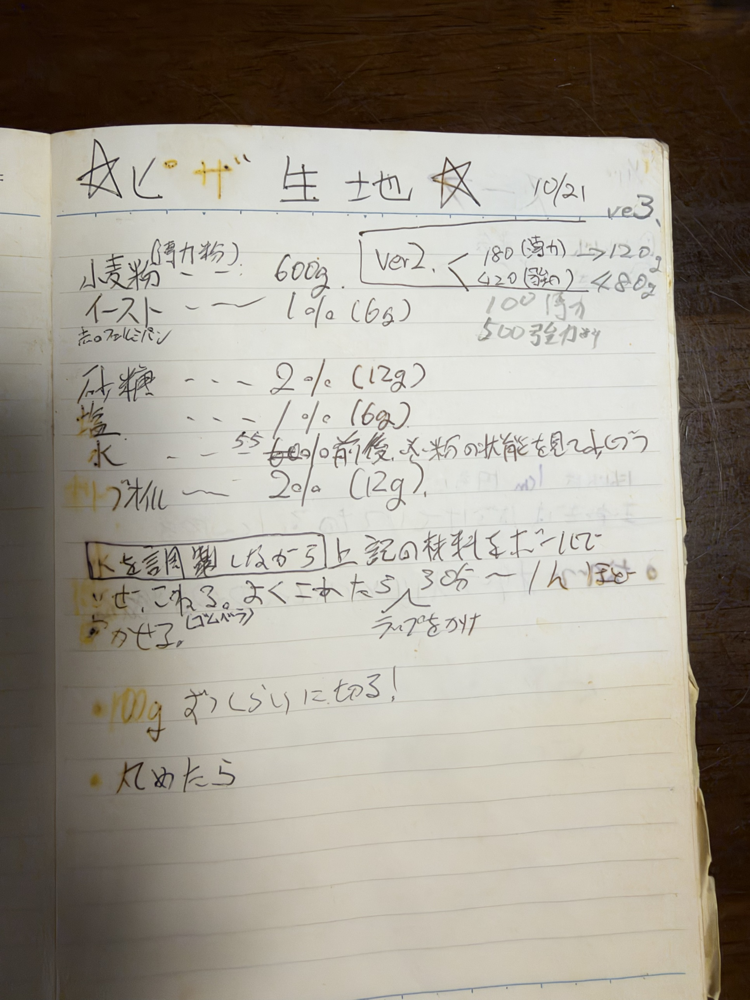
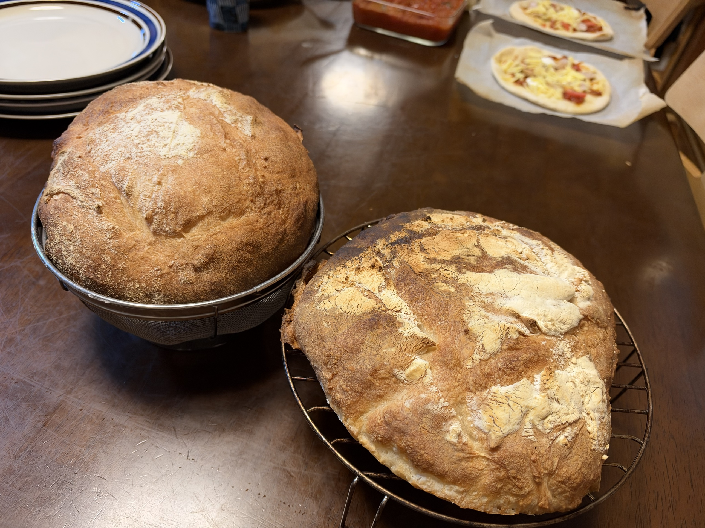
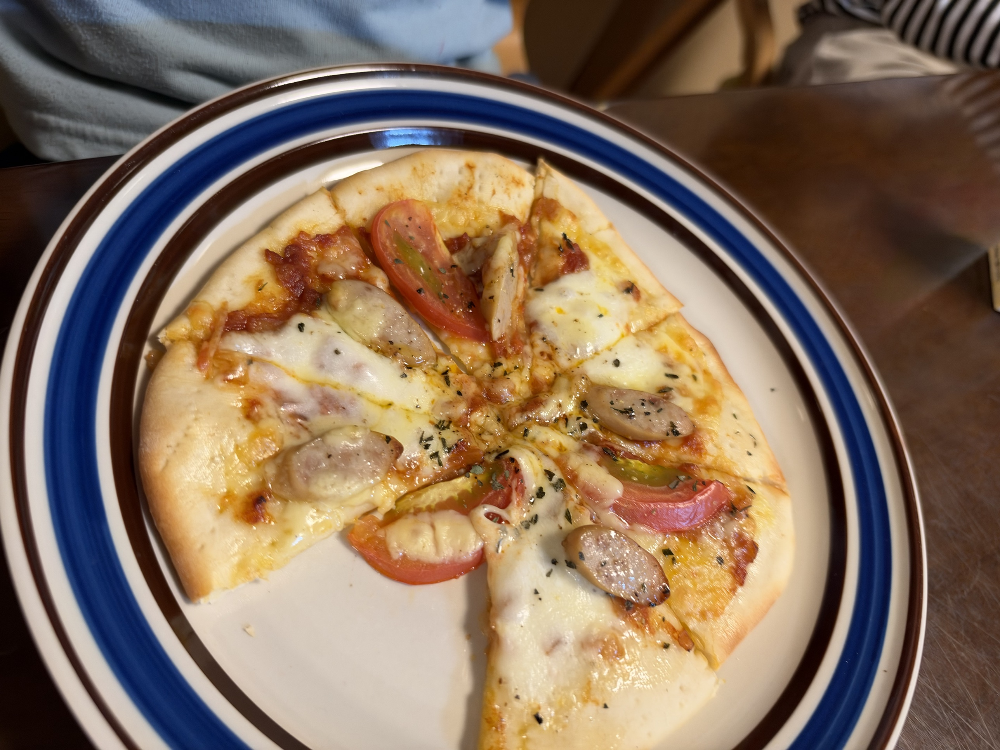

[31回目カンパーニュ]()と並行して、**往年のカフェで出していたピザ生地レシピを復刻**。手書きノートから読み取ったver3（強500 + 薄100）配合そのままで、100g×6枚のマルゲリータを作る。

## なぜこのタイミングでピザ？

- 手書きレシピノートを発見、油染みや修正跡に歴史あり
- カンパーニュの二次発酵タイミングで**KN-1000が空く**
- **家族の日曜夕食にカンパーニュ+マルゲリータ**という贅沢
- リーン系ハードパン（カンパーニュ）とセミハード（ピザ）の対比

## 元レシピ（ノートより）

**2006年のノート**、日付「10/21」、ver3の書き込み、複数の修正跡あり。カフェで実際に出していた配合。2026年の今、**20年前の自分の手書きレシピを復刻**するというノスタルジックな回。

**元の配合**:
- 小麦粉（薄力粉）: 600g
- イースト: 6g（1%）
- 砂糖: 12g（2%）
- 塩: 6g（1%）
- 水: 55〜60%前後（粉の状態を見ながら）
- オリーブオイル: 12g（2%）

**ver2の修正**: 180(薄) → 120g、420(強) → 480g
**ver3の修正**: 100 薄力、500 強力粉

つまり**ver3では薄力100g + 強力500g**という配合に落ち着いていた。カフェ運営中に何度も改良を重ねた形跡。

**ノートの注記の解釈**:
- 「**Kを調製しながら**」→ **K = 水**（水温を季節に応じて調整）
- 冬なら温水、夏なら常温という発酵環境の安定化テクニック
- 「よくこねたら 3分〜1時間」→ 発酵時間の幅
- 「100g おうしぶりに切る」→ 100gずつに分割
- 「丸めたら…」（続きあり、ページ外）

## 32回目の配合（ノートver3ベース + とかち野酵母置き換え）

**ドライイーストが在庫切れだったため、いつも使っているとかち野酵母に置き換え**。同量6gで発酵時間はほぼ同等を狙う。

| 材料 | 分量 | 粉比 | 元レシピとの差 |
|---|---:|---:|---|
| プロフーズ 強力粉 | 500 g | 83.3% | ノート通り |
| 薄力粉 | 100 g | 16.7% | ノート通り |
| **粉合計** | **600 g** | **100%** | ノート通り |
| **とかち野酵母（予備発酵タイプ）** | **6 g** | **1.0%** | **ドライ→とかち野に置換** |
| 砂糖（生地用） | 12 g | 2.0% | ノート通り |
| 塩 | 6 g | 1.0% | ノート通り |
| **予備発酵用 お湯（40℃）** | **80 g** | - | **とかち野用に新規** |
| **予備発酵用 砂糖** | **3 g** | - | **とかち野用に新規** |
| 水 | **268 g** | 45% | 元は348g、予備発酵液分を引いた |
| オリーブオイル | 12 g | 2.0% | ノート通り |

**加水合計: 348g（58%）** — ノート通りの加水を維持
**生地総量: 約1040g** → **約100g × 10枚**（余りは11枚目 or サイズ調整）

補足: 実際は生地総量が計算より多くなるため、100g × 6枚の後にまだ生地が残る可能性あり。追加の枚数として展開するか、大きめに切り分けるか、状況判断。

## カンパーニュ（31回目）との並行工程

| 時間 | カンパーニュ（31回目） | ピザ（32回目） |
|---|---|---|
| 15:30 | 一次発酵中 | - |
| 16:15 | 一次発酵完了 → 分割 | - |
| 16:30 | ベンチタイム → 成形 | **予備発酵なし、こねスタート**（KN-1000空き） |
| 16:45 | バヌトン/水切りカゴへ、二次発酵開始 | こね完了 → 一次発酵開始（SK-15） |
| 17:00 | 二次発酵中 | 一次発酵中 |
| 17:45 | 二次発酵完了 | 一次発酵完了 → 100g×6分割 → ベンチ |
| 17:55 | ひっくり返し + クープ → 焼成開始 | ベンチ、伸ばし準備 |
| 18:20 | カンパーニュ焼き上がり | オーブン空き待ち |
| 18:25 | 冷却中 | **ピザ焼成（250℃×5〜7分）** |
| 18:35 | **夕食スタート！** | **焼きたてピザ提供** |

## 工程

1. **予備発酵**: お湯80g + 砂糖3g にとかち野6g、10分待つ（**とかち野置換で追加された工程**）
2. **こね**:
   - KN-1000で
   - 粉600g + 砂糖12g + 塩6g を軽く混ぜる
   - **予備発酵液 + 水268g + オリーブオイル12g** を加える
   - **8〜10分こね**（オリーブオイルの効果で滑らか、短めでOK）
3. **一次発酵**: SK-15 30℃で **60分**（とかち野なので少し長め）
4. **分割**: **100g × 約10枚**（余り分は追加枚数として活用）
5. **ベンチタイム**: **15分**、丸めて濡れ布巾
6. **成形**: **手のひらで押して丸く伸ばす**（薄めが好みなら綿棒でも）
7. **トッピング（マルゲリータ）**:
   - **自家製トマトソース**（カフェ時代のレシピを参考に仕込み済み）を薄く塗る
   - **モッツァレラ** をちぎって散らす
   - **プランター育ちのフレッシュバジル** を焼き上がり後に散らす
   - 塩・オリーブオイルを少々
8. **焼成**: **250℃×5〜7分**（コンベックの最高温度、短時間で一気に）

## マルゲリータのトッピング

**必須3要素**（イタリア国旗の色）:
- **赤**: トマトソース（できればサンマルツァーノ、なければカゴメ完熟トマト等）
- **白**: モッツァレラチーズ（フレッシュタイプ理想、シュレッドでも可）
- **緑**: バジル（フレッシュ、焼成後 or 途中で乗せる）

**プロのコツ**:
- **トマトソースは薄く**（生地がべちゃつかない）
- **モッツァレラは水気を切る**（多い場合はキッチンペーパーで拭く）
- **バジルは焼く直前 or 焼き上がり後**（早すぎると焦げる）
- **オリーブオイルを回しかけ**（風味UP）

## カフェレシピの特徴考察

**強力粉ベース + 薄力粉ブレンド（強83% + 薄17%）の意味**:

- **強力粉100%**: モチモチ食感、厚めのピザに向く
- **薄力粉100%**: パリパリ食感、クリスピー系
- **83:17ブレンド**: **モチモチとパリパリの中間**、扱いやすさと食感のバランス
- カフェで**均一な品質**を求めた結果の配合と推測

**加水58%（ver3想定）**:
- ピザとしては標準的
- 扱いやすく、伸ばしやすい
- **60%まで上げるともっちり寄り、55%まで下げるとサクッと寄り**

**オリーブオイル2%**:
- **生地の伸びを助ける**
- **香りが焼成中に立つ**
- **クラストのサクッと感UP**

## 予想される変化・観察ポイント

- [ ] カフェレシピ復刻の再現度
- [ ] 強+薄ブレンドの食感（強力100%との違い）
- [ ] 加水58%の伸ばしやすさ
- [ ] 250℃×5〜7分での焼き色
- [ ] マルゲリータの3色バランス
- [ ] 家族評価（カンパーニュとの並行提供）
- [ ] カフェ時代の思い出との比較

## 仕上がり

**カンパーニュ2個と、これから焼くピザ2枚が並ぶ光景**。奥には自家製トマトソースの器。20年前のカフェレシピと現代の定番レシピが同じ食卓に並ぶ贅沢な瞬間。

**焼き上がりのピザ**。マルゲリータをベースに、**家族の食べ応えニーズに応えてソーセージを追加**した家族仕様。

- クラスト（耳）がふっくら綺麗、加水58% + オリーブオイル2%の効果
- モッツァレラチーズがトロッと溶けてこんがり焼き色
- **トマトの赤、チーズの白、バジル（乾燥）の緑**、マルゲリータの3色は維持
- ソーセージの輪切りが食べ応えのアクセント
- 8等分カット、シェアしやすい

## 振り返り

### 大成功: カンパーニュもピザも大好評

**家族評価「カンパーニュもピザも大好評」** ✓

日曜夕食プロジェクトは完全勝利。20年ぶりに復刻したカフェレシピが、朝来の古民家の食卓で家族に愛される瞬間。

### カフェレシピ復刻の成果

- **ver3配合（強500 + 薄100）** は現代でも通用する完成度
- **加水58%** は扱いやすさと食感のバランス最高
- **オリーブオイル2%** の香りと伸びの効果を実感
- **とかち野酵母への置換** も問題なく機能、風味に大きな違和感なし
- **20年前の自分の判断が正しかった**という自信の回復

### 家族仕様への進化

**「マルゲリータだけじゃ寂しい」からのソーセージ追加**は、カフェ運営で身につけた「お客さん第一」の発想と、家庭パンの実用性の両立。

- ベースはカフェの本気（生地・ソース）
- トッピングは家族の好み
- 純粋主義よりも、**「みんなが食べたい」を優先**する成熟した姿勢

### 並行工程の成功

**KN-1000をカンパーニュとピザで使い回す**段取りが機能:
- カンパーニュ一次発酵中にピザは待機
- カンパーニュ分割・成形後にKN-1000空く → ピザこね
- カンパーニュ二次発酵とピザ一次発酵が並行
- カンパーニュ焼成 → オーブン空き次第ピザ焼成
- **家族の日曜夕食に、焼きたて2種類を提供**

### カフェレシピの汎用性

強+薄ブレンドの生地は、ピザ以外にも展開できる可能性:
- **フォカッチャ**（同じ加水、厚焼き）
- **ナン**（同じ加水、フライパン焼き）
- **ピタパン**（同じ加水、高温短時間）
- **チャバッタ**（加水を上げる）

## 次回に向けてのメモ

- [ ] トマトソースのレシピを別記事として単独化（**カフェレシピ トマトソース編**）
- [ ] マルゲリータ純血版（トッピング3要素のみ）でリベンジ
- [ ] フォカッチャに転用（同じ生地でオリーブ・ローズマリー）
- [ ] ピザのオーバーナイト版（生地を前日仕込み）
- [ ] リスドォル100%のピザ（カンパーニュと同じ粉、実験）
- [ ] 家族の「もう一度食べたいピザランキング」を作る
- [ ] カフェ時代の他のレシピ発掘（パン、パスタ、デザート）
