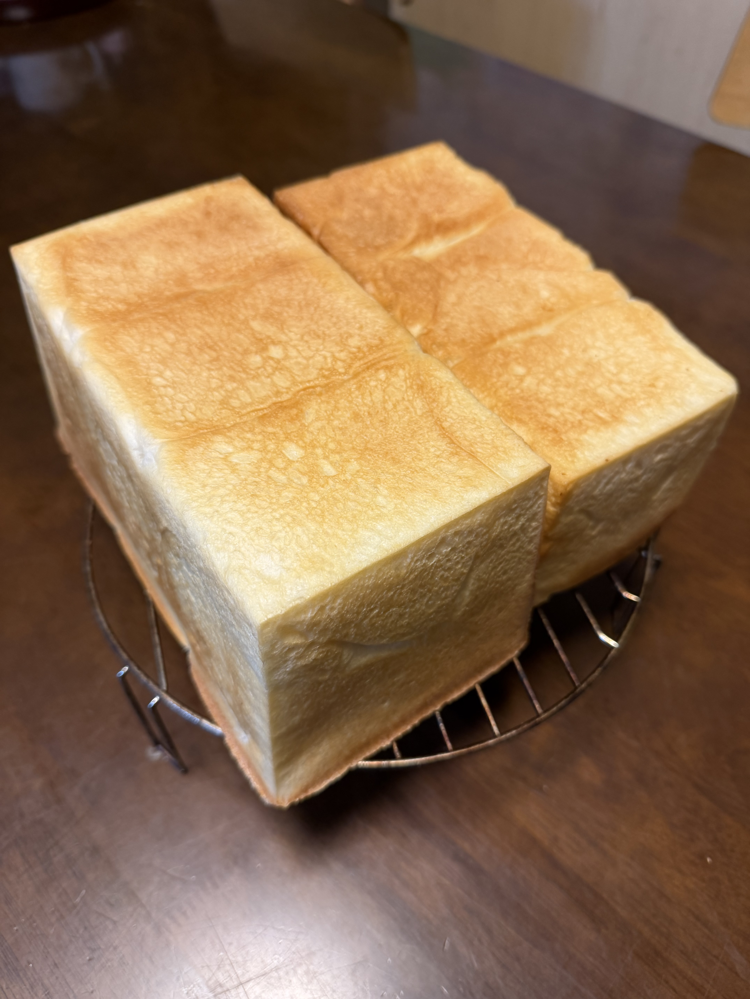

> **【この記事は生成AIが書いてます】**

前回の[1回目の日誌]()から以下を変更して再チャレンジ。

## 前回からの変更点と結果

- **イースト**: 10g → **12.5g**（+2.5g）→ 全体の発酵力は上がったが、**1斤側だけ上がりきらない傾向は解消せず**。イースト量が主因ではなさそう。
- **焼成温度**: 220℃ → **200℃** → 焦げなし、焼き色均一。**これは正解**。

## 条件

- 開始時刻: 21時
- 気温: 19℃
- 天気: 曇り

## 配合

食パン1斤 + 1.5斤ぶん（合計）

| 材料                                    | 分量        | 前回比       |
| --------------------------------------- | ---------: | ---------- |
| ニップン ゆめちからブレンド             | 500 g      | -          |
| 塩                                      | 7 g        | -          |
| ドライイースト（とかち野 予備発酵タイプ） | **12.5 g** | **+2.5 g** |
| 予備発酵用 お湯                         | 100 g      | -          |
| 予備発酵用 砂糖                         | 5 g        | -          |
| 牛乳                                    | 180 g      | -          |
| 水                                      | 70 g       | -          |
| 無塩バター（常温戻し）                  | 50 g       | -          |

## 工程

1. **予備発酵**: お湯100g + 砂糖5g にドライイースト12.5gを入れて予備発酵。
2. **一次こね**: ニーダーに小麦粉・砂糖・塩を入れ、予備発酵させたイーストと牛乳・水を加えて10分こね。
3. **バター投入**: 常温に戻した無塩バターを入れ、さらに5分こね。
4. **一次発酵**: オーブンの発酵機能、35℃ で 45分。
5. **分割・ベンチタイム**: 1 : 1.5 に分割し、それぞれを3分割。ベンチタイム15分。
   - 実測: 1斤型側 360g
6. **成形 → 二次発酵**: 食パン型に入れ、35℃ で 60分 → 1斤側の伸びが足りず **+15分追加**（合計75分）。
   - 2回目もイースト増量後、1斤側だけ上がりきらない傾向は残った。
7. **焼成**: **200℃ で 25分 → 前後を入れ替えてさらに 3分**。

## 仕上がり

- **角までしっかり立った綺麗な山型**。腰折れなし。
- 焼き色は均一で、前回のような焦げなし。200℃が正解だった。
- 側面の白さと上面のきつね色のコントラストが良い。

## 振り返り

| 項目         | 1回目           | 2回目           |
| ------------ | -------------- | -------------- |
| イースト     | 10g            | 12.5g          |
| 焼成温度     | 220℃           | 200℃           |
| 二次発酵時間 | 60分 + 10分追加 | 60分 + 15分追加 |
| 1斤側の伸び  | 7分目           | 上がりきらず    |
| 焼き色       | 一部焦げ        | 均一で綺麗      |

イースト 2.5g 増量しても、**1斤側だけ上がりきらない傾向は残った**。焼成温度は200℃で正解。

### 1斤側の伸び不足の仮説

使用しているのはプロフーズのアルタイト食パンケース。公式仕様は以下のとおり:

|          | 1斤     | 1.5斤    |
| -------- | -----: | ------: |
| 容量     | 1650cc | 2700cc  |
| 粉量目安 | 200g   | 330g前後 |

今回の分割は 1斤側 **360g** / 1.5斤側 **540g**（1:1.5）。型比容積（容量÷生地量）で見ると:

- 1斤側: 1650 ÷ 360 = **4.58**
- 1.5斤側: 2700 ÷ 540 = **5.00**

山型食パンの標準は 3.5〜3.7。どちらも生地量としては許容範囲で、**1斤側のほうがむしろ生地量/容積比は高い**。それでも1斤側だけ上がりきらない → **生地量そのものは主因ではない**。

実際のプロフーズ型の容量比は **2700:1650 ≒ 1.64:1** で、分割比 1:1.5 だと1斤側に相対的に多く入る計算。にも関わらず1斤側が上がらないとなると、生地量以外の要因が効いている可能性が高い。

残る仮説:

1. **オーブン発酵機能の温度ムラ**: 1斤型の置き位置が35℃に達していなかった可能性。庫内の位置（手前/奥、上段/下段）を次回は揃える or 入れ替える。
2. **成形の丸め・張りの差**: 小さい生地のほうが成形時に締めすぎ or 緩めすぎになりやすい。
3. **こね上げ温度のばらつき**: 分割後の生地温度が1斤側だけ下がっていた？

次回は**発酵中の生地温度を型ごとに実測**して切り分ける。

## 次回に向けてのメモ

- [ ] **発酵中の生地温度を型ごとに実測**（温度ムラ仮説の切り分け）
- [ ] 発酵時の**型の位置を入れ替えて**みる or 同じ段で並べる
- [ ] こね上げ温度を測って記録する習慣を付ける
- [ ] 成形時の丸め・張りを動画で記録して比較
- [ ] 断面写真も撮って気泡の様子を記録
- [ ] 分割比率を型容積比（1.64:1）に合わせて **550g:335g** で試す選択肢も
